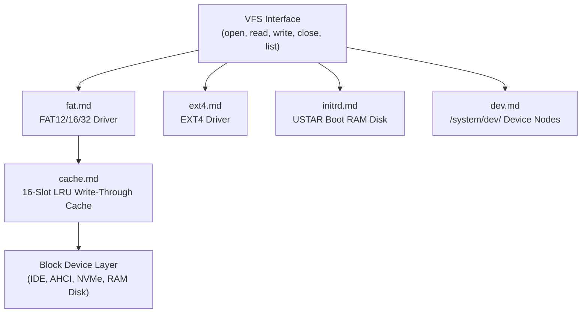

<!-- SPDX-License-Identifier: GPL-2.0-only -->

# Keira Kernel Virtual Filesystem (VFS) & Storage Formats

The `fs` subsystem provides unified file abstraction, partition drivers (FAT12/16/32, EXT4), USTAR RAM disk reading, character/block device nodes (`/system/dev/`), LRU sector caching, advisory file locks, and LVM/RAID.

---

## Filesystem Architecture

---

## Filesystem Module Index

| Document | Component | Description |
| :--- | :--- | :--- |
| [`fat.md`](fat.md) | FAT File Systems | FAT12, FAT16, and FAT32 file read/write operations and cluster chaining |
| [`ext4.md`](ext4.md) | EXT4 File System | Read-only EXT4 superblock parsing, block group descriptors, and inode extents |
| [`initrd.md`](initrd.md) | USTAR Boot RAM Disk | In-memory archive reader mounted at boot for system binaries and libraries |
| [`dev.md`](dev.md) | `/system/dev/` Device Nodes | Virtual device filesystem (`null`, `zero`, `random`, `console`, `sda`, `sda1`) |
| [`cache.md`](cache.md) | 16-Slot Sector Cache | Least-Recently-Used (LRU) write-through cache engine with thread-safe synchronization |
| [`lock.md`](lock.md) | Advisory File Locks | Multi-reader shared and single-writer exclusive file lock tracking |
| [`lvm_raid.md`](lvm_raid.md) | LVM & Software RAID | Logical Volume Management volume groups and RAID 0/1/5 striping/mirroring |
