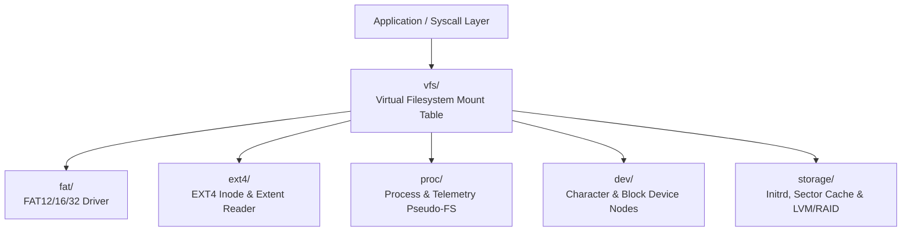

<!-- SPDX-License-Identifier: GPL-2.0-only -->

# Keira Virtual Filesystem & Storage Subsystems

The `fs` domain coordinates storage devices, partition drivers, virtual file systems, pseudo-filesystems, and file locking.

---

## Filesystem Architecture

---

## Submodule Index

| Submodule | Focus Area | Description |
| :--- | :--- | :--- |
| [`vfs/`](vfs/README.md) | Virtual Filesystem | Mount table, path resolution, file operations, permissions |
| [`fat/`](fat/README.md) | FAT Filesystem | FAT12/16/32 volume mounting, cluster chains, file read/write |
| [`ext4/`](ext4/README.md) | EXT4 Reader | Superblock verification, inode resolution, extent trees |
| [`proc/`](proc/README.md) | ProcFS | Process metrics, system uptime, memory telemetry |
| [`dev/`](dev/README.md) | DevFS | Device nodes (`/dev/null`, `/dev/zero`, `/dev/console`, etc.) |
| [`storage/`](storage/README.md) | Storage Support | USTAR initrd reader, LRU sector cache, LVM/RAID, flock |
