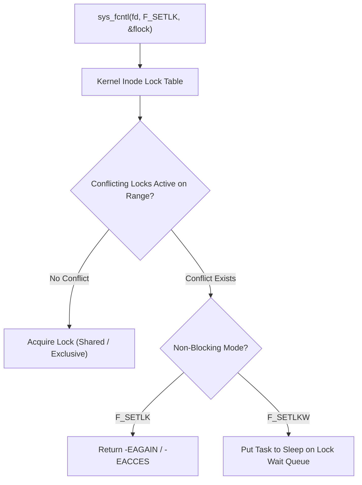

<!-- SPDX-License-Identifier: GPL-2.0-only -->

# File Locking & Concurrency Control

This document specifies POSIX advisory file locking (`fcntl` / `flock`), byte-range locking tables, and reader-writer exclusion in Keira Kernel.

---

## File Locking Architecture



---

## Technical Specifications

| Lock Type | Name | Behavior |
| :--- | :--- | :--- |
| **`F_RDLCK`** | Shared Read Lock | Multiple processes can hold shared read locks concurrently |
| **`F_WRLCK`** | Exclusive Write Lock | Only one process can hold an exclusive write lock; all others blocked |
| **`F_UNLCK`** | Unlock | Releases acquired byte-range lock on the inode |

---

## Core API (`crates/fs/src/lock/mod.rs`)

```rust
pub const F_RDLCK: i16 = 0;
pub const F_WRLCK: i16 = 1;
pub const F_UNLCK: i16 = 2;

/// Apply or query an advisory lock on a file descriptor.
pub unsafe fn apply_file_lock(fd: usize, lock_type: i16, start: u64, len: u64) -> Result<(), &'static str>;
```
