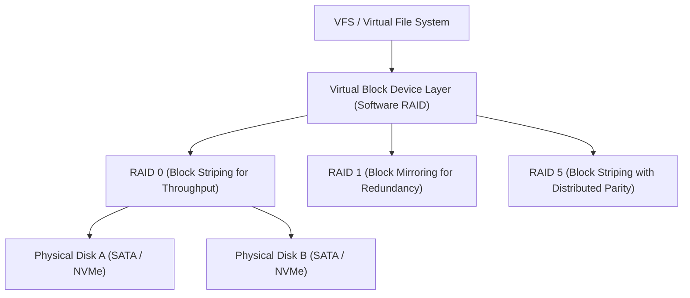

<!-- SPDX-License-Identifier: GPL-2.0-only -->

# Logical Volume Management & Software RAID

This document specifies software RAID volume striping (RAID 0), mirroring (RAID 1), parity recovery (RAID 5), and linear volume concatenation in Keira Kernel.

---

## Software RAID Architecture



---

## Technical Specifications

| RAID Level | Block Strategy | Fault Tolerance | Description |
| :--- | :--- | :--- | :--- |
| **RAID 0** | Striped Blocks | 0 Disk Failures | High-speed concurrent I/O throughput across $N$ disks |
| **RAID 1** | Mirrored Blocks | $N - 1$ Disk Failures | Exact copy on 2 or more disks for high availability |
| **RAID 5** | Striped with XOR Parity | 1 Disk Failure | Distributed parity block calculation for storage efficiency |

---

## Core API (`crates/fs/src/lvm/volume.rs`)

```rust
/// Query registered Logical Volume Management volume groups.
pub fn get_vol_groups() -> &'static [VolumeGroup; 2];

/// Query registered Software RAID arrays.
pub fn get_raid_arrays() -> &'static [RaidArray; 2];

/// Create a named Volume Group with a specified capacity.
pub fn create_vg_named(name: &str, total_mb: u32) -> Result<(), &'static str>;

/// Allocate a Logical Volume within an existing Volume Group.
pub fn create_lv_named(vg_name: &str, lv_name: &str, size_mb: u32, fs_type: &str) -> Result<(), &'static str>;

/// Synchronize data mirror state across member disks in a RAID-1 array.
pub fn sync_raid_array(md_name: &str) -> Result<(), &'static str>;

/// Retrieve global LVM statistics: (active_vgs, total_storage_mb, free_storage_mb, mapped_lvs).
pub fn get_lvm_stats() -> (usize, usize, usize, usize);

/// Retrieve global Software RAID statistics: (active_arrays, synced_arrays).
pub fn get_raid_stats() -> (usize, usize);

/// Dispatch LVM and Software RAID operations from userspace (Syscall 74).
pub unsafe fn sys_raid_lvm(cmd: u64, arg1: u64, arg2: u64) -> i64;
```
