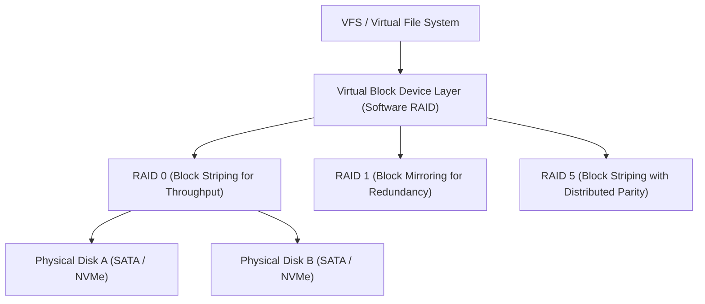

<!-- SPDX-License-Identifier: GPL-2.0-only -->

# Logical Volume Management & Software RAID

This document specifies software RAID volume striping (RAID 0), mirroring (RAID 1), parity recovery (RAID 5), and linear volume concatenation in Keira Kernel.

---

## Software RAID Architecture



---

## Technical Specifications

| RAID Level | Block Strategy | Fault Tolerance | Description |
| :--- | :--- | :--- | :--- |
| **RAID 0** | Striped Blocks | 0 Disk Failures | High-speed concurrent I/O throughput across $N$ disks |
| **RAID 1** | Mirrored Blocks | $N - 1$ Disk Failures | Exact copy on 2 or more disks for high availability |
| **RAID 5** | Striped with XOR Parity | 1 Disk Failure | Distributed parity block calculation for storage efficiency |

---

## Core API (`crates/fs/src/raid/mod.rs`)

```rust
/// Register a new Software RAID virtual block device.
pub unsafe fn create_raid_volume(level: u8, member_disks: &[usize]) -> Result<usize, &'static str>;

/// Read sectors from a virtual RAID volume.
pub unsafe fn raid_read(volume_id: usize, lba: u64, count: u32, buf: &mut [u8]) -> Result<(), &'static str>;
```
