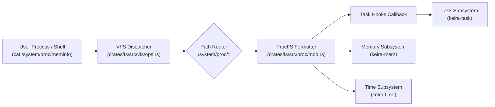

<!-- SPDX-License-Identifier: GPL-2.0-only -->

# Process Information Pseudo-Filesystem (`/system/proc/`)

This document specifies the design, virtual path layout, and formatting schemas of the Keira dynamic process information pseudo-filesystem (`/system/proc/` and `/proc/`).

---

## 1. Overview & Architectural Principles

`procfs` in Keira is an entirely in-memory, synthetic filesystem that exposes runtime kernel statistics, hardware telemetry, and process state through standard virtual filesystem (VFS) read operations.

Key architectural characteristics:
* **Zero Storage Overhead**: No disk blocks, inodes, or FAT/EXT4 directory table entries are consumed. All contents are generated dynamically into caller memory buffers on demand.
* **Dual VFS Mounting**: Mapped at `/system/proc/` (the canonical Keira system root) and aliased to `/proc/` for POSIX and standard C library compatibility.
* **Read-Only Telemetry**: Writing to `/system/proc/*` returns an access denial error (`EACCES` / `EROFS`).
* **Kernel Decoupling**: Process telemetry is obtained via registered function pointer hooks (`register_task_hooks`), preventing circular dependencies between `keira-fs` and `keira-task`.

---

## 2. Global Virtual Nodes

| Virtual Path | Formatter Source | Content Description |
| :--- | :--- | :--- |
| `/system/proc/uptime` | `keira_time::uptime_ms()` | System uptime and idle time in seconds with two decimal digits (`<uptime> <idle>`). |
| `/system/proc/meminfo` | `keira_mem::frame_stats()`, `swap_stats()` | Physical frame statistics and swap telemetry formatted in standard Linux-compatible kB keys (`MemTotal`, `MemFree`, `MemAvailable`, `SwapTotal`, `SwapFree`). |
| `/system/proc/cpuinfo` | CPUID instruction | Processor vendor, family, model name, and CPUID feature flags (`sse`, `sse2`, `avx`, etc.). |
| `/system/proc/version` | Kernel release constants | Kernel release string, target architecture, compiler toolchain, and build timestamp. |
| `/system/proc/loadavg` | Kernel scheduler load | Active execution load average over 1, 5, and 15 minutes, followed by runnable entity ratios and current active PID. |
| `/system/proc/cmdline` | Bootloader multiboot tags | Multiboot boot command line arguments passed to the kernel image. |

---

## 3. Per-Process Virtual Directories (`/system/proc/[pid]/`)

For any existing process ID, `procfs` generates process telemetry dynamically:

### A. `/system/proc/[pid]/status`
Exposes process execution state in standard key-value format:
* `Name`: Image filename or thread title.
* `Umask`: File mode creation mask (`0022`).
* `State`: State indicator (`R (running)`, `S (sleeping)`, `Z (zombie)`).
* `Tgid`: Thread group identifier.
* `Pid`: Process identifier.
* `PPid`: Parent process identifier.
* `Uid`: Real, effective, saved, and filesystem user IDs (`0 0 0 0`).
* `Gid`: Real, effective, saved, and filesystem group IDs (`0 0 0 0`).
* `FDSize`: Number of allocated file descriptor slots (`64`).
* `Threads`: Count of execution threads (`1`).

### B. `/system/proc/[pid]/cmdline`
Returns null-separated (`\0`) or space-separated command-line arguments ingested during process execution via `execve()`.

---

## 4. Kernel Integration & Data Flow

---

## 5. Security & Access Semantics

1. All `/system/proc/` paths are strictly read-only. Calls to `open()` with `O_WRONLY` or `O_RDWR` on procfs paths fail with `EACCES`.
2. Path resolution verifies process existence before formatting process-specific nodes (`[pid]/status`); querying a non-existent PID returns `ENOENT`.
