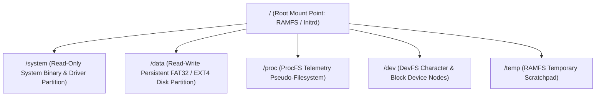

<!-- SPDX-License-Identifier: GPL-2.0-only -->

# VFS Mount Table & Filesystem Registration

The Virtual Filesystem (VFS) mount table maps filesystem drivers to directory prefixes in the unified system path namespace.

---

## 1. Mount Architecture



---

## 2. Mount Point Structure (`crates/fs/src/vfs/mount/`)

```rust
pub struct MountEntry {
    pub mount_point: String,
    pub fs: Arc<dyn FilesystemDriver + Send + Sync>,
    pub flags: MountFlags,
}

pub struct MountTable {
    mounts: Vec<MountEntry>,
}

impl MountTable {
    /// Resolves an absolute path to the longest matching mount entry and relative path.
    pub fn resolve(&self, path: &str) -> Option<(&MountEntry, &str)> {
        self.mounts
            .iter()
            .filter(|m| path.starts_with(&m.mount_point))
            .max_by_key(|m| m.mount_point.len())
            .map(|m| (m, &path[m.mount_point.len()..]))
    }
}
```

---

## 3. Standard Mount Configuration

At boot time, Keira mounts:
* `/`: USTAR archive initrd from GRUB boot modules.
* `/dev`: Pseudo-filesystem exposing character and block devices (`/dev/null`, `/dev/zero`, `/dev/console`, `/dev/sda`).
* `/proc`: Dynamic kernel metrics and process telemetry pseudo-filesystem.
* `/system`: Read-only kernel and userland runtime binaries (`/system/bin`, `/system/lib`, `/system/include`).
* `/data`: Persistent writable partition (FAT32 or EXT4) on detected AHCI/IDE block storage.
