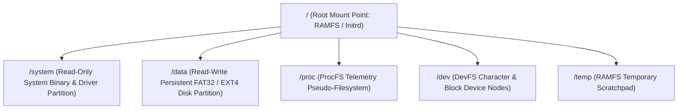

<!-- SPDX-License-Identifier: GPL-2.0-only -->

# VFS Mount Table & Filesystem Registration

The Virtual Filesystem (VFS) mount table maps filesystem drivers to directory prefixes in the unified system path namespace.

---

## 1. Mount Architecture


```mermaid
graph TD
    Root["/ (Root Mount Point: RAMFS / Initrd)"]
    Root --> System["/system (Read-Only System Binary & Driver Partition)"]
    Root --> Data["/data (Read-Write Persistent FAT32 / EXT4 Disk Partition)"]
    Root --> Proc["/proc (ProcFS Telemetry Pseudo-Filesystem)"]
    Root --> Dev["/dev (DevFS Character & Block Device Nodes)"]
    Root --> Temp["/temp (RAMFS Temporary Scratchpad)"]
```

---

## 2. Path Routing & Filesystem Dispatch (`crates/fs/src/vfs/path/router.rs`)

Keira routes unified virtual paths to their corresponding filesystem drivers via `route_path`:

```rust
use crate::vfs::types::FilesystemType;

/// Routes an absolute or relative path to its target filesystem type and relative sub-path.
pub fn route_path(path: &str) -> (&str, FilesystemType) {
    let resolved = resolve_alias_path(path);
    if let Some(rest) = resolved.strip_prefix("/system/proc/") {
        (rest, FilesystemType::Proc)
    } else if let Some(rest) = resolved.strip_prefix("/proc/") {
        (rest, FilesystemType::Proc)
    } else if let Some(rest) = resolved.strip_prefix("/system/dev/") {
        (rest, FilesystemType::Dev)
    } else if let Some(rest) = resolved.strip_prefix("/initrd/") {
        (rest, FilesystemType::Initrd)
    } else {
        (resolved, FilesystemType::Fat)
    }
}
```

---

## 3. Standard Mount Configuration

At boot time, Keira mounts:
* `/`: USTAR archive initrd from GRUB boot modules.
* `/dev`: Pseudo-filesystem exposing character and block devices (`/dev/null`, `/dev/zero`, `/dev/console`, `/dev/sda`).
* `/proc`: Dynamic kernel metrics and process telemetry pseudo-filesystem.
* `/system`: Read-only kernel and userland runtime binaries (`/system/bin`, `/system/lib`, `/system/include`).
* `/data`: Persistent writable partition (FAT32 or EXT4) on detected AHCI/IDE block storage.
