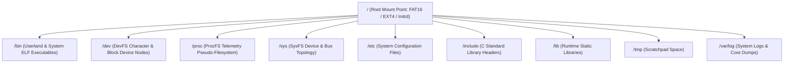

<!-- SPDX-License-Identifier: GPL-2.0-only -->

# VFS Mount Table & Filesystem Registration

The Virtual Filesystem (VFS) mount table maps filesystem drivers to directory prefixes in the unified system path namespace.

---

## 1. Mount Architecture


```mermaid
graph TD
    Root["/ (Root Mount Point: FAT16 / EXT4 / Initrd)"]
    Root --> Bin["/bin (Userland & System ELF Executables)"]
    Root --> Dev["/dev (DevFS Character & Block Device Nodes)"]
    Root --> Proc["/proc (ProcFS Telemetry Pseudo-Filesystem)"]
    Root --> Sys["/sys (SysFS Device & Bus Topology)"]
    Root --> Etc["/etc (System Configuration Files)"]
    Root --> Inc["/include (C Standard Library Headers)"]
    Root --> Lib["/lib (Runtime Static Libraries)"]
    Root --> Tmp["/tmp (Scratchpad Space)"]
    Root --> Var["/var/log (System Logs & Core Dumps)"]
```

---

## 2. Path Routing & Filesystem Dispatch (`crates/fs/src/vfs/path/router.rs`)

Keira routes unified virtual paths to their corresponding filesystem drivers via `route_path`:

```rust
use crate::vfs::types::FilesystemType;

/// Routes an absolute or relative path to its target filesystem type and relative sub-path.
pub fn route_path(path: &str) -> (&str, FilesystemType) {
    let resolved = resolve_alias_path(path);
    if let Some(rest) = resolved.strip_prefix("/proc/") {
        (rest, FilesystemType::Proc)
    } else if let Some(rest) = resolved.strip_prefix("/dev/") {
        (rest, FilesystemType::Dev)
    } else if let Some(rest) = resolved.strip_prefix("/initrd/") {
        (rest, FilesystemType::Initrd)
    } else {
        (resolved, FilesystemType::Fat)
    }
}
```

---

## 3. Standard Mount Configuration

At boot time, Keira mounts:
* `/`: Root storage filesystem (FAT16 or EXT4) on detected AHCI/IDE/NVMe block storage.
* `/bin`: Core system and userland ELF binaries.
* `/dev`: Pseudo-filesystem exposing character and block devices (`/dev/null`, `/dev/zero`, `/dev/tty`, `/dev/sda`).
* `/proc`: Dynamic kernel metrics and process telemetry pseudo-filesystem (`/proc/uptime`, `/proc/meminfo`, `/proc/cpuinfo`).
* `/sys`: Hardware driver hierarchy and subsystem telemetry.
* `/etc`: System configuration files (`/etc/grub.cfg`, `/etc/kernel.cfg`, `/etc/hostname`).
* `/include`: Freestanding C standard library headers.
* `/lib`: Static C runtime library archives and source stubs.
* `/tmp`: Temporary runtime scratch files and build buffers.
* `/var/log`: System event logs, boot records and core dumps.
