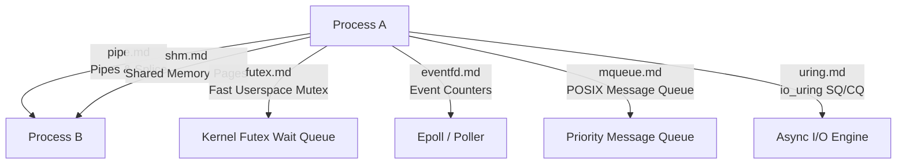

<!-- SPDX-License-Identifier: GPL-2.0-only -->

# Keira Kernel Inter-Process Communication (IPC)

The `ipc` subsystem provides high-throughput inter-process communication primitives, asynchronous event signaling, and zero-copy data streaming.

---

## Subsystem Architecture

---

## IPC Module Index

| Document | Component | Description |
| :--- | :--- | :--- |
| [`pipe.md`](pipe.md) | Anonymous Pipes & Splice | Ring buffer pipe channels and zero-copy `sys_splice` / `sys_vmsplice` data movement |
| [`shm.md`](shm.md) | POSIX Shared Memory | Cross-task shared virtual memory pages with page-table remapping |
| [`futex.md`](futex.md) | Fast Userspace Mutex | Low-overhead userland synchronization wait queues (`FUTEX_WAIT`, `FUTEX_WAKE`) |
| [`eventfd.md`](eventfd.md) | Event Descriptors | 64-bit event counter notification channels for asynchronous event loops |
| [`mqueue.md`](mqueue.md) | POSIX Message Queues | Priority-ordered inter-task message passing queues |
| [`uring.md`](uring.md) | Asynchronous I/O (`io_uring`) | Lockless submission queue (SQ) and completion queue (CQ) ring buffers |
