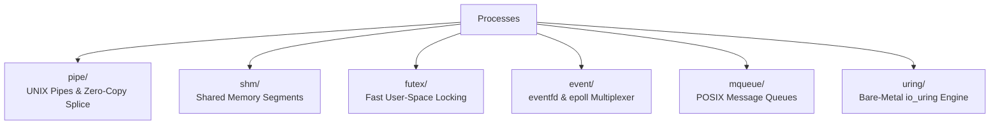

<!-- SPDX-License-Identifier: GPL-2.0-only -->

# Inter-Process Communication (IPC) Subsystems

The `ipc` domain encompasses anonymous pipes, zero-copy splice, POSIX message queues, shared memory, futexes, event multiplexing, and the `io_uring` asynchronous engine.

---

## IPC Architecture

---

## Submodule Index

| Submodule | Focus Area | Description |
| :--- | :--- | :--- |
| [`pipe/`](pipe/README.md) | Pipes & Splice | Anonymous FIFO pipes and zero-copy page splicing |
| [`shm/`](shm/README.md) | Shared Memory | Shared physical memory segment mapping between tasks |
| [`futex/`](futex/README.md) | Fast Mutexes | User-space atomic synchronization with kernel sleep/wake |
| [`event/`](event/README.md) | Event Notification | Inter-thread `eventfd` signaling and `epoll` multiplexing |
| [`mqueue/`](mqueue/README.md) | Message Queues | Priority-ordered POSIX message queue system |
| [`uring/`](uring/README.md) | Asynchronous I/O | Submission/Completion queue bare-metal `io_uring` |
