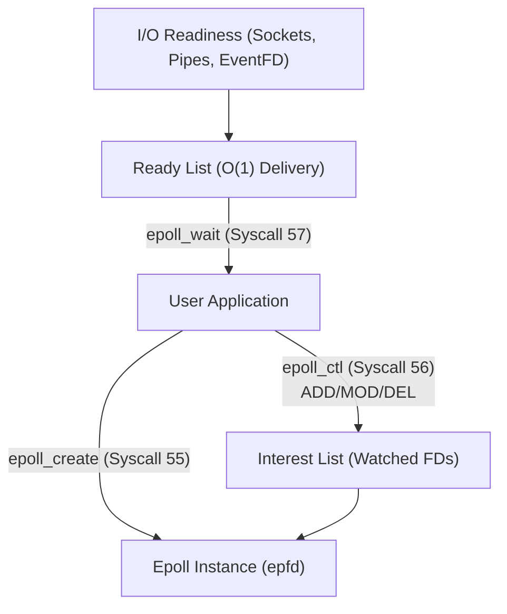

<!-- SPDX-License-Identifier: GPL-2.0-only -->

# `epoll` Scalable I/O Event Multiplexing

This document specifies the kernel-level scalable I/O event multiplexing facility (`epoll`) used for edge-triggered and level-triggered monitoring of multiple file descriptors in Keira Kernel.

---

## Architecture Overview



---

## Technical Specifications

| Parameter | Specification | Description |
| :--- | :--- | :--- |
| **Max Instances** | 8 concurrent epoll instances | System-wide epoll table capacity |
| **Max Watched FDs** | 32 descriptors per instance | Static interest list entries per epoll set |
| **Supported Events** | `EPOLLIN`, `EPOLLOUT`, `EPOLLERR`, `EPOLLHUP`, `EPOLLET` | Standard Linux event masks and flags |
| **Syscall Numbers** | 55 (`epoll_create`), 56 (`epoll_ctl`), 57 (`epoll_wait`) | Kernel system call dispatcher integration |

---

## Core API (`crates/ipc/src/event/epoll.rs`)

```rust
pub const EPOLL_CTL_ADD: i32 = 1;
pub const EPOLL_CTL_DEL: i32 = 2;
pub const EPOLL_CTL_MOD: i32 = 3;

pub const EPOLLIN: u32 = 0x0001;
pub const EPOLLOUT: u32 = 0x0004;
pub const EPOLLERR: u32 = 0x0008;
pub const EPOLLHUP: u32 = 0x0010;
pub const EPOLLET: u32 = 1 << 31;

/// Create a new epoll file descriptor instance.
pub fn epoll_create(size: i32) -> Result<i32, &'static str>;

/// Control interface for an epoll descriptor: add, modify, or delete watched file descriptors.
pub fn epoll_ctl(epfd: i32, op: i32, fd: i32, event: &EpollEvent) -> Result<(), &'static str>;

/// Wait for I/O events on an epoll instance.
pub fn epoll_wait(epfd: i32, events: &mut [EpollEvent], maxevents: i32, timeout: i32) -> Result<usize, &'static str>;

/// Close and release an active epoll instance.
pub fn epoll_close(epfd: i32) -> Result<(), &'static str>;
```

---

## Socket Descriptor Readiness Integration

When evaluating interest list events in `sys_epoll_wait`, the kernel dynamically interrogates file descriptor readiness via `check_fd_readiness`:

1. **Descriptor Dispatching**: The epoll subsystem accesses the current task's file descriptor table (`t.fds`). Descriptors marked with `is_socket == true` are routed to the network subsystem.
2. **Read Readiness (`EPOLLIN`)**:
   - Polled using `keira_net::socket::socket_is_readable(socket_id)`.
   - Fires when pending data resides in the socket's internal receive buffer (`rx_len > 0`), or when the socket has transitioned to a `Closed` / `Error` state (signaling EOF / disconnection).
3. **Write Readiness (`EPOLLOUT`)**:
   - Polled using `keira_net::socket::socket_is_writable(socket_id)`.
   - Fires when the socket is in a valid transmission state (`Connected` or `Listening`).
4. **Non-Blocking Operation**:
   - When combined with non-blocking socket flags (`nonblocking = true`), epoll enables asynchronous event loops without kernel thread preemption or blocking syscall stalls.
