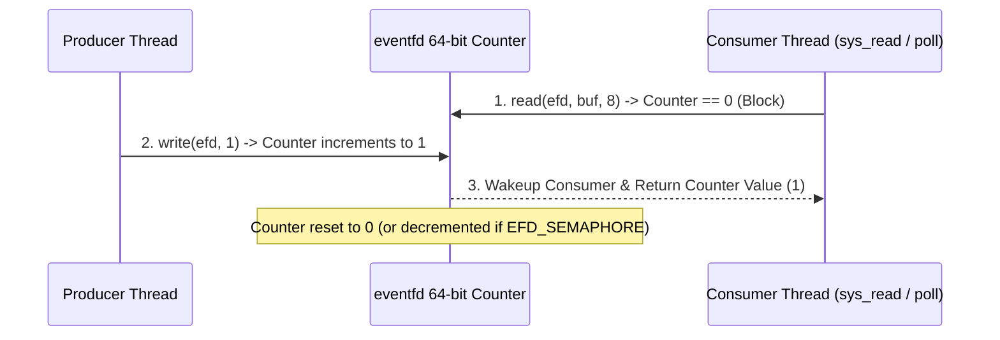

<!-- SPDX-License-Identifier: GPL-2.0-only -->

# `eventfd` Inter-Process Event Notification

This document specifies the 64-bit atomic counter event notification mechanism (`eventfd`) used for lightweight user-kernel and inter-thread signaling in Keira Kernel.

---

## Eventfd Notification Flow



---

## Technical Specifications

| Parameter | Specification | Description |
| :--- | :--- | :--- |
| **Counter Size** | 64-bit Unsigned Integer (`u64`) | Atomic integer storage |
| **Flags** | `EFD_CLOEXEC`, `EFD_NONBLOCK`, `EFD_SEMAPHORE` | Standard Linux eventfd flags |
| **Max Value** | `0xFFFF_FFFF_FFFF_FFFE` | Maximum counter threshold before blocking writers |

---

## Core API (`crates/ipc/src/event/eventfd.rs`)

```rust
pub const EFD_SEMAPHORE: u32 = 1;
pub const EFD_CLOEXEC: u32 = 0o2000000;
pub const EFD_NONBLOCK: u32 = 0o4000;

/// Create a new eventfd file descriptor with an initial 64-bit counter value.
pub unsafe fn create_eventfd(init_val: u64, flags: u32) -> Result<u32, &'static str>;

/// Read and consume counter value from an EventFD descriptor.
pub unsafe fn read_eventfd(id: u32) -> Result<u64, &'static str>;

/// Write integer increment to eventfd counter.
pub unsafe fn write_eventfd(id: u32, val: u64) -> Result<(), &'static str>;

/// Close and deallocate an EventFD descriptor.
pub unsafe fn close_eventfd(id: u32) -> Result<(), &'static str>;
```
