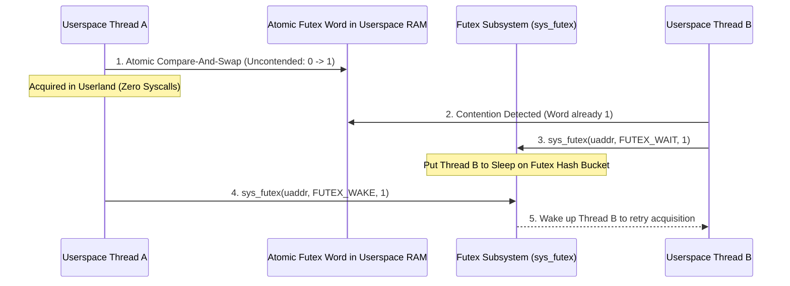

<!-- SPDX-License-Identifier: GPL-2.0-only -->

# Fast Userspace Mutex (`futex`) Subsystem

This document specifies the Fast Userspace Mutex (futex) engine, hash-bucket wait queues, and atomic lock contention resolution in Keira Kernel.

---

## Futex Synchronization Flow



---

## Technical Specifications

| Parameter | Specification | Description |
| :--- | :--- | :--- |
| **Hash Buckets** | 64 Futex Wait Queues | Hash-indexed wait queues by physical page address |
| **Operations** | `FUTEX_WAIT`, `FUTEX_WAKE`, `FUTEX_REQUEUE` | Standard Linux futex operations |
| **Lock Latency** | Sub-microsecond uncontended | Zero kernel transitions when no contention |

---

## Core API (`crates/ipc/src/futex/mod.rs`)

```rust
pub const FUTEX_WAIT: u32 = 0;
pub const FUTEX_WAKE: u32 = 1;
pub const FUTEX_REQUEUE: u32 = 3;

/// Handle futex system call for userspace locking primitives.
pub unsafe fn sys_futex(
    uaddr: usize,
    futex_op: u32,
    val: u32,
    timeout_ms: u64,
) -> Result<i32, &'static str>;
```
