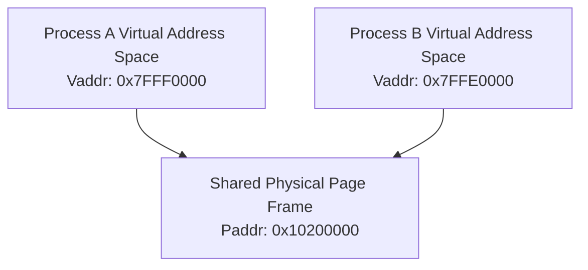

<!-- SPDX-License-Identifier: GPL-2.0-only -->

# POSIX Shared Memory Pages

This document details cross-process shared memory regions mapped across isolated task virtual address spaces.

---

## Memory Remapping Design



---

## Core API (`crates/ipc/src/shm/segment.rs`)

```rust
// Shared Memory Management
pub unsafe fn create_shm(size: usize) -> Result<usize, &'static str>;
pub unsafe fn get_shm_frame(shmid: usize) -> Option<u64>;
pub unsafe fn remove_shm(id: u32) -> Result<(), &'static str>;
pub unsafe fn get_shm_table() -> &'static [ShmSegment];

// Counting Semaphore Management
pub unsafe fn create_sem(key: u32, init_val: i32) -> Result<u32, &'static str>;
pub unsafe fn remove_sem(id: u32) -> Result<(), &'static str>;
pub unsafe fn get_sem_table() -> &'static [Semaphore];

// System Call Vector 75
pub unsafe fn sys_shm_sem(cmd: u32, arg1: u64, arg2: u64) -> Result<u64, &'static str>;
```

---

## Shell Integration

Inspect and manage shared memory and semaphores using native shell commands:
- `ipcs -m`: Query active shared memory segments.
- `ipcs -s`: Query active semaphore arrays.
- `ipcrm -m <shmid>`: Remove shared memory segment by ID.
- `ipcrm -s <semid>`: Remove semaphore array by ID.
