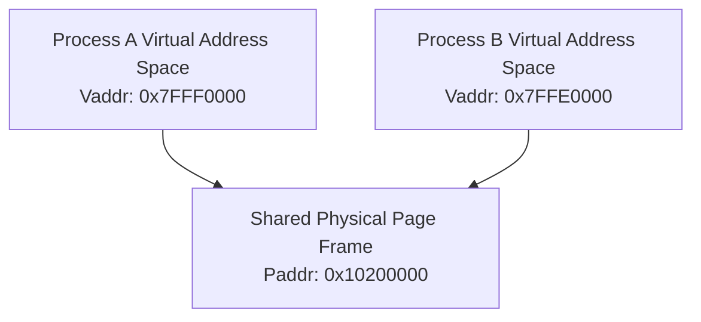

<!-- SPDX-License-Identifier: GPL-2.0-only -->

# POSIX Shared Memory Pages

This document details cross-process shared memory regions mapped across isolated task virtual address spaces.

---

## Memory Remapping Design



---

## Core API (`crates/ipc/src/shm.rs`)

```rust
pub fn sys_shm_open(name: *const u8, flags: i32, mode: u32) -> Result<u32, &'static str>;
pub fn sys_shm_mmap(shm_id: u32, size: usize) -> Result<usize, &'static str>;
pub fn sys_shm_unlink(name: *const u8) -> Result<(), &'static str>;
```
