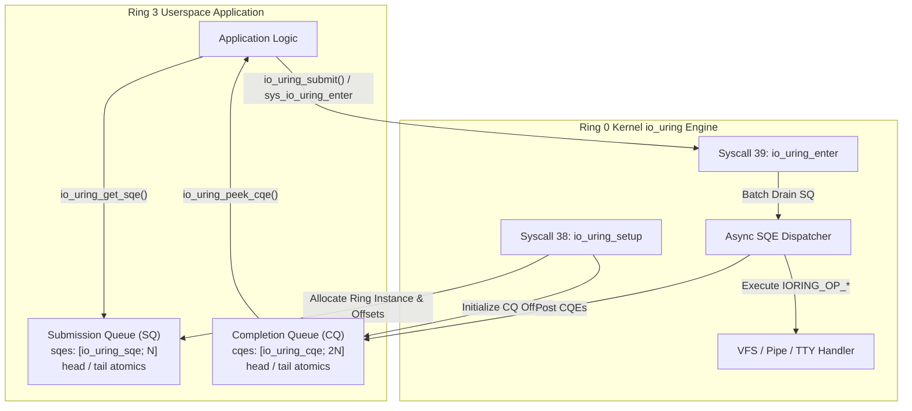

<!-- SPDX-License-Identifier: GPL-2.0-only -->

# Asynchronous I/O Ring Queues (`io_uring`)

This document details the bare-metal, lockless Submission Queue (SQ) and Completion Queue (CQ) ring buffer architecture implemented in Keira Kernel, maintaining Linux ABI compatibility with zero stubs.

---

## Subsystem Architecture

Keira's `io_uring` subsystem provides an asynchronous, zero-copy system call interface. Applications submit I/O requests into a lockless Submission Queue (SQ) and harvest completed results from a lockless Completion Queue (CQ) without requiring blocking kernel traps per request.



---

## Ring Buffer Data Structures & Layout

The submission and completion queues are designed for lockless single-producer single-consumer (SPSC) ring concurrency across user-space and kernel contexts:

### 1. Submission Queue Entry (`struct io_uring_sqe`)
Fixed 64-byte layout matching Linux ABI:
```c
struct io_uring_sqe {
    uint8_t   opcode;        /* IORING_OP_* operation code */
    uint8_t   flags;         /* IOSQE_* submission flags */
    uint16_t  ioprio;        /* I/O priority level */
    int32_t   fd;            /* Target file descriptor */
    uint64_t  off;           /* Target file offset */
    uint64_t  addr;          /* User pointer to data buffer */
    uint32_t  len;           /* Buffer length in bytes */
    uint32_t  rw_flags;      /* Read/Write modifier flags */
    uint64_t  user_data;     /* Application tag returned in CQE */
    uint16_t  buf_index;     /* Registered buffer index */
    uint16_t  personality;   /* Credential personality ID */
    int32_t   splice_fd_in;  /* Source fd for splice operations */
    uint64_t  pad2[2];       /* 16-byte alignment padding */
};
```

### 2. Completion Queue Entry (`struct io_uring_cqe`)
Fixed 16-byte layout matching Linux ABI:
```c
struct io_uring_cqe {
    uint64_t  user_data;     /* Echoes sqe->user_data */
    int32_t   res;           /* Syscall return code (bytes or -errno) */
    uint32_t  flags;         /* Operation completion flags */
};
```

### 3. Parameters & Offsets (`struct io_uring_params`)
Returned by `io_uring_setup` to describe ring geometry and addresses:
- `sq_entries`: Submission queue capacity (power-of-two, e.g. 16, 32, 64).
- `cq_entries`: Completion queue capacity (typically `2 * sq_entries`).
- `features`: Feature flags supported by kernel (`IORING_FEAT_SINGLE_MMAP`, `IORING_FEAT_NODROP`, `IORING_FEAT_SUBMIT_STABLE`).
- `sq_off` / `cq_off`: Ring buffer metadata offsets and buffer addresses.

---

## Supported Opcodes

| Opcode ID | Constant | Description | Implementation Status |
| :--- | :--- | :--- | :--- |
| `0` | `IORING_OP_NOP` | No-operation diagnostic barrier (CQE returns 0) | `[Active]` |
| `3` | `IORING_OP_FSYNC` | Flush filesystem block cache to disk (`flush_dirty_sectors`) | `[Active]` |
| `19` | `IORING_OP_CLOSE` | Close file or pipe descriptor (`fd`) | `[Active]` |
| `22` | `IORING_OP_READ` | Asynchronous read from stdin (PS/2 / UART), pipe, or VFS file | `[Active]` |
| `23` | `IORING_OP_WRITE` | Asynchronous write to stdout (VGA / UART), pipe, or VFS file | `[Active]` |

---

## System Calls

### Syscall 38: `io_uring_setup`
```c
int io_uring_setup(uint32_t entries, struct io_uring_params *params);
```
- **Arguments**:
  - `entries`: Number of SQ entries requested (clamped between 1 and 64).
  - `params`: Pointer to `struct io_uring_params` initialized by caller.
- **Returns**: File descriptor (`ring_fd`) on success, or `-ENOMEM` / `-EINVAL` / `-EFAULT` on error.
- **Kernel Security**: Validates `params` pointer using `validate_user_ptr` to ensure non-kernel writeable user memory.

### Syscall 39: `io_uring_enter`
```c
int io_uring_enter(int fd, uint32_t to_submit, uint32_t min_complete, uint32_t flags);
```
- **Arguments**:
  - `fd`: Ring file descriptor returned by `io_uring_setup`.
  - `to_submit`: Number of queued SQEs to drain and process.
  - `min_complete`: Minimum completed operations required before returning.
  - `flags`: Enter flags (`IORING_ENTER_GETEVENTS`, etc.).
- **Returns**: Total number of successfully processed requests on success, or `-EINVAL` on error.

---

## Userland C Library API (`<sys/io_uring.h>`)

Keira's freestanding C standard library provides high-level helpers in `user/lib/uring/uring.c`:

```c
#include <sys/io_uring.h>

struct io_uring ring;

/* Initialize 16-entry ring */
int ret = io_uring_queue_init(16, &ring, 0);

/* Obtain and populate next SQE */
struct io_uring_sqe *sqe = io_uring_get_sqe(&ring);
sqe->opcode = IORING_OP_NOP;
sqe->user_data = 0x1234;

/* Submit batch to kernel */
int submitted = io_uring_submit(&ring);

/* Peek completion result */
struct io_uring_cqe *cqe = NULL;
if (io_uring_peek_cqe(&ring, &cqe) == 0 && cqe) {
    printf("Result: %d, Data: 0x%llx\n", cqe->res, cqe->user_data);
    io_uring_cqe_seen(&ring, cqe);
}

/* Teardown ring instance */
io_uring_queue_exit(&ring);
```

---

## Shell Diagnostic Command (`ipcs -u`)

Active `io_uring` ring instances and telemetry counters can be inspected live via the `ipcs` utility:

```bash
keira> ipcs -u
------ io_uring Ring Instances ------
ID   SQ_ENTRIES  CQ_ENTRIES  SUBMITTED   COMPLETED   FLAGS
0    16          32          2           2           0x0
```
