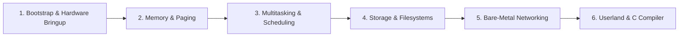

<!-- SPDX-License-Identifier: GPL-2.0-only -->

# The Keira Learning Journey

The Keira project is conceived as an exploratory systems programming journey—building an entire operating system from bare silicon to a native Ring 3 C toolchain.

---

## Journey Milestones

---

## Milestone Chapters

| Milestone | Chapter Document | Topics Covered |
| :--- | :--- | :--- |
| **Milestone 1** | [`bootstrap.md`](bootstrap.md) | Multiboot2, GDT, TSS, IDT, PIC/APIC, and 16-bit AP trampolines |
| **Milestone 2** | [`memory.md`](memory.md) | Physical frame allocator, 4-level paging, kernel heap, and swap |
| **Milestone 3** | [`multitasking.md`](multitasking.md) | Context switching, preemptive scheduler, cgroups, and signals |
| **Milestone 4** | [`storage_vfs.md`](storage_vfs.md) | VFS architecture, FAT16, EXT4, USTAR initrd, and block cache |
| **Milestone 5** | [`networking.md`](networking.md) | Bare-metal TCP/IP stack, e1000 driver, sockets, TLS 1.3 |
| **Milestone 6** | [`userland_compiler.md`](userland_compiler.md) | Ring 3 userland, libc runtime, and native in-kernel KCC compiler |
