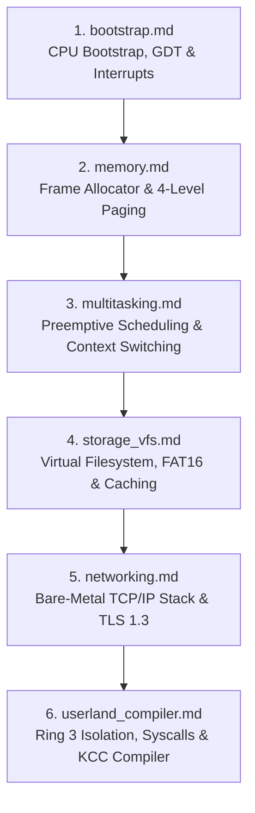

<!-- SPDX-License-Identifier: GPL-2.0-only -->

# The Keira Kernel Learning Journey

> *"The best way to truly understand how an operating system works is not merely to read about it, but to build one from the very first instruction."*

This module is an open engineering journal and educational roadmap detailing the design decisions, challenges, and lessons learned while developing **Keira Kernel** from scratch in safe Rust, C, and Assembly.

---

## Learning Milestones Index

---

## Milestone Catalog

| Milestone | Document | Focus Area & Key Takeaways |
| :--- | :--- | :--- |
| **Milestone 1** | [`bootstrap.md`](bootstrap.md) | Multiboot2, 32-bit/64-bit trampolines, GDT, TSS, and IDT exception handling |
| **Milestone 2** | [`memory.md`](memory.md) | Physical frame bitmap (PMM), 4-level paging (VMM), and bump/slab heap design |
| **Milestone 3** | [`multitasking.md`](multitasking.md) | Preemptive timer ticks, task state machines, context switching, and spinlocks |
| **Milestone 4** | [`storage_vfs.md`](storage_vfs.md) | Unified VFS traits, FAT12/16/32, EXT4 parsing, and LRU sector caching |
| **Milestone 5** | [`networking.md`](networking.md) | Intel e1000/RTL8139 drivers, ARP, IPv4, TCP 3-way handshakes, and TLS 1.3 |
| **Milestone 6** | [`userland_compiler.md`](userland_compiler.md) | Ring 3 userland privilege separation, 62 syscalls, and native C compiler |
