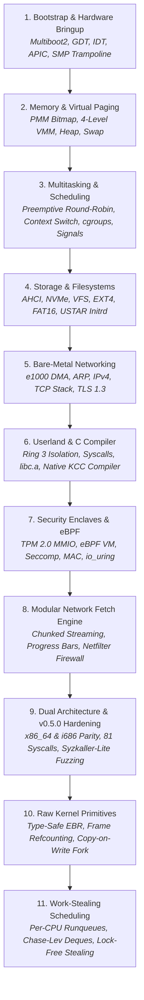

<!-- SPDX-License-Identifier: GPL-2.0-only -->

# The Keira Learning Journey

The Keira project is conceived as an exploratory systems programming journey—building an entire freestanding monolithic kernel from scratch on bare silicon to a native Ring 3 C toolchain and hardened multi-architecture operating environment.

---

## Architecture Milestone Timeline

```mermaid
graph TD
    M1["1. Bootstrap & Hardware Bringup<br/><i>Multiboot2, GDT, IDT, APIC, SMP Trampoline</i>"] --> M2["2. Memory & Virtual Paging<br/><i>PMM Bitmap, 4-Level VMM, Heap, Swap</i>"]
    M2 --> M3["3. Multitasking & Scheduling<br/><i>Preemptive Round-Robin, Context Switch, cgroups, Signals</i>"]
    M3 --> M4["4. Storage & Filesystems<br/><i>AHCI, NVMe, VFS, EXT4, FAT16, USTAR Initrd</i>"]
    M4 --> M5["5. Bare-Metal Networking<br/><i>e1000 DMA, ARP, IPv4, TCP Stack, TLS 1.3</i>"]
    M5 --> M6["6. Userland & C Compiler<br/><i>Ring 3 Isolation, Syscalls, libc.a, Native KCC Compiler</i>"]
    M6 --> M7["7. Security Enclaves & eBPF<br/><i>TPM 2.0 MMIO, eBPF VM, Seccomp, MAC, io_uring</i>"]
    M7 --> M8["8. Modular Network Fetch Engine<br/><i>Chunked Streaming, Progress Bars, Netfilter Firewall</i>"]
    M8 --> M9["9. Dual Architecture & v0.5.0 Hardening<br/><i>x86_64 & i686 Parity, 81 Syscalls, Syzkaller-Lite Fuzzing</i>"]
    M9 --> M10["10. Raw Kernel Primitives<br/><i>Type-Safe EBR, Frame Refcounting, Copy-on-Write Fork</i>"]
    M10 --> M11["11. Work-Stealing Scheduling<br/><i>Per-CPU Runqueues, Chase-Lev Deques, Lock-Free Stealing</i>"]
```

---

## Milestone Chapters

| Milestone | Chapter Document | Target Version | Primary Focus Areas |
| :--- | :--- | :--- | :--- |
| **Milestone 1** | [`bootstrap.md`](bootstrap.md) | `v0.1.0` | Multiboot2 handshake, GDT, TSS, IDT, APIC, and 16-bit real-mode AP trampolines |
| **Milestone 2** | [`memory.md`](memory.md) | `v0.1.0` | Physical frame allocator, 4-level paging, segregated free-list heap, and swap |
| **Milestone 3** | [`multitasking.md`](multitasking.md) | `v0.2.0` | Preemptive timer scheduling, PCB context switching, cgroups, and POSIX signals |
| **Milestone 4** | [`storage_vfs.md`](storage_vfs.md) | `v0.2.0` | VFS architecture, AHCI SATA, NVMe, FAT16/32, EXT4 extents, and sector LRU cache |
| **Milestone 5** | [`networking.md`](networking.md) | `v0.3.0` | Intel e1000 DMA rings, ARP cache, IPv4, TCP state machine, and TLS 1.3 socket engine |
| **Milestone 6** | [`userland_compiler.md`](userland_compiler.md) | `v0.3.0` | Ring 3 userland isolation, freestanding libc.a runtime, and native in-kernel KCC C compiler |
| **Milestone 7** | [`security_ebpf.md`](security_ebpf.md) | `v0.4.0` | TPM 2.0 enclave PCR measurements, in-kernel eBPF virtual machine, and asynchronous io_uring |
| **Milestone 8** | [`network_engine.md`](network_engine.md) | `v0.4.0` | Modular network fetch engine, chunked streaming, progress bars, and Netfilter firewall |
| **Milestone 9** | [`hardening_v050.md`](hardening_v050.md) | `v0.5.0` | Dual-architecture x86_64/i686 parity, 81 syscall vectors, and Syzkaller-Lite fuzzing defense |
| **Milestone 10** | [`raw_kernel_v060.md`](raw_kernel_v060.md) | `v0.6.0` | Type-Safe Epoch-Based Reclamation (EBR), physical frame reference counting, and Copy-on-Write (COW) |
| **Milestone 11** | [`work_stealing_v060.md`](work_stealing_v060.md) | `v0.6.0` | Per-CPU lock-free work-stealing scheduler, Chase-Lev deques, EBR pinning, and decentralized task balancer |

---

## Core Engineering Principles

Throughout all milestones, Keira enforces five fundamental invariants:

1. **Pure Freestanding Architecture (`#![no_std]`)**: Zero host operating system libraries, zero foreign runtime bloat, and pure memory management from first principles.
2. **Defensive Kernel Programming**: Complete absence of `unwrap()` and `panic!` calls in kernel-space runtime paths, relying on explicit `Result<T, &'static str>` or custom error enums.
3. **Symmetrical Dual-Architecture Support**: Native support for modern 64-bit Long Mode (`x86_64`) and legacy 32-bit Protected Mode (`i686`) across all core subsystems.
4. **Hardware Verification First**: Every feature is rigorously verified against real and simulated silicon via automated multi-architecture QEMU test harnesses.
5. **Austere Console Palette**: Strictly compliant with the standard monochrome console standard (`White`, `LightGrey`, `LightGreen`, `Yellow`, `LightRed`).
