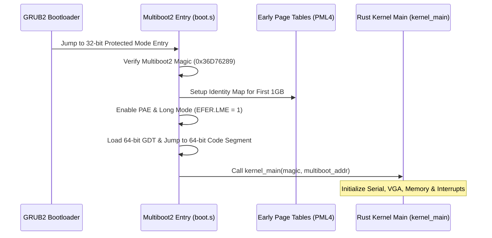

<!-- SPDX-License-Identifier: GPL-2.0-only -->

# Development Journey: The Bootstrap Phase

This document chronicles the design, challenges, and implementation of early Multiboot2 bootloading, GDT/IDT descriptor setup, and 64-bit Long Mode transition in Keira Kernel.

---

## Bootstrap Sequence

---

## Key Milestones & Engineering Challenges

1. **Multiboot2 Compliance**: Implemented compliant 64-bit and 32-bit Multiboot2 headers supporting memory maps, linear framebuffers, and initrd boot modules.
2. **Long Mode Transition**: Configured 4-level page tables (PML4, PDPT, PD, PT) with 2MB huge pages to map the kernel seamlessly into higher-half virtual memory.
3. **Interrupt Vector Table**: Initialized IDT with 256 vector gates, capturing double faults, general protection faults, and hardware IRQs without triple faults.
