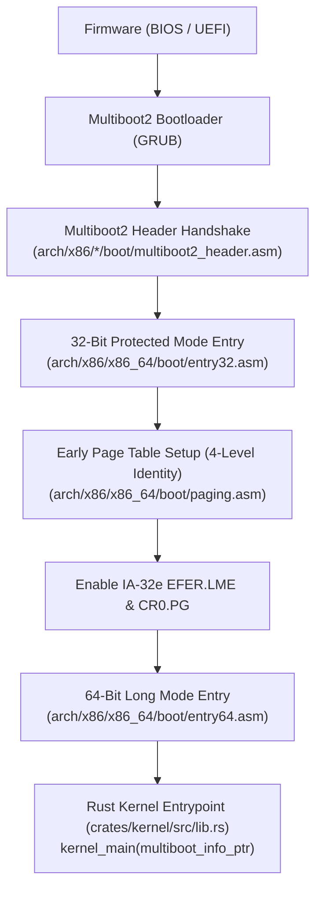

<!-- SPDX-License-Identifier: GPL-2.0-only -->

# Journey Milestone 1: Bare-Metal Bootstrap & CPU Bringup

Milestone 1 marks the foundational achievement of the Keira learning journey: transitioning the CPU from firmware bootloader control to a fully configured, multi-core 64-bit Long Mode and 32-bit Protected Mode kernel execution environment.

---

## 1. Architectural Overview & Boot Pipeline


```mermaid
graph TD
    BIOS["Firmware (BIOS / UEFI)"] --> GRUB["Multiboot2 Bootloader (GRUB)"]
    GRUB --> Handshake["Multiboot2 Header Handshake<br/>(arch/x86/*/boot/multiboot2_header.asm)"]
    Handshake --> Entry32["32-Bit Protected Mode Entry<br/>(arch/x86/x86_64/boot/entry32.asm)"]
    Entry32 --> Paging["Early Page Table Setup (4-Level Identity)<br/>(arch/x86/x86_64/boot/paging.asm)"]
    Paging --> LongMode["Enable IA-32e EFER.LME & CR0.PG"]
    LongMode --> Entry64["64-Bit Long Mode Entry<br/>(arch/x86/x86_64/boot/entry64.asm)"]
    Entry64 --> KernelMain["Rust Kernel Entrypoint (crates/kernel/src/lib.rs)<br/>kernel_main(multiboot_info_ptr)"]
```

---

## 2. Core Engineering Challenges & Solutions

### A. Multiboot2 Specification Compliance
When GRUB loads the kernel ELF binary into physical RAM, it passes the physical address of the Multiboot2 Information Structure (MIS) in register `EBX` and the magic value `0x36D76289` in `EAX`.

Keira's early assembly validates this signature immediately:
```nasm
cmp eax, 0x36D76289
jne .no_multiboot2
```

The kernel then parses the contiguous chain of Multiboot2 tags:
- **Type 4 (Basic Memory Info)**: Lower and upper physical memory limits.
- **Type 6 (Memory Map)**: Complete list of usable RAM regions, ACPI reclaimable zones, and reserved memory ranges.
- **Type 8 (Framebuffer)**: Linear framebuffer physical address, resolution (1280x800), color depth, and pitch.
- **Type 3 (Module)**: Physical bounds of the bundled USTAR `initrd.tar` archive.

### B. Dual-Architecture Symmetrical Entry
To maintain strict dual-target parity, Keira provides tailored boot paths:
1. **`x86_64` (64-Bit Target)**:
   - Starts in 32-bit protected mode (`entry32.asm`).
   - Builds 4-level identity page tables (`PML4`, `PDPT`, `PD`, `PT`) covering the lower 1 GiB.
   - Sets the `PAE` bit in `CR4` and `LME` (Long Mode Enable) in `IA32_EFER` MSR (`0xC0000080`).
   - Enables `CR0.PG` and performs a far jump to the 64-bit code descriptor in GDT.
2. **`i686` (32-Bit Target)**:
   - Executes directly in protected mode without 64-bit transition overhead.
   - Configures a standard 2-level paging directory and table layout.

### C. GDT, TSS, and IDT Vectoring
- **Global Descriptor Table (GDT)**: Flat segmentation model defining Kernel Code (`0x08`), Kernel Data (`0x10`), User Code (`0x18` or `0x1B` Ring 3), User Data (`0x20` or `0x23` Ring 3), and Task State Segment (`0x28`).
- **Task State Segment (TSS)**: Configured with dedicated Interrupt Stack Tables (`IST1` for double fault, `IST2` for NMI) and the privileged Ring 0 stack pointer (`RSP0`) for safe privilege transitions.
- **Interrupt Descriptor Table (IDT)**: Complete 256-gate table mapping CPU exceptions (`0..31`), legacy IRQs (`32..47`), Local APIC timer (`0x20`), and software system call vectors.

### D. Symmetric Multiprocessing (SMP) Bringup
Waking secondary Application Processors (APs) from hardware reset requires navigating real-mode silicon constraints:
1. An AP bootstrap trampoline is placed at physical page `0x8000` (within 16-bit real mode addressable space).
2. The Bootstrap Processor (BSP) issues a Local APIC **INIT IPI** to secondary cores:
   ```text
   ICR Low = 0x000C4500 (INIT, Assert, Edge)
   ```
3. After a 10 ms delay, the BSP sends two **Startup IPIs (SIPI)** pointing to the trampoline vector (`0x08` for `0x8000`):
   ```text
   ICR Low = 0x000C4608 (SIPI, Vector 0x08)
   ```
4. Secondary cores wake in real mode, enable protected mode, load the shared GDT, enable paging, and jump into the synchronized Rust AP entrypoint using an atomic spin-barrier.

---

## 3. Real-Time Hardware Telemetry Verification

The milestone is validated directly via the Keira shell:

```text
keira:/system# system
System Specifications & Kernel Information
  Kernel Version : Keira Kernel v0.5.0
  Architecture   : x86_64 Long Mode (Freestanding)
  CPU Vendor     : AuthenticAMD
  System Uptime  : 0h 0m 2s 888ms
  Heap Memory    : 0 KB / 1024 KB
  PCI Devices    : 5 detected

keira:/system# cpu
Processor & Architecture Telemetry:
  Vendor String : AuthenticAMD
  Architecture  : x86_64 Long Mode (64-bit)
  Feature Flags : SSE2, AVX2, VMX/SVM, AES-NI, NX-Bit, KASLR
  TSC Cycles    : 2418920154
  Context Switch: 0 switches
  Timer Ticks   : 1942 ticks (1000 Hz)
  Interrupts    : 0 IRQ events
  Core Temp     : 42 deg C (DTS)

keira:/system# smp
Symmetric Multiprocessing (SMP) Hardware Topology:
  Total Online Cores : 2

CORE   APIC ID   ROLE   STATUS
----   -------   ----   ------
Core 0  0x0       BSP    Online (Active)
Core 1  0x1       AP     Online (Active)
```
