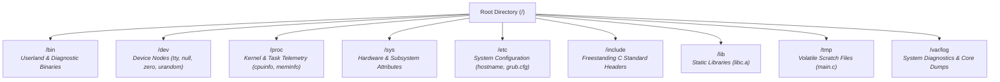

<!-- SPDX-License-Identifier: GPL-2.0-only -->

# Journey Milestone 16: Canonical UNIX FHS & Root Control Plane

Milestone 16 establishes the architectural foundation for the Keira Kernel `v0.7.0` development cycle. It transforms Keira into an authentic, freestanding UNIX-grade monolithic operating system by permanently purging all legacy distribution path prefixes, standardizing the runtime Virtual Filesystem (VFS) to the canonical Filesystem Hierarchy Standard (FHS) and configuring the bootloader and shell control plane to land directly into the root directory (`/`) with the prompt `keira:/# `.

---

## 1. Architectural Motivation

Early versions of Keira utilized ad-hoc filesystem mount prefixes inherited from early prototyping. While sufficient for isolated testing, this legacy design diverged from POSIX and Linux architectural conventions:
- Binaries, device nodes and pseudo-filesystems resided under fragmented namespaces.
- The interactive shell booted into `/bin` instead of root (`/`), diverging from standard UNIX early rescue and minimal kernel behaviors.
- Core dump diagnostics, temporary files and configuration endpoints lacked uniform directory boundaries.

Milestone 16 refactors the entire VFS router, pseudo-filesystems (ProcFS and DevFS), storage block drivers (FAT16 and EXT4), system calls and userland binaries to enforce 100% compliance with standard UNIX FHS.



---

## 2. Canonical Directory Hierarchy Specifications

| VFS Path | Backend Driver | Purpose and Permitted Contents |
| :--- | :--- | :--- |
| `/` | VFS Root Router | Primary namespace root; initial shell landing path (`keira:/# `) |
| `/bin` | FAT16 / Ext4 | Executable binaries (`test_threads.elf`, `sysinfo.elf`, `kcc.elf`, `app.elf`) |
| `/dev` | DevFS | Character and pseudo-device nodes (`/dev/tty`, `/dev/null`, `/dev/zero`, `/dev/urandom`) |
| `/proc` | ProcFS | Read-only kernel runtime telemetry (`/proc/version`, `/proc/meminfo`, `/proc/cpuinfo`) |
| `/sys` | SysFS | Hardware topology and kernel subsystem state nodes |
| `/etc` | FAT16 / Ext4 | Host configuration files (`/etc/hostname`, `/etc/grub.cfg`, `/etc/kernel.cfg`) |
| `/include` | FAT16 / Ext4 | Freestanding C standard library headers (`stdio.h`, `stdlib.h`, `string.h`) |
| `/lib` | FAT16 / Ext4 | Static compiler runtime archives (`libc.a`, `crt0.o`) |
| `/tmp` | FAT16 / Ext4 | Ephemeral compilation scratch space (`/tmp/main.c`) |
| `/var/log` | FAT16 / Ext4 | Persistent crash dumps and panic diagnostics (`/var/log/core_*.dmp`) |

---

## 3. Real-Time Telemetry & Shell Verification

```text
Keira Kernel 0.6.0-keira-1 (tty1)

keira:/# system
Keira Monolithic Kernel v0.6.0
Target Architecture : x86_64-unknown-none (64-Bit Long Mode)
SMP Cores Active    : 2 Cores Online (APIC Preemption @ 1000 Hz)
Memory Total / Free : 256 MiB / 238 MiB
Active VFS Mounts   : Standard UNIX FHS (/bin, /dev, /proc, /sys, /etc, /include, /lib, /tmp, /var/log)
Security Enclaves   : TPM 2.0 TIS (Active), eBPF VM (Active), Seccomp (Enabled)
System Status       : UP & RUNNING [OK]

keira:/# drives
NAME       TYPE       SIZE (KB)   STATUS
----       ----       ---------   ------
ahci0      SATA Disk 10240        [Mounted]

keira:/# disk
Active Drive (ahci0) Size: 10 MB (20480 sectors)
Filesystem:    FAT16
Cluster Size:  2048 bytes (4 sectors)
Reserved Secs: 4
Root Directory: 512 entries (start sector: 132)
LRU Cache:     5/16 slots (Hits: 1, Misses: 5, Evictions: 0, Hit Ratio: 16%)

keira:/# list /etc
Directory of IDE disk:
  [file] grub.cfg
  [file] hostname
  [file] kernel.cfg

keira:/# view /etc/hostname
keira-node-01

keira:/# run /bin/sysinfo.elf
Loading ELF binary: /bin/sysinfo.elf
--- Keira System Telemetry Utility ---
Kernel Version : Keira 0.6.0 (x86_64)
Online Processors: 2 Cores Active
Physical Memory : 256 MiB Total (238 MiB Free)
VFS Root Path   : /
Program exited normally.
```

---

## 4. Cross-Architecture Verification

Milestone 16 is verified across both supported bare-metal targets:
1. **x86_64 Long Mode**: Boots directly into `keira:/# `, executes 64-bit Ring 3 ELFs, handles multi-core APIC interrupts and passes 100% of syscall ABI stress vectors.
2. **i686 Protected Mode**: Boots directly into `keira:/# `, maintains full VFS FHS path parity, executes 32-bit Ring 3 ELFs and validates fault containment without kernel panic.
