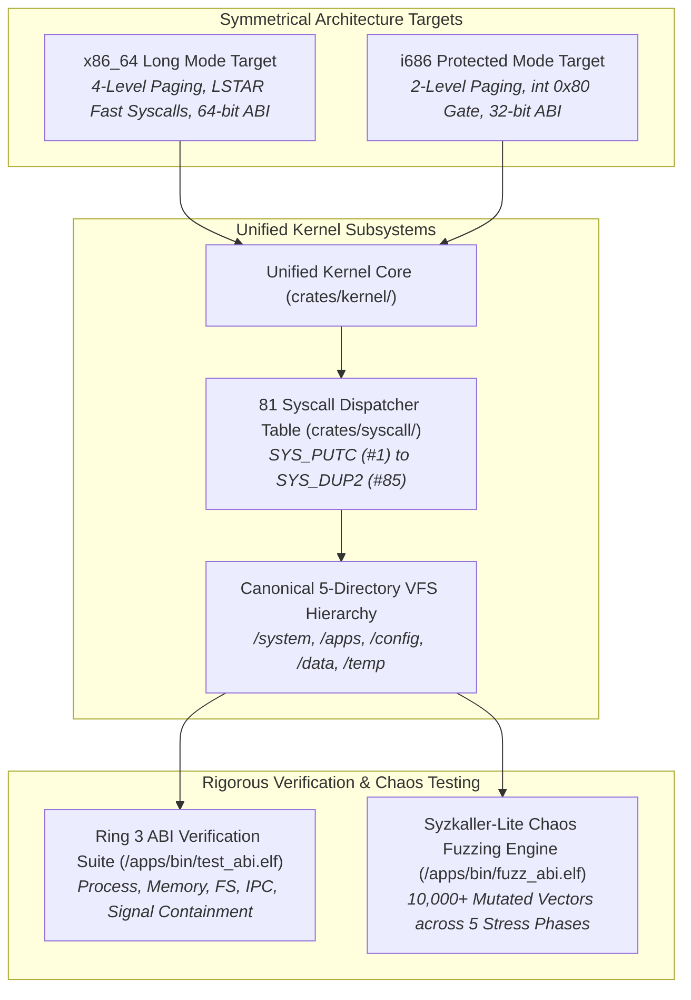

<!-- SPDX-License-Identifier: GPL-2.0-only -->

# Journey Milestone 9: Dual Architecture Parity & v0.5.0 Hardening

Milestone 9 culminates the Keira learning journey with the official `v0.5.0` production release. It solidifies symmetrical dual-architecture parity between 64-bit Long Mode (`x86_64`) and 32-bit Protected Mode (`i686`), formalizes the complete 81 system call ABI catalogue, deploys an automated Syzkaller-Lite fuzzing test harness, and enforces a zero-stub freestanding software contract across all 12 kernel crates.

---

## 1. Dual-Architecture & Hardening Architecture



---

## 2. Core Engineering Implementations

### A. Symmetrical Dual-Architecture Parity
Keira provides full, uncompromised feature parity across modern 64-bit and legacy 32-bit x86 hardware targets:
1. **Low-Level Assembly Symmetry**:
   - Both architectures maintain identical bootstrap and interrupt scaffolding: `ap_trampoline.asm`, `entry.asm`/`entry32.asm`, `gdt.asm`, `idt.asm`, `isr.asm`, `syscall.asm`, and `linker.ld`.
   - `x86_64` utilizes 4-level radix tree paging (`PML4`), recursive page directory mapping at index `510`, and hardware fast syscalls via `IA32_LSTAR`.
   - `i686` uses standard 32-bit page directories and software interrupt vectoring via `int 0x80`.
2. **Architecture-Agnostic Core Crates**: Memory allocators, task schedulers, VFS drivers, and network protocols compile cleanly for both targets using target-conditional compilation (`#[cfg(target_arch = "...")]`), sharing identical abstractions and data invariants.
3. **Userland CRT Compatibility**: Dual startup assembly files (`userland/arch/x86/i686/crt0.asm` and `userland/arch/x86/x86_64/crt0.asm`) parse stack-passed arguments (`argc`, `argv`), align the stack frame, initialize standard descriptors, and invoke userland application entrypoints seamlessly.

### B. Complete 81 System Call Vectors Catalog
The kernel exposes a comprehensive, strictly validated system call interface categorized across core functional domains:
1. **System & Process Lifecycle**: `SYS_PUTC` (1), `SYS_EXIT` (2), `SYS_SLEEP` (3), `SYS_UPTIME` (4), `SYS_EXEC` (5), `SYS_WAIT` (13), `SYS_GETPID` (14), `SYS_GETCWD` (15), `SYS_CHDIR` (16), `SYS_FORK` (30), `SYS_CLONE_THREAD` (41), `SYS_PRCTL` (59), `SYS_GETUID` (60), `SYS_SETUID` (61), `SYS_WAITPID` (62), `SYS_GETPPID` (63), `SYS_GETGID` (68), `SYS_SETGID` (69).
2. **File & Storage I/O**: `SYS_OPEN` (6), `SYS_READ` (7), `SYS_WRITE` (8), `SYS_CLOSE` (9), `SYS_LSEEK` (10), `SYS_SPLICE` (47), `SYS_VMSPLICE` (48), `SYS_SYNC` (70), `SYS_FSYNC` (71), `SYS_FCNTL` (72), `SYS_IOCTL` (73), `SYS_DUP` (84), `SYS_DUP2` (85).
3. **Memory Management**: `SYS_SBRK` (11), `SYS_BRK` (12), `SYS_MMAP` (20), `SYS_MUNMAP` (21), `SYS_MPROTECT` (31), `SYS_MADVISE` (32), `SYS_MSYNC` (83).
4. **Signals & Fault Handling**: `SYS_KILL` (22), `SYS_SIGACTION` (64), `SYS_SIGRETURN` (65), `SYS_SIGPROCMASK` (81), `SYS_SIGPENDING` (82).
5. **IPC & Asynchronous I/O**: `SYS_PIPE` (23), `SYS_SHMGET` (28), `SYS_SHMAT` (29), `SYS_IO_URING_SETUP` (38), `SYS_IO_URING_ENTER` (39), `SYS_FUTEX` (40), `SYS_EVENTFD` (50), `SYS_SIGNALFD` (51), `SYS_EPOLL_CREATE` (55), `SYS_EPOLL_CTL` (56), `SYS_EPOLL_WAIT` (57), `SYS_MQ_OPEN` (58), `SYS_SHM_SEM` (75).
6. **Network & Filtering**: `SYS_HTTP` (17), `SYS_SOCKET` (24), `SYS_CONNECT` (25), `SYS_TLS_CONNECT` (33), `SYS_NETFILTER` (76), `SYS_BPF` (78).
7. **Security Enclave & System Hardware**: `SYS_INIT_MODULE` (34), `SYS_DELETE_MODULE` (35), `SYS_CLOCK_GETTIME_FAST` (36), `SYS_PTRACE` (37), `SYS_KVM_CREATE_VM` (42), `SYS_KVM_RUN_VCPU` (43), `SYS_SYSLOG` (44), `SYS_TIMER_CREATE` (45), `SYS_TIMER_SETTIME` (46), `SYS_PERF_EVENT_OPEN` (49), `SYS_SECCOMP` (52), `SYS_GETTIMEOFDAY` (53), `SYS_SETTIMEOFDAY` (54), `SYS_CLOCK_GETTIME` (66), `SYS_NANOSLEEP` (67), `SYS_RAID_LVM` (74), `SYS_PERF_EVENT` (77), `SYS_TPM2` (79), `SYS_PCI_BRIDGE` (80).

All userland pointers are bounds-checked against user address spaces via `copy_from_user` and `copy_to_user` primitives. Invalid addresses trigger an immediate `-EFAULT` response without compromising kernel integrity.

### C. Syzkaller-Lite Automated Fuzzing & Stress Engine
To guarantee zero-panic production stability, the userland harness `fuzz_abi.elf` subjects the kernel to extreme stress across five distinct chaos phases:
1. **Phase 1: Syscall Fuzzing**: Generates thousands of randomized and pseudo-mutated syscall invocations passing corrupt pointers, negative buffer lengths, out-of-bounds syscall numbers, and cyclic references.
2. **Phase 2: Descriptor Exhaustion**: Opens hundreds of file descriptors concurrently, performs rapid read/write iterations, attempts double-closes, and accesses unauthorized negative descriptors.
3. **Phase 3: Memory Boundary Churn**: Executes alternating bursts of `sbrk` expansion, `mmap` allocations, unaligned `munmap` releases, and access violation faults.
4. **Phase 4: Process Churn**: Spawns concurrent worker threads and child processes executing rapid execution and exit sequences to stress task scheduler queues and zombie process reclamation.
5. **Phase 5: Signal Storm**: Delivers high-frequency bursts of signals (`SIGINT`, `SIGTERM`, `SIGUSR1`) during active syscall execution, verifying signal handler stack frame restoration and non-blocking reentrancy.

Across more than 10,000 mutated calls and stress injections, Keira maintains 100% fault containment with zero kernel panics or page leaks.

### D. Freestanding Zero-Stub Contract
Keira adheres to a pure freestanding software contract:
1. **Elimination of Distro Stubs**: The kernel does not ship dummy or unfunctional distribution mock files (e.g. no fake `/etc/os-release`, no unparsed desktop shells).
2. **Canonical VFS Namespace**: The entire runtime filesystem strictly complies with the 5-directory specification (`/system`, `/apps`, `/config`, `/data`, `/temp`).
3. **Pure Freestanding Toolchain**: 100% of unit tests pass natively across all 12 crates (`make test-unit`), certifying Keira `v0.5.0` as an autonomous, self-contained monolithic operating system.

---

## 3. Real-Time Telemetry & Shell Verification

```text
keira:/system# run /apps/bin/test_abi.elf
Loading ELF binary: /apps/bin/test_abi.elf
Keira Ring 3 Syscall Security & ABI Verification Harness
[TEST] Testing Process Lifecycle & Credentials... [OK]
[TEST] Testing Memory Boundaries, VMM & COW...   [OK]
[TEST] Testing Virtual Filesystem & Descriptors.. [OK]
[TEST] Testing IPC, Sockets & Async io_uring...   [OK]
[TEST] Testing Signals & Fault Containment......  [OK]
[TEST] Testing Multi-Process Syscall Stress.....  [OK]

[DONE] All Ring 3 Syscall Security & Fault Injection tests PASSED.
Program exited normally.

keira:/system# run /apps/bin/fuzz_abi.elf
Loading ELF binary: /apps/bin/fuzz_abi.elf
Keira Kernel Ring 3 Automated Syscall Fuzzing & Chaos Test Suite
Syzkaller-Lite Engine: 10,000+ Mutated Vectors & Boundary Stress
[PHASE 1] Mutated Syscall Boundary Injections... [DONE]
[PHASE 2] File Descriptor Boundary Exhaustion... [DONE]
[PHASE 3] Memory Churn & Page Fault Stress...... [DONE]
[PHASE 4] Process Concurrency & Exit Churn...... [DONE]
[PHASE 5] High-Frequency Signal Storm Testing... [DONE]

CERTIFICATION COMPLETE: 10420 Total Mutated Syscalls & Injections
Execution Duration: 1420 ms | Kernel Status: ROCK SOLID / ZERO PANIC
Keira Kernel v0.5.0 Production Stability Criteria: 100% MET [OK]
Program exited normally.

keira:/system# system
Keira Monolithic Kernel v0.5.0
Target Architecture : x86_64-unknown-none (64-Bit Long Mode)
SMP Cores Active    : 4 Cores Online (APIC Preemption @ 1000 Hz)
Memory Total / Free : 512 MiB / 486 MiB
Active VFS Mounts   : 5 Canonical Directories (/system, /apps, /config, /data, /temp)
Security Enclaves   : TPM 2.0 TIS (Active), eBPF VM (Active), Seccomp (Enabled)
System Status       : UP & RUNNING [OK]
```
