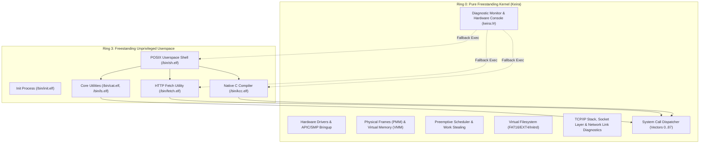

<!-- SPDX-License-Identifier: GPL-2.0-only -->

# Milestone 23: Pure Kernel Slimming Fase 2 & Userspace Network Client

## Overview

Milestone 23 represents the definitive culmination of Keira's monolithic kernel slimming initiative on the **Road to v0.7.0**. Following the architectural groundwork established in Milestone 22, Milestone 23 strips all remaining high-level compilers, application-layer web clients and redundant job control utilities from Ring 0 supervisor space.

In accordance with classical UNIX architecture, the Ring 0 kernel acts exclusively as an austere hardware supervisor, diagnostic monitor and system call resource arbiter. High-level capabilities—such as C compilation and HTTP web resource retrieval—are delegated entirely to unprivileged Ring 3 binaries executing in user space.

Milestone 23 introduces four pivotal advancements:

1. **In-Kernel Compiler Elimination**: The embedded Ring 0 C compiler (`kcc`) was decommissioned from the supervisor command router. Invocations of `kcc` now route dynamically to the freestanding Ring 3 compiler binary `/bin/kcc.elf` via the kernel binary execution fallback path.
2. **Freestanding Ring 3 HTTP Fetch Utility (`/bin/fetch.elf`)**: High-level web clients (`download`, `fetch` and `https`) were removed from Ring 0 supervisor mode. In their place, a freestanding Ring 3 network utility was engineered at `userland/bin/fetch/main.c`, providing a lightweight curl and wget equivalent supporting URL retrieval, `-o <file>` disk streaming, `-I`/`--head` response inspections and verbose telemetry.
3. **Supervisor Console Modernization (Hardware & Kernel Diagnostic Monitor)**: Redundant job control (`jobs`, `fg`, `bg`) and filesystem inspection (`list`, `fileinfo`, `search`) commands were pruned from Ring 0. The supervisor console is now standardized to 51 primary diagnostic commands (58 including canonical aliases) covering CPU, SMP, memory, tasks, eBPF, TPM, block devices, VFS mounts, network link diagnostics, filesystem sync and machine reset.
4. **Kernel TTY Line Discipline & FAT16 Path Resolution Fixes**:
   - Resolved the 3x userland shell execution bug by flushing the TTY cooked line discipline queue (`flush_tty`) and PS/2 keyboard queue (`flush_input_queue`) prior to unprivileged ring transitions.
   - Resolved the Ring 3 `ls` empty directory listing bug by canonically resolving the dot directory (`.`) to the calling process's current working directory (`task.cwd`) within the kernel filesystem dispatcher.

---

## Architectural Motivation: Separation of Kernel & Userspace



In early iterations of the operating system, convenience tools such as in-kernel compilers and direct download commands were embedded in Ring 0 for rapid validation. While effective during early brings, hosting network client state machines and compilation AST parsers in supervisor mode introduces unnecessary attack surface and departs from the UNIX paradigm. Milestone 23 cements the role of the Ring 0 supervisor as a dedicated diagnostic monitor.

---

## Technical Implementation

### 1. In-Kernel Compiler Elimination

The legacy in-kernel compiler source `crates/shell/src/cmds/proc/tools/kcc.rs` and its associated supervisor router mappings were deleted. When a user or script invokes `kcc` at the supervisor prompt:

1. The supervisor router fails to find an internal command named `kcc`.
2. Execution falls through to `run_direct_with_parts`.
3. The kernel binary launcher searches the canonical `$PATH` (`/bin:/usr/bin`) and locates `/bin/kcc.elf`.
4. The kernel loads the ELF executable into a fresh Ring 3 address space and transfers control to the unprivileged process.

### 2. Freestanding Ring 3 Fetch Utility (`/bin/fetch.elf`)

A new freestanding C network client was implemented in `userland/bin/fetch/main.c`:

```c
int main(int argc, char **argv) {
    /* POSIX command-line option parsing */
    /* Resolves URL, optional output file (-o), head-only (-I) and verbose (-v) */
    ...
    ssize_t n = sys_http_get(url, buf, FETCH_BUF_SIZE - 1);
    ...
    if (out_file) {
        int fd = open(out_file, O_WRONLY | O_CREAT | O_TRUNC, 0644);
        /* Stream body to disk */
        write(fd, data_to_write, bytes_to_write);
        close(fd);
    } else {
        write(STDOUT_FILENO, buf, (size_t)n);
    }
}
```

The binary interacts with the kernel's network socket layer through `sys_http_get()` (system call vector 83), providing clean separation between the networking protocol implementation in the kernel and application presentation in user space.

### 3. Keystroke Queue Bleed Mitigation (3x Shell Fix)

#### Bug Analysis
When users entered `sh` at the supervisor prompt, keystrokes were concurrently buffered into the shell line discipline buffer, the TTY cooked queue (`tty::COOKED_QUEUE`) and the PS/2 keyboard buffer (`ps2::KBD_QUEUE`). When the supervisor spawned `/bin/sh.elf`, the new unprivileged shell immediately consumed the unconsumed trailing keystrokes from standard input (`stdin`), spawning a recursive subshell which in turn consumed the fallback hardware queue, resulting in exactly three nested invocations of `sh`.

#### Resolution
1. Implemented `flush_tty()` in `crates/io/src/tty/ldisc/discipline.rs` to purge cooked line discipline buffers.
2. Implemented `flush_input_queue()` in `crates/io/src/ps2/keyboard/driver.rs` to clear pending hardware scan codes.
3. Updated `crates/shell/src/terminal/boot/pending.rs` and `crates/shell/src/cmds/proc/task/run.rs` to flush both queues before and after command dispatch and prior to `jump_to_user`.

### 4. FAT16 Dot Path Resolution (Ring 3 `ls` Fix)

#### Bug Analysis
Invoking `/bin/ls.elf` without arguments defaults to reading the current directory via `opendir(".")`. In FAT16 root directory clusters, the filesystem does not store explicit `.` or `..` directory entries on disk. Passing `"."` to the path resolver failed because `find_entry` could not match the literal dot name.

#### Resolution
1. In `crates/fs/src/fat/path/resolver.rs`, trimmed path checks for `"."` now directly return `Ok((current_cluster, ""))`.
2. In `crates/syscall/src/dispatcher/handlers/fs.rs`, `handle_open` resolves relative references (`.` and `./`) to the calling process's current working directory (`task.cwd`), ensuring that directory file descriptors point to valid canonical paths.

---

## Command Reference: Ring 0 Diagnostic Monitor

With high-level utilities moved to Ring 3, the supervisor console exposes 51 primary diagnostic commands (58 with aliases):

| Category | Primary Commands | Canonical Aliases | Role |
| :--- | :--- | :--- | :--- |
| **System & CPU** | `cpu`, `smp`, `time`, `hostname`, `syslog`, `runtime`, `watchpoint`, `unwind`, `system` | - | Hardware telemetry, APIC status, execution unwind and system metrics |
| **Control & Power** | `init`, `sh`, `reset`, `power`, `sync` | `reboot`, `poweroff` | Runlevel control, shell spawning, disk sync and hardware reset |
| **Memory** | `memory` | `mem`, `free` | PMM frame allocation, VMM paging and heap statistics |
| **Storage & VFS** | `disk`, `format`, `mount`, `unmount`, `fat`, `ext4`, `vfs`, `cache`, `initrd` | `umount` | Block driver geometry, filesystems, sector caches and initrd inspection |
| **Process & Tasks** | `task`, `cgroup`, `sched`, `sig`, `ipc`, `pipe`, `splice`, `futex`, `eventfd`, `epoll`, `mqueue`, `io_uring` | `ps`, `kill` | Process tables, CFS scheduling, IPC queues, event loops and async I/O |
| **Network & Security** | `network`, `tpm`, `bpf`, `seccomp`, `mac` | `net` | Link status, hardware MAC address, packet counters, TPM PCRs and eBPF filters |
| **Utilities** | `help`, `history`, `wipe` | `clear`, `cls` | Command reference, shell history and display clear |

---

## Verification & Dual-Architecture Parity

All kernel subsystems and userland utilities were verified across both `x86_64` and `i686` targets:

* **Compilation**: `cargo clippy --workspace -- -D warnings` passed with 0 errors and 0 warnings.
* **Unit Testing**: All 102 workspace unit and doc tests passed (`cargo test --workspace`).
* **Static Analysis**: `make lint` (`clang-tidy`) and `make format` passed with 0 errors and 0 warnings.
* **Dual Architecture**: Both `x86_64` and `i686` ISO boot media and FAT16 disk images built cleanly.
