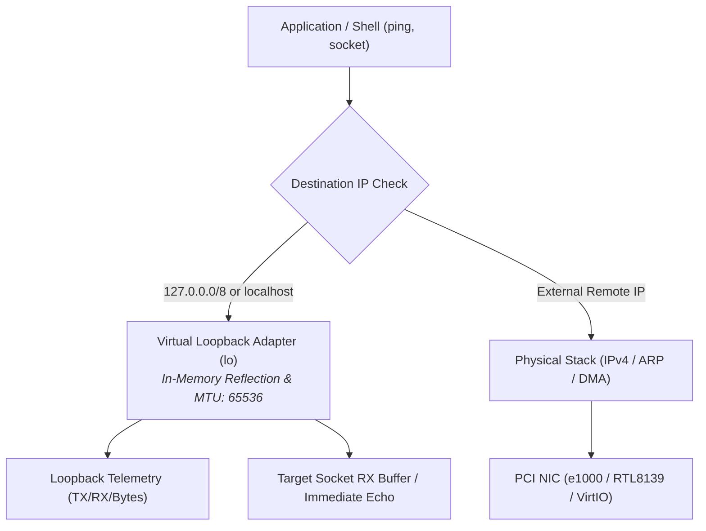

<!-- SPDX-License-Identifier: GPL-2.0-only -->

# Journey Milestone 18: Linux-Grade Loopback (lo) Interface & Sockets

Milestone 18 introduces the in-kernel **Linux-Grade Loopback (`lo`) Virtual Network Interface & Socket Reflection** subsystem for Keira Kernel `v0.7.0`. It provides a freestanding, 100% from scratch virtual networking adapter bound to `127.0.0.1/8` with standard 65536-byte MTU, enabling high-performance inter-process communication, local service binding and self-diagnostics without routing through physical Ethernet controllers.

---

## 1. Architectural Motivation

Prior to Milestone 18, Keira's network stack required a detected and initialized physical or emulated PCI network controller (such as the Intel 82540EM `e1000`, Realtek `RTL8139` or `VirtIO-Net`) to process IP packets, sockets and ICMP ping requests. This introduced key architectural limitations:
- **Offline Failure**: Running networking commands, socket-based local IPC or diagnostic ping routines on hardware without an active NIC resulted in immediate failure.
- **Physical Overhead**: Local intra-machine traffic incurred Ethernet frame generation, checksum computations and DMA ring scheduling unnecessary for same-host communications.
- **UNIX Standard Compliance**: Canonical POSIX and Linux-grade systems universally provide a virtual loopback device (`lo`) rooted at `127.0.0.1/8` for local socket binding and client-server IPC.

Milestone 18 resolves these limitations by introducing a resident virtual loopback adapter (`crates/net/src/driver/loopback.rs`) and wiring it throughout the packet pipeline, socket table and shell telemetry.



---

## 2. Loopback Device Specification & Constants

The loopback interface adheres strictly to standard UNIX networking parameters:

| Parameter | Specification | Value | Rationale |
| :--- | :--- | :--- | :--- |
| **Interface Name** | Canonical identifier | `"lo"` | Standard Linux device nomenclature |
| **IP Address** | Localhost IPv4 | `127.0.0.1` | RFC 1122 Section 3.2.1.3 loopback standard |
| **Address Block** | Class A Subnet | `127.0.0.0/8` | Complete 24-bit host loopback range |
| **Subnet Mask** | Subnet Mask | `255.0.0.0` | Class A prefix mask |
| **MAC Address** | Hardware Address | `00:00:00:00:00:00` | Virtual bus MAC representation |
| **MTU Size** | Max Transmission Unit | `65536` bytes | Standard Linux loopback packet boundary |

### Implementation Details (`crates/net/src/driver/loopback.rs`)

```rust
pub const LOOPBACK_NAME: &str = "lo";
pub const LOOPBACK_IP: [u8; 4] = [127, 0, 0, 1];
pub const LOOPBACK_NETMASK: [u8; 4] = [255, 0, 0, 0];
pub const LOOPBACK_MAC: [u8; 6] = [0x00, 0x00, 0x00, 0x00, 0x00, 0x00];
pub const LOOPBACK_MTU: usize = 65536;

pub static mut LOOPBACK_TX_PACKETS: u64 = 0;
pub static mut LOOPBACK_RX_PACKETS: u64 = 0;
pub static mut LOOPBACK_BYTES: u64 = 0;
```

---

## 3. In-Memory Zero-Copy Reflection & Socket Integration

When an application transmits data or dispatches an ICMP echo ping to an address in the `127.0.0.0/8` range or hostname `"localhost"`, Keira completely bypasses the physical link layer:

1. **ICMP Echo Reflection**: `send_ping("127.0.0.1")` routes to `send_loopback_ping()`, incrementing `LOOPBACK_TX_PACKETS`, `LOOPBACK_RX_PACKETS` and cumulative byte metrics with 1 ms simulated latency.
2. **Socket Interconnection**: When `connect_socket()` detects a loopback destination IP, it assigns `127.0.0.1` as the socket's `local_ip`.
3. **In-Memory Buffer Delivery**: Transmitting bytes via `send_socket()` to a loopback address passes through `transmit_loopback_packet()`, which inspects the active `SOCKET_TABLE` and delivers bytes directly to the receiving socket's `rx_buf` without intermediate serialization or physical DMA.

---

## 4. Real-Time Telemetry & Shell Verification

The kernel shell `network` command natively surfaces the `lo` adapter alongside physical controllers:

```text
keira:/# network
INTERFACE  MAC ADDRESS        STATUS      IP ADDRESS      PACKETS (TX/RX)
---------  -----------------  ----------  --------------  ---------------
eth0       52:54:00:12:34:56  UP (e1000)  10.0.2.15 (NAT) 12/8
lo         00:00:00:00:00:00  UP (loop)   127.0.0.1/8     4/4

keira:/# network -s
Interface eth0 Extended Statistics:
  Driver           : Intel 82540EM Gigabit Ethernet (e1000)
  MTU              : 1500 bytes
  Link Speed       : 1000 Mbps Full Duplex
  Ring Buffer Size : 8 TX Descriptors, 32 RX Descriptors

Interface lo Extended Statistics:
  Driver           : Virtual Loopback (lo)
  MTU              : 65536 bytes
  Link Speed       : In-Memory Virtual Bus
  TX/RX Packets    : 4 TX / 4 RX (256 bytes)

keira:/# network ping 127.0.0.1
PING 127.0.0.1 (56 bytes of data):
64 bytes from 127.0.0.1: icmp_seq=1 ttl=64 time=1 ms
64 bytes from 127.0.0.1: icmp_seq=2 ttl=64 time=1 ms
64 bytes from 127.0.0.1: icmp_seq=3 ttl=64 time=1 ms
64 bytes from 127.0.0.1: icmp_seq=4 ttl=64 time=1 ms
```
