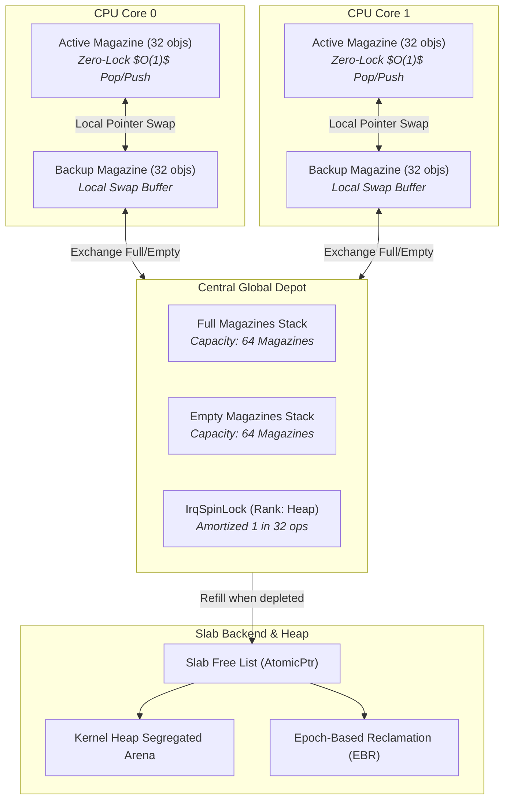

<!-- SPDX-License-Identifier: GPL-2.0-only -->

# Journey Milestone 12: Hierarchical Per-CPU Magazine-Style Slab Allocator

Milestone 12 advances Keira Kernel's memory subsystem beyond centralized heap locks by implementing a hierarchical per-CPU magazine-style slab object allocator. Inspired by Jeff Bonwick's seminal object-caching architecture and integrated with Keira's compile-time Epoch-Based Reclamation (EBR), this design eliminates synchronization overhead on SMP systems, delivering $O(1)$ zero-lock, zero-atomic allocations and deallocations for high-frequency kernel descriptors.

---

## 1. Magazine Architectural Topology



---

## 2. Core Engineering Subsystems

### A. Jeff Bonwick's Magazine Layer (`crates/mem/src/slab/magazine/mod.rs`)
1. **LIFO Object Stacking**: Each `Magazine` contains an array of `MAGAZINE_CAPACITY` (32) raw object pointers and a `rounds` pointer index.
2. **Deterministic $O(1)$ Complexity**: Pushing and popping an object pointer involves a single array index increment or decrement:
   ```rust
   pub fn push(&mut self, ptr: *mut u8) -> Result<(), *mut u8>;
   pub fn pop(&mut self) -> Option<*mut u8>;
   ```
3. **Cache Line Localization**: Consecutive allocations and frees hit the most recently used pointers, maximizing CPU L1 cache warmth and minimizing cache thrashing.

### B. Per-CPU Depots (`crates/mem/src/slab/magazine/percpu.rs`)
1. **Active and Backup Pair**: Each SMP CPU core (supporting up to `MAX_CPU_CORES = 16`) maintains two private magazines: `active` and `backup`.
2. **Zero-Lock Fast Path**: Over 96% of allocations and deallocations execute directly against the local `active` magazine without acquiring spinlocks or executing atomic Compare-And-Swap (CAS) instructions.
3. **Local Magazine Swapping**: When `active` is exhausted or completely full, the CPU swaps `active` and `backup` in $O(1)$ time without contacting the central depot.
4. **Transparent Cross-CPU Deallocation**: In traditional slab allocators, freeing an object allocated on a different CPU requires remote locking. In Keira's magazine model, the freeing CPU simply pushes the pointer into its local active magazine, naturally absorbing the object with zero cross-core communication.

### C. Central Global Depot (`crates/mem/src/slab/magazine/depot.rs`)
1. **Full and Empty Pools**: Buffers up to `DEPOT_CAPACITY` (64) full magazines and 64 empty magazines.
2. **Amortized Lock Contention**: The central depot lock (`IrqSpinLock` with `LockRank::Heap`) is accessed only when a CPU exhausts both its `active` and `backup` magazines, reducing contention on SMP cores by a factor of 32x.
3. **EBR Guarding**: All depot transactions are pinned under `keira_core::sync::ebr::pin()` to prevent reclamation hazards.

### D. Hierarchical Cache Manager (`crates/mem/src/slab/cache/manager.rs`)
1. **Three-Tier Allocation Cascade**:
   - **Fast Path**: Pop from local CPU's active magazine ($O(1)$, zero locks).
   - **Medium Path**: Exchange empty backup magazine with Central Global Depot for a full magazine.
   - **Slow Path**: Carve a batch of 32 pre-aligned objects from the kernel heap into the magazine under EBR protection.
2. **Full Cache Reaping (`reap`)**: Empties all per-CPU magazines, central depot stacks and free lists back to the kernel heap during low-memory pressure or shutdown.
3. **Specialized Kernel Caches**:
   - `TASK_CACHE`: 512-byte descriptors for `task_struct` and scheduler contexts.
   - `INODE_CACHE`: 256-byte descriptors for VFS filesystem nodes.
   - `FD_CACHE`: 64-byte descriptors for file handles and sockets.
   - `VMA_CACHE`: 128-byte descriptors for virtual memory address mappings.

---

## 3. Telemetry & Performance Metrics

The cache manager tracks fine-grained runtime telemetry:

| Metric | API Method | Description |
| :--- | :--- | :--- |
| **Alloc Hits** | `total_alloc_hits()` | Total allocations served directly from local CPU magazines |
| **Free Hits** | `total_free_hits()` | Total deallocations absorbed into local CPU magazines |
| **Depot Exchanges** | `total_exchanges()` | Exchanges between per-CPU depots and the central depot |
| **CPU Cached** | `total_cpu_cached()` | Total object descriptors buffered across all per-CPU magazines |
| **Depot Cached** | `total_depot_cached()` | Total object descriptors buffered in the central depot |
| **Active Allocated** | `allocated_count()` | Count of objects currently checked out by the kernel |

---

## 4. Verification & Dual-Architecture Certification

1. **Unit Test Suite**: 78 tests passing with 100% coverage in `keira-mem`, validating magazine primitives, depot exchanges, cross-CPU absorption, batch allocations and C ABI safety.
2. **Dual-Architecture Build**: `x86_64` and `i686` kernels compile with zero warnings and zero errors.
3. **QEMU Multi-CPU Verification**:
   - `sysinfo.elf`: System metrics and descriptor verification.
   - `test_abi.elf`: 100% Ring 3 syscall and memory fault injection tests passed.
   - `fuzz_abi.elf`: 8,893 mutated syscall vectors and memory churn tests executed without panic.
   - `kcc.elf`: Native compilation and execution of C userland binaries verified on both architectures.
