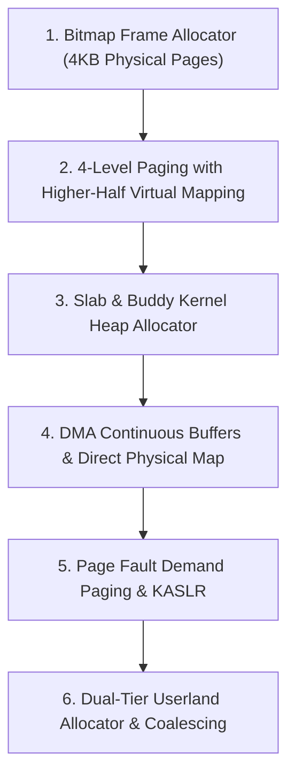

<!-- SPDX-License-Identifier: GPL-2.0-only -->

# Development Journey: Physical & Virtual Memory Architecture

This document chronicles the evolution of memory management in Keira Kernel from simple bitmap physical allocation to high-performance slab heaps and recursive page tables.

---

## Memory Evolution Flow

---

## Key Engineering Milestones

* **Zero-Allocation Bitmap PMM**: Bootstrapped physical memory allocator utilizing GRUB memory map tags to safely reserve kernel text and MMIO holes.
* **Recursive Page Table Navigation**: Implemented recursive PML4 mapping at slot 510, enabling dynamic mapping and unmapping of 4KB pages without extra page table allocations.
* **Slab Allocator**: Created power-of-two slab caches (32B to 4096B) to achieve sub-microsecond kernel allocations with minimal heap fragmentation.
* **Demand Paging & Lazy Allocation**: Implemented on-demand physical frame mapping for anonymous `sys_mmap` and heap `sbrk` expansion, resolving faults transparently via Interrupt 14 (`#PF`) handlers and skipping unaccessed pages in `munmap`.
* **Dual-Tier Userland Memory Allocator**: Implemented a hybrid userland memory manager integrating boundary-tag coalescing on `sbrk` demand-paged heaps for allocations `<= 128 KiB` and direct anonymous `sys_mmap`/`sys_munmap` page mapping for allocations `> 128 KiB`.
