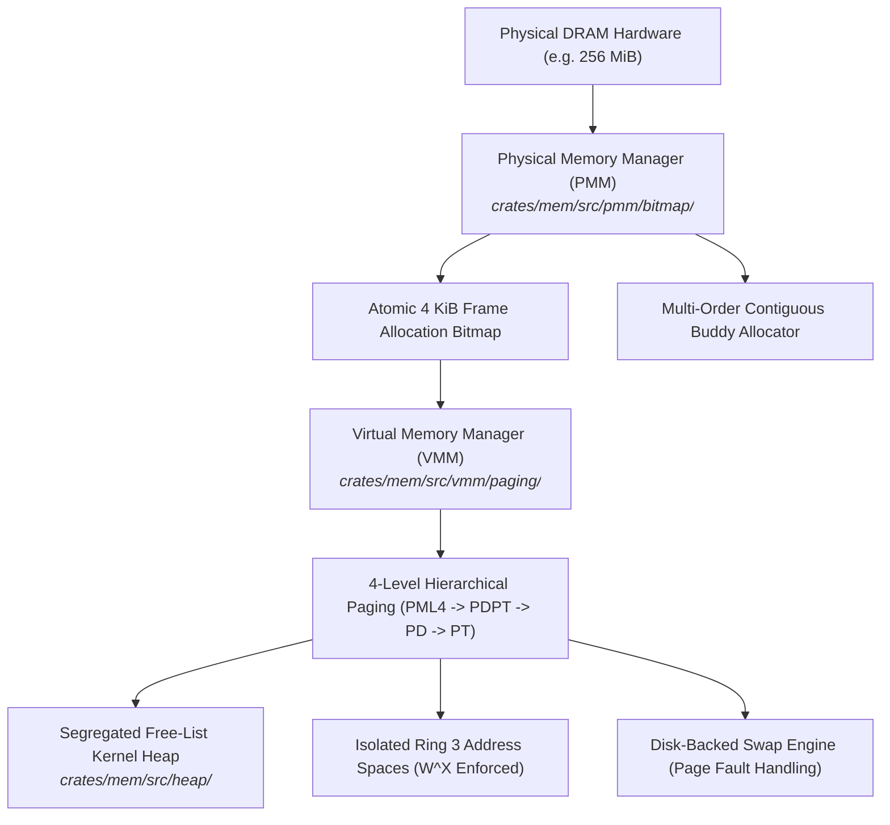

<!-- SPDX-License-Identifier: GPL-2.0-only -->

# Journey Milestone 2: Memory Management & Virtual Paging

Milestone 2 addresses the fundamental challenge of physical silicon and virtual address abstraction: transforming raw hardware DRAM into safe, isolated virtual memory spaces and deterministic dynamic heap pools.

---

## 1. Memory Subsystem Architecture


```mermaid
graph TD
    Hardware["Physical DRAM Hardware (e.g. 256 MiB)"] --> PMM["Physical Memory Manager (PMM)<br/><i>crates/mem/src/pmm/bitmap/</i>"]
    PMM --> FrameBitmap["Atomic 4 KiB Frame Allocation Bitmap"]
    PMM --> BuddyAlloc["Multi-Order Contiguous Buddy Allocator"]
    FrameBitmap --> VMM["Virtual Memory Manager (VMM)<br/><i>crates/mem/src/vmm/paging/</i>"]
    VMM --> PageTables["4-Level Hierarchical Paging (PML4 -> PDPT -> PD -> PT)"]
    PageTables --> KernelHeap["Segregated Free-List Kernel Heap<br/><i>crates/mem/src/heap/</i>"]
    PageTables --> UserVMM["Isolated Ring 3 Address Spaces (W^X Enforced)"]
    PageTables --> SwapEngine["Disk-Backed Swap Engine (Page Fault Handling)"]
```

---

## 2. Deep Dive: Memory Allocator Engines

### A. Physical Memory Manager (PMM) Bitmap
Rather than relying on intrusive linked lists that waste valuable RAM, Keira utilizes a compact **physical frame bitmap**:
- Each bit represents exactly one **4 KiB page frame** (`4096 bytes`).
- A 32-bit `u32` word tracks **128 KiB** of contiguous physical memory.
- For a 256 MiB machine, the entire bitmap occupies only **8 KiB** of kernel RAM (`65,536 frames`).

Frame allocation operates atomically using bit-scan instructions (`BSR` / `trailing_zeros`):
```rust
pub fn alloc_frame() -> Option<PhysAddr> {
    // Scan bitmap words for first clear bit (0 = free, 1 = occupied)
    for (word_idx, word) in BITMAP.iter_mut().enumerate() {
        if *word != 0xFFFF_FFFF {
            let bit_idx = (!*word).trailing_zeros() as usize;
            *word |= 1 << bit_idx;
            return Some(PhysAddr::new((word_idx * 32 + bit_idx) * 4096));
        }
    }
    None
}
```

### B. 4-Level Paging Virtual Memory Manager (VMM)
On `x86_64`, virtual addresses are translated through a 4-level radix tree:
```text
Virtual Address [47:0]:
+---------+---------+---------+---------+---------------+
| PML4    | PDPT    | PD      | PT      | Page Offset   |
| 9 bits  | 9 bits  | 9 bits  | 9 bits  | 12 bits       |
+---------+---------+---------+---------+---------------+
```

Keira employs **recursive page table mapping** at index `510` of the PML4 table, allowing the kernel to access and modify page table structures without remapping them to scratch virtual addresses:
- **PML4 Virtual Address**: `0xFFFF_FF7F_BFDF_E000`
- **Page Directory Virtual Address**: `0xFFFF_FF7F_BFC0_0000`

All page table entries rigorously validate architecture control bits:
- `Bit 0 (P)`: Present
- `Bit 1 (R/W)`: Read/Write
- `Bit 2 (U/S)`: User/Supervisor (Ring 3 access)
- `Bit 63 (NX)`: No-Execute bit preventing code execution on data/stack frames (`W^X` invariant).

### C. Segregated Free-List Heap Allocator
Dynamic kernel allocations (`Box`, `Vec`, `String` equivalents) are served by a deterministic, segregated free-list heap allocator:
- **Fixed Size Classes**: 16 B, 32 B, 64 B, 128 B, 256 B, 512 B, 1024 B, 2048 B, and 4096 B.
- **Canary Bounds**: Every heap allocation is flanked by an 8-byte guard canary `0xDEAD_BEEF_CAFE_BABE` checked on `dealloc` to catch buffer overflows.
- **Zero Fragmentation**: Requests exceeding 4 KiB bypass the free-list pools and are served directly by contiguous physical frame allocations.

### D. Swap Subsystem & Page Fault Handlers
When physical memory pressure rises, inactive pages are swapped to the dedicated swap partition on disk.
When an invalid virtual address is accessed, the CPU triggers **Exception 14 (#PF)**:
1. The hardware places the faulting address into control register `CR2`.
2. The page fault handler extracts the error code (`P=0` for not present, `W=1` for write violation, `U=1` for userland violation).
3. If the page is marked swapped, the kernel allocates a new physical frame, reads the sector from disk, restores the PTE, and re-executes the instruction transparently.

---

## 3. Real-Time Telemetry & Shell Verification

```text
keira:/system# memory
Memory Statistics & Frame Allocator:
REGION         TOTAL         USED         FREE
------         -----         ----         ----
Kernel Heap    1024 KB       0 KB         1024 KB
Physical RAM   257168 KB     44 KB        257124 KB

Heap Allocator Statistics:
  Total Allocations : 0 requests
  Active Allocations: 0 blocks
  Peak Heap Usage   : 0 bytes (0 KB)
  Arena Consumed    : 0 bytes (0 KB)
  Fragmentation     : 0 %
```
