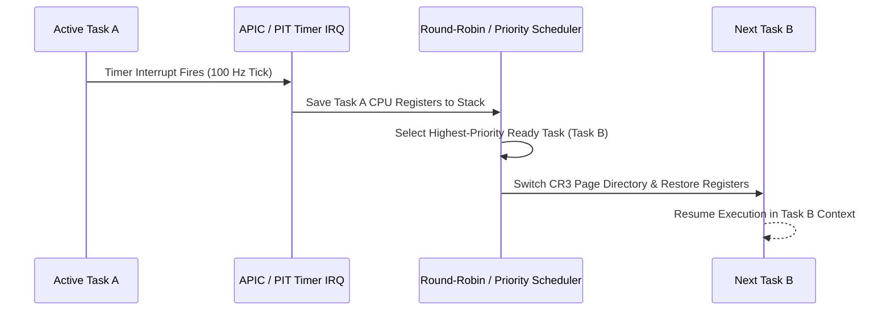

<!-- SPDX-License-Identifier: GPL-2.0-only -->

# Development Journey: Preemptive Multitasking & Scheduling

This document chronicles the design and implementation of context switching, timer-driven scheduling, and userland Ring 3 isolation in Keira Kernel.

---

## Context Switch Architecture

---

## Key Engineering Milestones

* **Software Context Switching**: Handcrafted x86_64 assembly routine (`switch_to`) saving and restoring callee-saved registers (`RBP`, `RBX`, `R12`–`R15`).
* **Privilege Level 3 Transition**: Configured TSS, GDT user code/data descriptors, and `IRETQ` stack frames to drop safely into Ring 3 userland.
* **Task State Management**: Implemented `Ready`, `Running`, `Blocked`, and `Zombie` lifecycle transitions with automatic parent reclamation (`waitpid`).
* **Dynamic TSS RSP0 & Syscall Trampoline Switching**: Dynamic per-task `TSS.rsp0` and `kernel_stack_temp` synchronization during scheduler context switches, ensuring privilege-level transitions use dedicated per-process kernel stacks.
* **Ring 3 Multiprocess Orchestration**: Preemptive task cloning via `fork()` capturing user `syscall` register snapshots, `TaskState::Zombie(exit_code)` status propagation, and blocking parent reaping with POSIX `waitpid()` status encoding.
