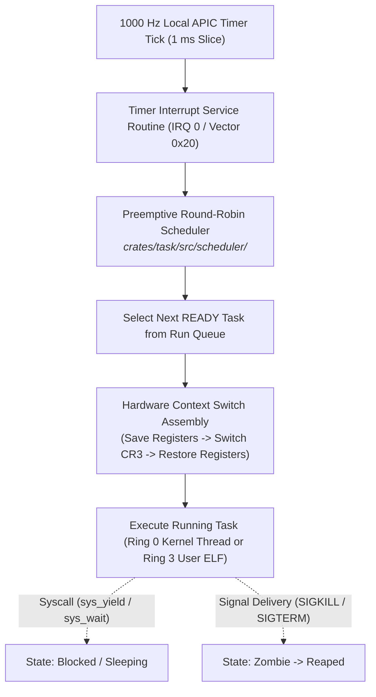

<!-- SPDX-License-Identifier: GPL-2.0-only -->

# Journey Milestone 3: Preemptive Multitasking & Task Scheduling

Milestone 3 transitions Keira from a single-threaded runtime into a fully preemptive, multi-tasking operating environment with POSIX process semantics, resource quotas and thread synchronization primitives.

---

## 1. Process Lifecycle & Scheduler Pipeline


```mermaid
graph TD
    Timer["1000 Hz Local APIC Timer Tick (1 ms Slice)"] --> ISR["Timer Interrupt Service Routine (IRQ 0 / Vector 0x20)"]
    ISR --> Scheduler["Preemptive Round-Robin Scheduler<br/><i>crates/task/src/scheduler/</i>"]
    Scheduler --> PickTask["Select Next READY Task from Run Queue"]
    PickTask --> ContextSwitch["Hardware Context Switch Assembly<br/>(Save Registers -> Switch CR3 -> Restore Registers)"]
    ContextSwitch --> NextTask["Execute Running Task (Ring 0 Kernel Thread or Ring 3 User ELF)"]

    NextTask -.->|"Syscall (sys_yield / sys_wait)"| StateChange["State: Blocked / Sleeping"]
    NextTask -.->|"Signal Delivery (SIGKILL / SIGTERM)"| StateDead["State: Zombie -> Reaped"]
```

---

## 2. Process Control Block (PCB) & Kernel Structures

Every executable task is represented by a strictly isolated `ProcessControlBlock` (PCB):

```rust
pub struct ProcessControlBlock {
    pub pid: u32,
    pub ppid: u32,
    pub state: TaskState,             // Ready, Running, Blocked, Zombie
    pub priority: u8,
    pub ticks_remaining: u32,         // Quantum slices (1000 Hz ticks)
    pub cr3: u64,                     // Page Table Physical Base
    pub kernel_stack_top: u64,        // Privileged Ring 0 stack pointer
    pub user_stack_top: u64,          // Ring 3 userland stack pointer
    pub context: CpuRegisters,        // Callee-saved architectural registers
    pub fd_table: [Option<FileDescriptor>; MAX_FD],
    pub signal_mask: u32,
    pub pending_signals: u32,
}
```

### A. Hardware Context Switching Assembly
When the timer tick fires or a process voluntarily yields via `SYS_YIELD`:
1. The hardware pushes `SS`, `RSP`, `RFLAGS`, `CS` and `RIP` onto the privileged kernel stack.
2. The ISR pushes remaining general-purpose registers (`RAX..R15`).
3. The scheduler updates the current PCB's stack pointer and selects the next eligible task from the ready queue.
4. If switching across distinct processes, control register `CR3` is reloaded to activate the target's address space.
5. The TSS `RSP0` field is updated with the target task's kernel stack ceiling, ensuring future interrupts trap to the correct thread stack.
6. A single `IRETQ` instruction pops the register frame and resumes the target thread.

### B. Resource Control Groups (cgroups)
To prevent rogue processes from exhausting system resources, Keira implements hierarchical control groups:
- **Memory Ceiling**: Enforces maximum physical frame allocations per cgroup slice (e.g. 112 MB limit).
- **Proportional CPU Shares**: Divides scheduler timer ticks according to assigned group weights.
- **Process Throttling**: Blocks fork attempts when group task ceilings are reached.

### C. Fast Userspace Mutex (Futex) Wait-Queues
Thread synchronization avoids expensive kernel-space locking via in-kernel futex wait queues:
- **`FUTEX_WAIT`**: Enqueues the calling thread onto an address-keyed hash bucket if the userspace atomic variable matches the expected value.
- **`FUTEX_WAKE`**: Wakes the specified count of threads waiting on the matching memory address.
- **`FUTEX_REQUEUE`**: Requeues waiters from one futex address to another without waking them immediately, mitigating the "thundering herd" problem.

---

## 3. Real-Time Telemetry & Shell Verification

```text
keira:/# tasks
PID   TASK NAME          STATE      TICKS      SWITCHES
---   ---------          -----      -----      --------
0     kernel_shell       RUNNING    1875       1

Scheduler Telemetry:
  Active Tasks           : 1
  Total Context Switches: 0
  Total Scheduler Ticks : 1876

keira:/# cgroups status
Resource Control Groups (cgroups) Subsystem Status:
  Subsystem Engine : Active (Memory Controller & Proportional CPU Shares)
  Active Groups    : 3 / 8 slices configured
  Total Used Memory: 14 MB
  Total Max Memory : 112 MB configured ceiling
  PID Namespaces   : Isolated Container Namespaces Mapped

keira:/# futex status
Fast Userspace Mutex (Futex) Subsystem Status:
  Subsystem Engine : Active (In-Kernel Wait Queues & Hash Table)
  Active Waiters   : 1 / 16 slots in use
  Total Waits      : 1 ops
  Total Wakes      : 0 ops
  Total Requeues   : 0 ops
  Syscall Vectors  : Syscall 32 (futex) / Syscall 40

keira:/# jobs
[Job ID]  PID   State       Command
--------  ---   -----       -------
 (No active background process jobs currently running)
```
