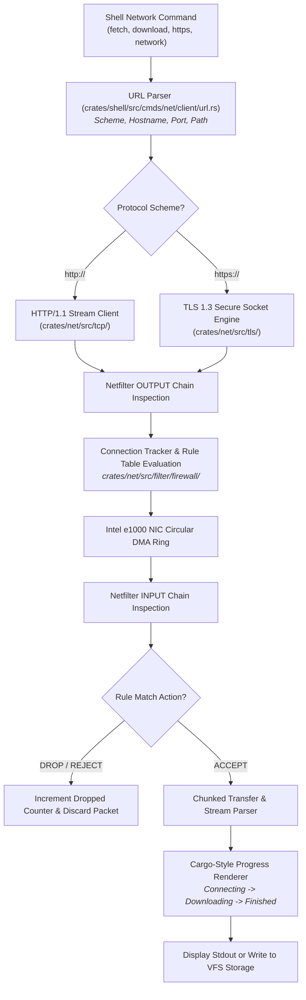

<!-- SPDX-License-Identifier: GPL-2.0-only -->

# Journey Milestone 8: Modular Network Fetch Engine & Netfilter Firewall

Milestone 8 elevates Keira's bare-metal networking subsystem from raw socket primitives into a modular network client suite and a stateful in-kernel packet filtering firewall. It introduces chunked HTTP/1.1 and TLS 1.3 streaming, 12-character progress tracking and a stateful IPv4 Netfilter engine.

---

## 1. Network Processing & Firewall Pipeline



---

## 2. Core Engineering Implementations

### A. Modular Network Client Suite
Network utilities in `crates/shell/src/cmds/net/` are decoupled into specialized commands with unified arguments:
1. **`fetch`**: Streams HTTP/HTTPS responses directly to the terminal stdout or captures HTTP headers (`-I`, `--head`), supporting file output redirection (`-o`, `--output`).
2. **`download`**: Downloads remote artifacts directly to disk or ramdisk locations (`/tmp/`, `/bin/`) with real-time transfer metrics.
3. **`network`**: Manages network interface configurations, displaying MAC address, assigned IPv4 address, gateway, subnet mask and link status.
4. **`https`**: Diagnoses TLS 1.3 handshakes, cipher negotiation and remote certificate validation.

### B. Chunked Streaming & Progressive Buffer Management
Bare-metal network clients must operate within finite kernel memory without allocating massive heap buffers:
1. **Streaming Data Ingestion**: The HTTP engine processes TCP data packets iteratively as they arrive across the circular DMA descriptor ring, invoking streaming callbacks rather than loading entire payloads into RAM.
2. **HTTP Chunked Transfer Decoding**: Handles variable-length responses dynamically formatted with HTTP chunk framing (`Transfer-Encoding: chunked`):
   - Reads chunk size in hexadecimal format followed by `\r\n`.
   - Ingests exactly the specified number of payload bytes.
   - Detects the terminating zero-chunk (`0\r\n\r\n`) to cleanly finalize the transfer stream.
3. **Freestanding Integer Byte Formatting**: The `print_byte_size()` routine converts raw transfer sizes into human-readable units (`B`, `KiB`, `MiB`) with fractional precision using pure integer arithmetic, avoiding floating-point CPU registers.

### C. Console Palette & Cargo-Style Progress Tracking
Network command telemetry conforms strictly to the austere console palette standards defined in `docs/contributing/guides/style.md`:
1. **12-Character Right-Aligned Status Badges**: All progress updates use bracketed Cargo-style status tags padded to exactly 12 characters:
   - `Connecting` (`vga::Color::LightGreen`)
   - `Downloading` (`vga::Color::LightGreen`)
   - `Downloaded` (`vga::Color::LightGreen`)
   - `Finished` (`vga::Color::LightGreen`)
   - `Warning` (`vga::Color::Yellow`)
   - `Error` (`vga::Color::LightRed`)
2. **Dynamic Progress Renderer**: Visualizes transfer percentage and rate metrics dynamically on standard VGA text mode displays without ANSI escape sequence dependencies.

### D. Stateful Netfilter IPv4 Firewall Engine
Network security is enforced at the packet boundary via an in-kernel Netfilter implementation:
1. **Rule Table Architecture**: Maintains a 16-slot table of `FirewallRule` structures:
   ```rust
   pub struct FirewallRule {
       pub chain: [u8; 12],          // "INPUT", "OUTPUT", "FORWARD"
       pub proto: [u8; 8],           // "TCP", "UDP", "ICMP"
       pub src_ip: [u8; 16],         // Source CIDR string (e.g. "0.0.0.0/0")
       pub dst_ip: [u8; 16],         // Destination CIDR string
       pub dport: u16,               // Target port number
       pub action: [u8; 12],         // "ACCEPT", "DROP", "REJECT"
       pub match_count: u32,         // Packet match telemetry counter
       pub in_use: bool,             // Slot occupancy flag
   }
   ```
2. **Stateful Connection Tracking (`conntrack`)**: Tracks active TCP 4-tuples (`Source IP`, `Source Port`, `Dest IP`, `Dest Port`) and state flags (`SYN_SENT`, `ESTABLISHED`, `FIN_WAIT`). Incoming packets belonging to verified established sessions bypass evaluation overhead.
3. **Default Security Baseline**:
   - `ACCEPT` inbound HTTP (`TCP:80`), HTTPS (`TCP:443`) and ICMP echo requests.
   - `DROP` insecure legacy vectors (e.g. `TCP:23` Telnet).
4. **System Call Vector**: Managed from Ring 3 via `SYS_NETFILTER` (`Syscall 76`) and inspected via the `firewall` command.

---

## 3. Real-Time Telemetry & Shell Verification

```text
keira:/bin# fetch http://icanhazip.com/
  Connecting http://icanhazip.com/
 Downloading 15 B
    Finished in 0.04s (375 B/s)
93.184.216.34

keira:/bin# fetch -I http://httpbin.org/get
  Connecting http://httpbin.org/get
HTTP/1.1 200 OK
Date: Tue, 29 Sep 2026 07:14:02 GMT
Content-Type: application/json
Content-Length: 304
Connection: close
Server: gunicorn/19.9.0
Access-Control-Allow-Origin: *

keira:/bin# firewall status
Stateful IPv4 Netfilter Firewall Status:
Engine State: ENABLED (Active Packet Inspection & Filtering)
  Packets Inspected : 142
  Packets Dropped   : 0

Active Firewall Chain Rules:
  [Rule 1] Chain INPUT | Proto: TCP | Src: 0.0.0.0/0 -> Dst: 0.0.0.0/0:80 => ACCEPT (Matches: 12)
  [Rule 2] Chain INPUT | Proto: TCP | Src: 0.0.0.0/0 -> Dst: 0.0.0.0/0:443 => ACCEPT (Matches: 8)
  [Rule 3] Chain INPUT | Proto: ICMP | Src: 0.0.0.0/0 -> Dst: 0.0.0.0/0:0 => ACCEPT (Matches: 4)
  [Rule 4] Chain INPUT | Proto: TCP | Src: 0.0.0.0/0 -> Dst: 0.0.0.0/0:23 => DROP (Matches: 0)

keira:/bin# firewall disable
[FIREWALL] Disabled stateful Netfilter engine (Bypass mode) [OK]

keira:/bin# firewall enable
[FIREWALL] Enabled stateful Netfilter engine [OK]
```
