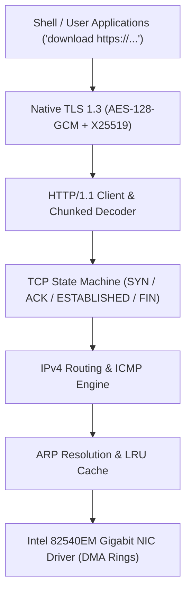

<!-- SPDX-License-Identifier: GPL-2.0-only -->

# Development Journey: Bare-Metal Network Stack & TLS 1.3

This document chronicles the implementation of the pure Rust networking stack, Intel e1000 DMA drivers, TCP state machine, and native TLS 1.3 encryption in Keira Kernel.

---

## Network Stack Layering

---

## Key Engineering Milestones

* **Pure Rust TCP Engine**: Built reliable TCP connection handling with 3-way handshakes, sequence tracking, window management, and retransmission.
* **Native Bare-Metal TLS 1.3**: Implemented pure Rust TLS 1.3 handshake without external dependencies, integrating AES-128-GCM, SHA-256, HKDF, and Curve25519.
* **Continuous Streaming Downloads**: Enabled streaming downloads directly over HTTP/HTTPS with cargo-style progress badges saved directly to FAT16 storage.
