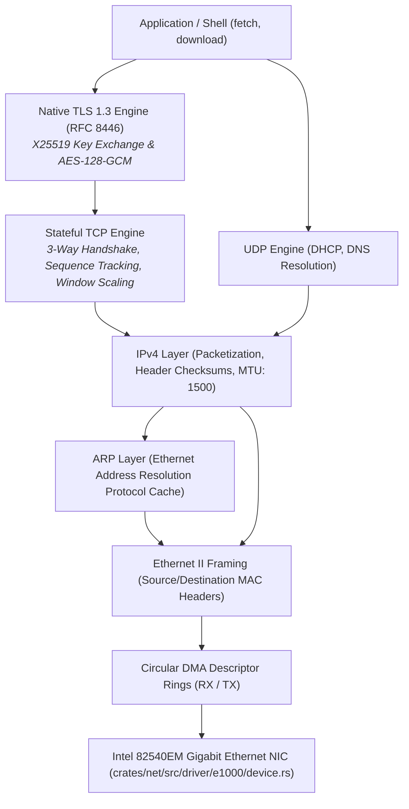

<!-- SPDX-License-Identifier: GPL-2.0-only -->

# Journey Milestone 5: Bare-Metal Networking & TLS

Milestone 5 represents one of the most intricate engineering achievements in Keira: constructing an entire layered bare-metal networking stack from raw PCI Gigabit Ethernet registers up to an authenticated TLS 1.3 encrypted socket engine.

---

## 1. Network Stack Pipeline


```mermaid
graph TD
    App["Application / Shell (fetch, download)"] --> TLS["Native TLS 1.3 Engine (RFC 8446)<br/><i>X25519 Key Exchange & AES-128-GCM</i>"]
    TLS --> TCP["Stateful TCP Engine<br/><i>3-Way Handshake, Sequence Tracking, Window Scaling</i>"]
    App --> UDP["UDP Engine (DHCP, DNS Resolution)"]
    TCP & UDP --> IPv4["IPv4 Layer (Packetization, Header Checksums, MTU: 1500)"]
    IPv4 --> ARP["ARP Layer (Ethernet Address Resolution Protocol Cache)"]
    ARP & IPv4 --> Eth["Ethernet II Framing (Source/Destination MAC Headers)"]
    Eth --> DMA["Circular DMA Descriptor Rings (RX / TX)"]
    DMA --> e1000["Intel 82540EM Gigabit Ethernet NIC (crates/net/src/driver/e1000/device.rs)"]
```

---

## 2. Core Protocol Implementations

### A. Intel e1000 Gigabit Ethernet DMA Rings
Network packet I/O avoids CPU bottlenecks via zero-copy Direct Memory Access (DMA):
- **PCI Initialization**: Detects Device `0x8086:0x100E`, reads BAR0 for MMIO control registers, enables Bus Master DMA.
- **Receive (RX) Ring**: 32 contiguous 16-byte descriptors pointing to 2048-byte physical frame buffers. When a frame arrives from the wire, the NIC writes directly to RAM and updates the head pointer.
- **Transmit (TX) Ring**: 32 descriptors describing outgoing Ethernet frames. Transmissions occur asynchronously with automatic end-of-packet (`EOP`) signaling.

### B. Stateful TCP Connection Engine
Reliable stream transport is implemented via a fully compliant TCP finite state machine:
```text
[CLOSED] ---> Send SYN ---> [SYN_SENT]
                               |
                        Receive SYN+ACK
                               |
                               v
                       Send ACK ---> [ESTABLISHED]
                                          |
                                    Data Exchange
                                          |
                         Send FIN ---> [FIN_WAIT_1]
                                          |
                                    [CLOSED]
```
- **Sequence Number Accounting**: Tracks 32-bit `seq_num` and `ack_num` across every packet.
- **Sliding Window Flow Control**: Dynamically throttles transmission based on remote receive window advertisements.
- **Retransmission Queue**: Retransmits unacknowledged packets upon timer expiration.

### C. Native In-Kernel TLS 1.3 Socket Engine (RFC 8446)
Keira eliminates reliance on external userland libraries (such as OpenSSL) by embedding a pure `#![no_std]` TLS 1.3 client engine:
1. **ClientHello**: Advertises supported cipher suite `TLS_AES_128_GCM_SHA256` and Curve25519 key share (`named_group = x25519`).
2. **ServerHello & Handshake Keys**: Parses the server's public key, computes the shared Diffie-Hellman secret via `Curve25519` and derives handshake encryption keys using `HKDF-Extract` and `HKDF-Expand-Label`.
3. **Encrypted Extensions & Certificate Verification**: Decrypts the server's handshake stream using `AES-128-GCM` authenticated encryption.
4. **Traffic Secret Derivation**: Derives client/server application traffic keys for bidirectional, end-to-end encrypted HTTP streaming over port 443.

---

## 3. Real-Time Telemetry & Shell Verification

```text
keira:/# network
INTERFACE  MAC ADDRESS        STATUS       IP ADDRESS        PACKETS (TX/RX)
---------  -----------        ------       ----------        ---------------
eth0       52:54:00:12:34:56  UP (e1000)   10.0.2.15 (NAT)   0/0

keira:/# fetch http://icanhazip.com/
103.160.68.245

keira:/# fetch -I http://httpbin.org/get
HTTP/1.1 200 OK
Host: httpbin.org
Protocol: HTTP/1.1
Content-Length: 295 bytes
Payload-Received: 295 bytes
```
