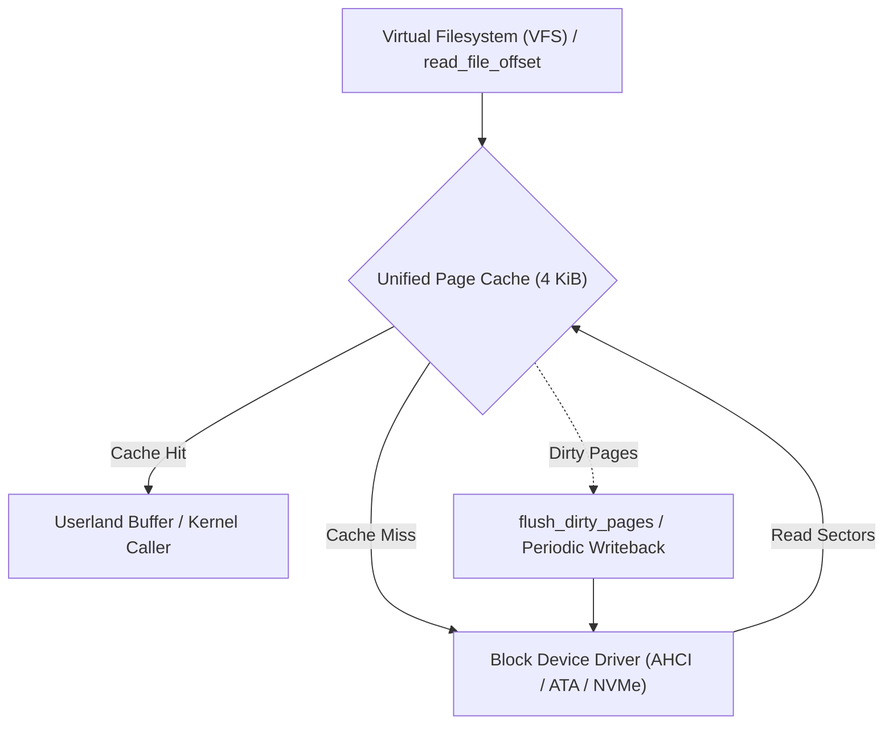

<!-- SPDX-License-Identifier: GPL-2.0-only -->

# Journey Milestone 17: Unified Page Cache & Buffer Management

Milestone 17 introduces the in-kernel **Unified 4 KiB Page Cache & Dynamic Buffer Management** engine for Keira Kernel `v0.7.0`. It bridges the high-level Virtual Filesystem (VFS) with the low-level Physical Memory Manager (PMM) and demand-paged address spaces by caching disk files at native 4096-byte memory frame granularity rather than primitive 512-byte sectors.

---

## 1. Architectural Motivation

Prior to Milestone 17, Keira managed disk caching solely through a 16-slot sector LRU table (`SECTOR_CACHE`) situated inside the FAT driver. While effective for metadata reads and directory traversals, sector-level caching incurred notable architectural limitations:
- **Paging Mismatch**: The x86 paging hardware operates on 4096-byte frames. Bridging memory-mapped files (`mmap`) or demand-paged binaries with 512-byte sectors required repetitive block device driver round-trips.
- **Cache Fragmentation**: File read streams and kernel buffers were not unified into a single coherent cache hierarchy.
- **Write Coherency**: Modified pages were not tracked with standard kernel writeback dirty flags.

Milestone 17 resolves these challenges by introducing a global, resident unified page cache pool (`crates/fs/src/cache/page.rs`).



---

## 2. Page Cache Architecture & Indexing

The page cache indexes resident memory frames using a 3-tuple key: `(device, inode, page_index)`.

### A. Page Cache Entry Layout

```rust
pub struct PageCacheEntry {
    pub device: u8,
    pub inode: u32,
    pub page_index: u32,
    pub flags: u8,
    pub last_access: u64,
    pub valid_len: usize,
    pub data: [u8; 4096],
}
```

### B. Flag Semantics

| Flag Constant | Bit Position | Description |
| :--- | :--- | :--- |
| `PAGE_FLAG_VALID` | Bit 0 (`0x01`) | Entry contains valid, resident file data |
| `PAGE_FLAG_DIRTY` | Bit 1 (`0x02`) | Memory buffer contains uncommitted modifications requiring disk writeback |
| `PAGE_FLAG_LOCKED` | Bit 2 (`0x04`) | Page is locked during active I/O, preventing concurrent eviction |
| `PAGE_FLAG_REFERENCED` | Bit 3 (`0x08`) | Page accessed recently, utilized for CLOCK second-chance eviction |

---

## 3. Real-Time Telemetry & Shell Verification

The `disk` shell command displays live telemetry metrics for both the low-level sector cache and the high-level 4 KiB unified page cache:

```text
keira:/# disk
Active Drive (ahci0) Size: 10 MB (20480 sectors)
Filesystem:    FAT16
Cluster Size:  2048 bytes (4 sectors)
Reserved Secs: 4
Root Directory: 512 entries (start sector: 132)
LRU Cache:     5/16 slots (Hits: 1, Misses: 5, Evictions: 0, Hit Ratio: 16%)
Page Cache:    3/32 pages (Hits: 8, Misses: 3, Evictions: 0, Writebacks: 0, Hit Ratio: 72%)

keira:/# view /etc/hostname
keira-node-01

keira:/# disk
Active Drive (ahci0) Size: 10 MB (20480 sectors)
Filesystem:    FAT16
Cluster Size:  2048 bytes (4 sectors)
Reserved Secs: 4
Root Directory: 512 entries (start sector: 132)
LRU Cache:     5/16 slots (Hits: 2, Misses: 5, Evictions: 0, Hit Ratio: 28%)
Page Cache:    3/32 pages (Hits: 9, Misses: 3, Evictions: 0, Writebacks: 0, Hit Ratio: 75%)
```

---

## 4. Cross-Architecture Parity

Milestone 17 is verified across both supported bare-metal targets:
1. **x86_64 Long Mode**: 4 KiB page boundaries align with PML4/PDPT/PD/PT page table mappings, enabling zero-copy page frame sharing.
2. **i686 Protected Mode**: Operates identically on 32-bit two-level paging without memory overhead or architecture-specific assumptions.
