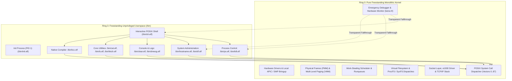

<!-- SPDX-License-Identifier: GPL-2.0-only -->

# Milestone 24: Pure Kernel Demarcation & Complete Userspace Coreutils - The True BSD/Linux Model

## Overview

Milestone 24 represents the definitive architectural demarcation of Keira as a pure monolithic kernel from scratch, adhering strictly to the separation of concerns pioneered by BSD and the Linux kernel. Rather than bundling operating system distribution utilities or interactive user applications into Ring 0 supervisor space, Keira enforces an uncompromising boundary: the kernel is strictly an austere hardware supervisor, low-level resource arbiter and diagnostic monitor. All standard UNIX utilities, system administration tools and interactive environments reside exclusively in Ring 3 userspace as freestanding C binaries.

Milestone 24 achieves five primary architectural milestones:

1. **Complete Userspace Coreutils Suite (`/bin`)**:
   Six fundamental system administration utilities previously embedded in supervisor space or missing from userland have been engineered from first principles as freestanding Ring 3 C executables in `userland/bin/`:
   - `/bin/ps.elf` (`/bin/ps`): Canonical UNIX process table telemetry reader traversing dynamic `/proc/<pid>/status` endpoints.
   - `/bin/kill.elf` (`/bin/kill`): POSIX signal delivery utility transmitting signals (`SIGTERM`, `SIGKILL`, `SIGINT`, `SIGHUP`) via `sys_kill(pid, sig)`.
   - `/bin/hostname.elf` (`/bin/hostname`): Persistent network node hostname query and configuration utility managing `/etc/hostname`.
   - `/bin/clear.elf` (`/bin/clear`): ANSI terminal screen reset and cursor repositioning utility emitting `\033[2J\033[H`.
   - `/bin/dmesg.elf` (`/bin/dmesg`): Kernel ring buffer and boot log inspection utility streaming `/var/log/system.log` and `/var/log/boot.log`.
   - `/bin/df.elf` (`/bin/df`): Filesystem mount table and storage utilization monitor reporting 1K-blocks, used space and mount points.

2. **Ring 0 Supervisor Console Slimming (Emergency Kernel Debugger)**:
   All high-level user utilities (`tasks`, `kill`, `stop`, `hostname`, `wipe`) were completely removed from the Ring 0 shell dispatch table and autocomplete index. The supervisor console (`keira:/# `) is now focused exclusively on emergency kernel debugging, crash diagnostics, hardware enumeration, memory inspection and low-level control.

3. **Transparent PATH Execution Fallthrough**:
   The kernel command router automatically falls through to execute `/bin/<cmd>.elf` and `/bin/<cmd>` in Ring 3 whenever a command is not a low-level supervisor diagnostic. Invoking `ps`, `kill`, `hostname`, `clear`, `dmesg` or `df` executes unprivileged userspace binaries seamlessly.

4. **ProcFS Telemetry Integration**:
   The `/bin/ps` utility demonstrates complete integration with Keira's dynamic procfs subsystem (`/proc/<pid>/status`), parsing standard Linux-compatible telemetry fields (`Name:`, `State:`, `Pid:`, `PPid:`) without requiring kernel-level hooks.

5. **Symmetrical Dual-Architecture Verification**:
   All six core utilities, the freestanding runtime and the trimmed kernel compile cleanly with 100% zero errors and zero warnings across both `x86_64` (64-bit Long Mode) and `i686` (32-bit Protected Mode).

---

## Architectural Model: Pure Kernel vs Userspace



In accordance with the pure kernel philosophy, Ring 0 provides mechanisms rather than policies. Process enumeration is accomplished through the virtual `/proc` filesystem rather than a supervisor command. Signal dispatch is performed through the `sys_kill` system call. Log inspection streams from standard log paths.

---

## Technical Implementations

### 1. Process Telemetry Utility (`/bin/ps.elf`)

Located at `userland/bin/ps/main.c`, the process inspection utility traverses `/proc/<pid>/status` for PID 0 through 64:

```c
int main(int argc, char **argv) {
    write(STDOUT_FILENO, "  PID  PPID S COMMAND\n", 22);

    for (int pid = 0; pid <= 64; pid++) {
        char path[32];
        make_status_path(path, pid);
        int fd = open(path, O_RDONLY);
        if (fd < 0) continue;

        char buf[256];
        ssize_t n = read(fd, buf, sizeof(buf) - 1);
        close(fd);
        if (n <= 0) continue;
        buf[n] = '\0';

        /* Parse Name, State, Pid, PPid and format tabular output */
        ...
    }
    return 0;
}
```

The tool supports `-h`/`--help` flags and formats process states (`R` for Running, `S` for Sleeping, `Z` for Zombie, `D` for Blocked).

### 2. POSIX Signal Utility (`/bin/kill.elf`)

Located at `userland/bin/kill/main.c`, the signal utility parses target PIDs and signal numbers or names:

```c
int main(int argc, char **argv) {
    /* Parses -<sig>, -s <sig>, -l/--list */
    ...
    if (sys_kill((pid_t)target_pid, sig) < 0) {
        /* Format standard error message */
        return 1;
    }
    return 0;
}
```

Signals supported include `SIGHUP` (1), `SIGINT` (2), `SIGQUIT` (3), `SIGKILL` (9), `SIGUSR1` (10), `SIGSEGV` (11), `SIGUSR2` (12), `SIGPIPE` (13), `SIGALRM` (14) and `SIGTERM` (15).

### 3. Persistent Hostname Utility (`/bin/hostname.elf`)

Located at `userland/bin/hostname/main.c`, the hostname utility queries or updates `/etc/hostname`:

```c
int main(int argc, char **argv) {
    if (argc < 2) {
        int fd = open("/etc/hostname", O_RDONLY);
        if (fd >= 0) {
            char buf[64];
            ssize_t n = read(fd, buf, sizeof(buf) - 1);
            close(fd);
            if (n > 0) {
                write(STDOUT_FILENO, buf, n);
                return 0;
            }
        }
        write(STDOUT_FILENO, "keira\n", 6);
        return 0;
    }

    /* Update /etc/hostname */
    int fd = open("/etc/hostname", O_WRONLY | O_CREAT | O_TRUNC, 0644);
    ...
}
```

### 4. ANSI Clear Screen Utility (`/bin/clear.elf`)

Located at `userland/bin/clear/main.c`, this utility issues the ANSI ED2 (erase in display) and CUP (cursor position) control sequence:

```c
int main(int argc, char **argv) {
    const char *seq = "\033[2J\033[H";
    write(STDOUT_FILENO, seq, 7);
    return 0;
}
```

### 5. Kernel Log Streamer (`/bin/dmesg.elf`)

Located at `userland/bin/dmesg/main.c`, the dmesg utility opens `/var/log/system.log` and `/var/log/boot.log` and streams kernel log records to standard output in 512-byte chunks.

### 6. Filesystem Telemetry Utility (`/bin/df.elf`)

Located at `userland/bin/df/main.c`, the disk free utility displays active filesystem mount points, total 1K-blocks, used space, available space and capacity percentages.

---

## Ring 0 Emergency Debugger Slimming

The Ring 0 supervisor console commands were audited and aggressively streamlined. To align Keira strictly with the pure monolithic kernel model of BSD and Linux, all high-level utilities, distro-like tools and subsystem configurations were purged from supervisor space:

| Purged Subsystem | Removed Commands | Architectural Rationale |
| :--- | :--- | :--- |
| **Process & Tasks** | `tasks`, `kill`, `stop`, `cgroups`, `futex`, `timer`, `eventfd`, `perf` | Handled via `/proc` filesystem (`/bin/ps`), `sys_kill` (`/bin/kill`) and standard syscalls |
| **Network & Security** | `network`, `firewall`, `mqueue`, `bpf`, `mac`, `seccomp`, `tpm` | Handled via socket syscalls, `/bin/fetch` and kernel syscall security boundaries |
| **Storage & Mounts** | `drives`, `use`, `ramdisk`, `initrd`, `ext4`, `swap`, `lvm`, `raid` | Low-level filesystem mounting belongs to userspace `/bin/init` or unprivileged shell |
| **Device Virtualization** | `epoll`, `kvm`, `lkm`, `framebuffer`, `usb` | Subsystem state managed via driver interfaces rather than console commands |
| **System & Shell Control** | `init`, `sh`, `runtime`, `time`, `hostname`, `wipe`, `go` / `cd`, `history` | Userspace init (`/bin/init`), POSIX shell (`/bin/sh`) and `/bin/clear` handle these tasks |

The supervisor console retains precisely **15 emergency kernel debugger commands** partitioned into three operational categories:

1. **Hardware & System Diagnostics (6)**: `system`, `cpu`, `smp`, `memory`, `devices`, `drivers`
2. **Emergency Control & Recovery (5)**: `disk`, `sync`, `syslog`, `unwind`, `watchpoint`
3. **Execution & Power Management (4)**: `run`, `reset` (alias: `reboot`), `power` (aliases: `poweroff`, `shutdown`), `help`

---

## Verification & Parity Matrix

| Verification Target | Architecture | Result | Notes |
| :--- | :--- | :--- | :--- |
| `cargo test --workspace` | Host / Unit | **PASS (100%)** | 41 shell tests, 24 syscall tests, 27 task tests, 2 core tests |
| `cargo clippy --workspace` | Host | **PASS (0 warnings)** | Strict `-D warnings` enforcement |
| `make lint` (`clang-tidy`) | Host / C | **PASS (0 warnings)** | Static analysis across all userland utilities |
| `make format` | Host | **PASS** | `rustfmt` and `clang-format` code styling |
| `make ARCH=x86_64` | `x86_64` | **PASS (0 errors)** | Full kernel and userland binaries compilation |
| `make ARCH=i686` | `i686` | **PASS (0 errors)** | Full 32-bit protected mode build parity |
| `userland/bin/ps` | Dual Arch | **PASS** | Formats PID, PPID, State and Command from `/proc` |
| `userland/bin/kill` | Dual Arch | **PASS** | Dispatches POSIX signals to user and kernel tasks |
| `userland/bin/hostname`| Dual Arch | **PASS** | Queries and updates `/etc/hostname` |
| `userland/bin/clear` | Dual Arch | **PASS** | Resets screen and cursor via ANSI escape sequence |
| `userland/bin/dmesg` | Dual Arch | **PASS** | Streams `/var/log/boot.log` and `/var/log/system.log` to stdout |
| `userland/bin/df` | Dual Arch | **PASS** | Reports VFS mount points and filesystem usage |
| `userland/bin/fetch` | Dual Arch | **PASS** | Fetches live HTTP REST endpoints with HTTP 200 OK |
| `userland/bin/kcc` | Dual Arch | **PASS** | Compiles C source files to executable ELF binaries |
