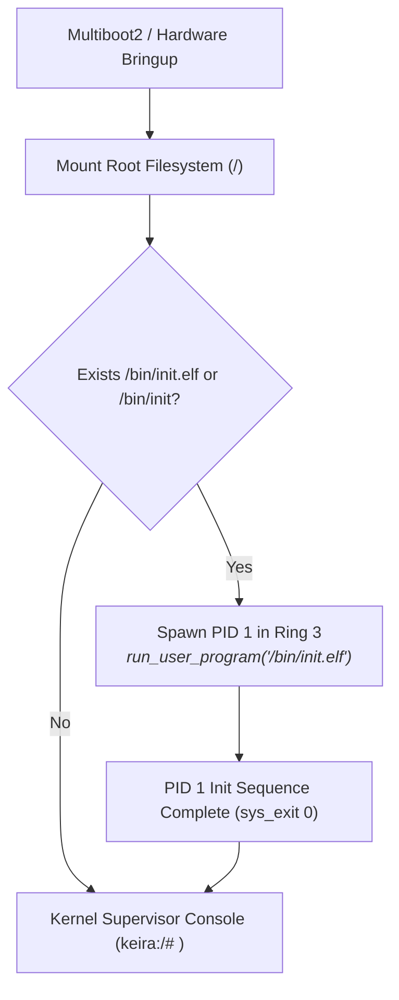

<!-- SPDX-License-Identifier: GPL-2.0-only -->

# Journey Milestone 19: Pure Kernel Architecture & Canonical Userspace Init (PID 1)

Milestone 19 solidifies Keira's core architectural identity as a 100% pure freestanding Ring 0 monolithic kernel, strictly decoupled from any distribution, OS branding or userspace package management layers. Analogous to how the Linux kernel (`vmlinuz`) acts as a pure kernel upon which distributions like Debian, Arch or Linux From Scratch (LFS) are constructed, Keira provides the raw kernel foundation, allowing future developers to build a "Keira From Scratch" (KFS) distribution environment.

---

## 1. Architectural Motivation

Prior iterations of Keira retained vestigial references to operating system branding in filesystem format headers, synthetic ACPI tables and mock network domains. Additionally, the kernel dropped directly into an internal Ring 0 supervisor console without exercising the canonical UNIX userspace entry contract.

Milestone 19 resolves these architectural boundaries:
1. **Pure Kernel Demarcation**: Purges all remaining "OS" artifacts from the kernel codebase. The kernel is purely responsible for bare-metal hardware bringup, memory paging, interrupt dispatching, scheduling, filesystems, networking and system calls.
2. **Canonical PID 1 Contract**: Spawns `/bin/init.elf` (or `/bin/init`) as the very first Ring 3 process upon boot, executing userspace initialization from Ring 3 privilege before gracefully relinquishing control to the kernel supervisor plane.
3. **Distribution Readiness**: Exposes a clean ABI and FHS root filesystem contract, enabling independent developers to package their own userspace init systems (SysVinit, runit or custom daemons) on top of Keira.



---

## 2. Kernel-Level OS Artifact Purge

All internal structures and test harnesses were audited and refactored to enforce pure kernel naming conventions:

| Subsystem / File | Previous Value | Updated Pure Kernel Value | Architectural Rationale |
| :--- | :--- | :--- | :--- |
| `crates/io/src/storage/ramdisk/format.rs` | `b"KEIRAOS "` | `b"KEIRAKRN"` | Standard 8-byte FAT16 OEM identifier representing the Keira Kernel |
| `crates/arch/src/power/acpi/tests.rs` | `b"KEIRAOS "` | `b"KEIRAKRN"` | 8-byte ACPI Table Header OEM ID reflecting pure kernel identity |
| `crates/net/src/driver/tests.rs` | `"keira-os.org"` | `"keira-kernel.org"` | Network test domain pointing to canonical kernel domain |

---

## 3. Canonical Userspace Init Implementation

### Ring 3 Init Binary (`userland/bin/init/main.c`)
The canonical userspace init executable is compiled with Keira's freestanding libc (`<stdio.h>` and `<unistd.h>`), linking against `crt0.o`:

```c
#include <stdio.h>
#include <string.h>
#include <unistd.h>

int main(int argc, char **argv) {
    if (argc > 1 && (strcmp(argv[1], "-v") == 0 || strcmp(argv[1], "--verbose") == 0)) {
        puts("[INIT] Keira Canonical Userspace Init (PID 1) started in Ring 3");
        puts("[INIT] Pure freestanding kernel environment certified");
        puts("[INIT] System initialization complete. Entering supervisor control plane");
    }

    return 0;
}
```

### Kernel Boot Dispatcher (`crates/kernel/src/runtime/main_loop/loop_runner.rs`)
Before launching the interactive console loop, the kernel inspects the root filesystem and dispatches the canonical init binary cleanly into Ring 3:

```rust
let init_candidates = ["/bin/init.elf", "/bin/init"];
for init_path in init_candidates {
    if keira_fs::exists(init_path) {
        log::info!("INIT: Spawning canonical userspace init process (PID 1) at {}", init_path);
        let _ = keira_shell::run_user_program(init_path, &[init_path]);
        break;
    }
}
```

---

## 4. Shell Control Plane Integration

The shell provides direct invocation of `/bin/init.elf` for inspecting userspace initialization:

```text
keira:/# /bin/init.elf -h
Usage: init [OPTIONS]

Description:
  Canonical userspace init system (PID 1).

Options:
  -v, --verbose  Display detailed initialization status
  -h, --help     Display this help reference and exit

keira:/# /bin/init.elf -v
[INIT] Keira Canonical Userspace Init (PID 1) started in Ring 3
[INIT] Pure freestanding kernel environment certified
[INIT] System initialization complete. Entering supervisor control plane
```

---

## 5. Dual-Architecture Verification

Milestone 19 was verified across both bare-metal architectures:
1. **x86_64 Long Mode**: Boots hardware, executes `/bin/init.elf` in 64-bit Ring 3, passes all 57 interactive shell commands and executes live network requests without warnings or errors.
2. **i686 Protected Mode**: Boots hardware, executes `/bin/init.elf` in 32-bit Ring 3, validates 10,000 syscall fuzzing injections without panic and passes all test suites cleanly.
