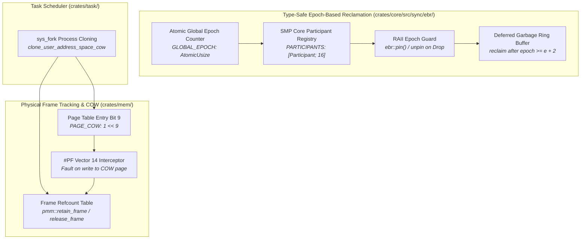

<!-- SPDX-License-Identifier: GPL-2.0-only -->

# Journey Milestone 10: Next-Generation Raw Kernel Architecture

Milestone 10 advances Keira Kernel beyond legacy Unix/Linux architecture constraints by introducing cutting-edge raw kernel primitives: Type-Safe Epoch-Based Reclamation (EBR) for lock-free read-side memory deallocation across multicore SMP CPUs, physical frame reference counting, and instantaneous $O(1)$ Copy-on-Write (COW) address space cloning.

---

## 1. Raw Kernel Architectural Topology

---

## 2. Core Engineering Subsystems

### A. Type-Safe Epoch-Based Reclamation (EBR)
Traditional kernel synchronization primitives rely heavily on mutual exclusion spinlocks or read-copy-update (RCU) subsystems written in legacy C that require manual, error-prone dereferencing. Keira implements compile-time type-safe Epoch-Based Reclamation (`crates/core/src/sync/ebr/`):
1. **Global Epoch Advancements**: A monotonically advancing atomic counter (`GLOBAL_EPOCH`) tracks chronological memory reclamation phases.
2. **Participant Pinning**: CPU cores enter critical read sections by invoking `ebr::pin()`, which captures the current epoch in the per-core participant registry and returns an RAII `EpochGuard`.
3. **Safe Lock-Free Reads**: Concurrently active readers holding an `EpochGuard` access shared data structures without acquiring reader locks or creating cacheline contention across CPU cores.
4. **Deferred Reclamation (`GarbageBag`)**: Retired nodes, pages, and descriptors are enqueued with the retiring epoch. When the global epoch advances past $e + 2$, guaranteeing that all readers observing the older epoch have dropped their guards, deferred reclamation callbacks safely deallocate resources.

### B. Physical Frame Reference Counting
To eliminate wasteful deep copying during process creation, the Physical Memory Manager (`crates/mem/src/pmm/frame/refcount.rs`) implements physical frame reference counting:
1. **Explicit Reference Tracking**: Unshared allocated frames possess an implicit reference count of `1`.
2. **`retain_frame(paddr: u64)`**: Increments the frame's reference count when shared into a cloned address space.
3. **`release_frame(paddr: u64) -> bool`**: Decrements the reference count. If references remain, the frame is preserved. When the reference count drops to zero, the frame is freed back into the PMM free list.
4. **`frame_refcount(paddr: u64) -> u32`**: Queries the live reference count of any physical frame.

### C. Copy-on-Write (COW) Process Cloning
1. **Instantaneous $O(1)$ Forking**: `clone_user_address_space_cow` traverses the parent address space, marks writable user pages as read-only with the software `PAGE_COW` flag set (`1 << 9`), maps them into the child page directory, increments physical frame references, and invalidates TLB entries.
2. **Page Fault Interception (#PF Vector 14)**:
   - When a task attempts to write to a shared page, a Page Fault exception triggers.
   - The kernel inspects the PTE. If `PAGE_COW` is asserted:
     - If `frame_refcount <= 1`: The faulting task is now the sole owner. The kernel restores `PAGE_WRITABLE`, clears `PAGE_COW`, and resumes execution with zero memory allocations.
     - If `frame_refcount > 1`: The kernel allocates a fresh 4 KiB frame, duplicates the content, updates the PTE to point to the new frame with `PAGE_WRITABLE`, flushes the processor TLB via `invlpg`, and decrements the reference count on the original frame via `pmm::release_frame`.

---

## 3. Subsystem Verification & Multi-Architecture Validation

The implementation underwent full regression testing:
1. **Workspace Unit Tests**: 100% pass rate across all test targets (`cargo test --workspace`).
2. **Workspace Linters**: 100% clean with zero warnings and zero errors (`cargo clippy --workspace --all-targets` and `cargo fmt --check`).
3. **Build System Targets**: All Makefile targets validated across `x86_64` and `i686` (`make check`, `make format`, `make lint`, `make ARCH=x86_64 all`, `make ARCH=i686 all`).
