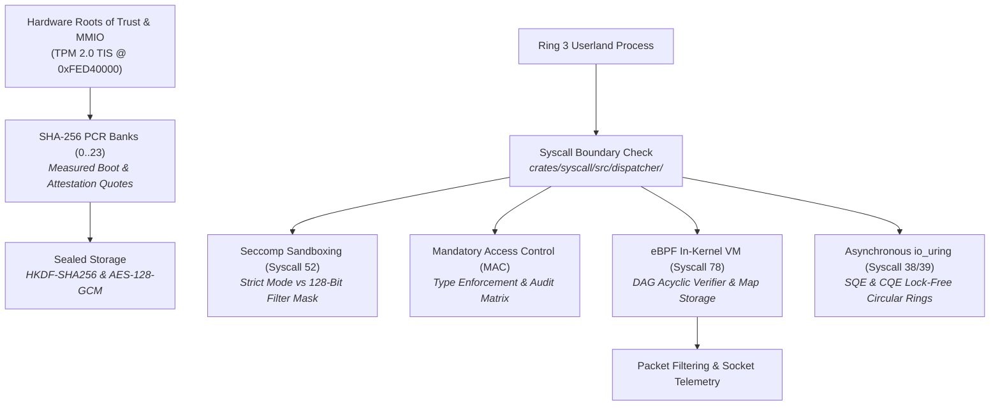

<!-- SPDX-License-Identifier: GPL-2.0-only -->

# Journey Milestone 7: Security Enclaves, eBPF & Asynchronous I/O

Milestone 7 transitions Keira from a functional multi-user system into a hardened, defense-in-depth operating system. It introduces hardware-rooted trust via a TPM 2.0 security enclave, an in-kernel eBPF virtual machine with static safety verification, multi-layer sandboxing through Seccomp and Mandatory Access Control (MAC) and a high-performance asynchronous `io_uring` engine.

---

## 1. Security Architecture & Execution Pipeline



---

## 2. Core Engineering Implementations

### A. TPM 2.0 TIS MMIO Enclave & Measured Boot
Hardware security guarantees are rooted in the Trusted Platform Module (TPM 2.0) interface implemented according to the TCG PC Client Platform TPM Profile:
1. **MMIO Register Mapping**: The kernel accesses the TPM hardware through memory-mapped I/O starting at base address `0xFED4_0000`:
   - `TPM_REG_ACCESS` (`0x0000`): Locality request and arbitration controls (`REQUEST_USE = 0x02`, `ACTIVE_LOCALITY = 0x20`).
   - `TPM_REG_STS` (`0x0018`): Device status flags, burst count and data availability indicators.
   - `TPM_REG_DATA_FIFO` (`0x0024`): Data FIFO transfer register for commands and responses.
   - `TPM_REG_DID_VID` (`0x0F00`) / `TPM_REG_RID` (`0x0F04`): Hardware vendor, device and revision identifiers.
2. **SHA-256 Platform Configuration Registers (PCR)**: Keira maintains a 24-slot SHA-256 PCR bank tracking kernel and bootloader measurements:
   - `PCR[00]`: Firmware and BIOS IVT integrity signature.
   - `PCR[01]`: Host bus and platform hardware configuration.
   - `PCR[02]`: PCI device topology and host bridge configuration.
   - `PCR[04]`: Kernel `.text` executable code segment measurement.
   - `PCR[05]`: Initrd USTAR filesystem archive measurement.
   - `PCR[07]`: Secure Boot policy and SMAP/SMEP execution state.
   - `PCR[10]`: Integrity Measurement Architecture (IMA) launched binary digests.
3. **Genuine `TPM2_PCR_Extend` Operation**: Dynamic measurements update PCR slots following the cryptographically irreversible extend formula:
   $$\text{PCR}_{\text{new}} = \text{SHA256}(\text{PCR}_{\text{old}} \parallel \text{SHA256}(\text{data}))$$
4. **Policy-Bound Sealed Storage**: Secret payloads (up to 128 bytes) are sealed against specific PCR bitmasks. The encryption key is derived using HKDF-SHA256 from an internal TPM master seed and the PCR attestation quote digest:
   ```rust
   #[repr(C)]
   pub struct TpmSealedBlob {
       pub magic: [u8; 4],               // b"TPMS"
       pub pcr_mask: u32,                // Policy bitmask (e.g. 0x0000_00FF)
       pub expected_quote: [u8; 32],     // SHA-256 composite quote digest
       pub nonce: [u8; 12],              // 96-bit initialization vector
       pub data_len: u32,                // Secret payload byte length
       pub ciphertext: [u8; 128],        // AES-128-GCM encrypted payload
       pub auth_tag: [u8; 16],           // 128-bit Galois authentication tag
   }
   ```
   If any measured system component changes, the PCR quote digest diverges, causing unsealing to fail cryptographically at authentication tag verification.
5. **System Call Vector**: Exposed to Ring 3 through `SYS_TPM2` (`Syscall 79`).

### B. In-Kernel eBPF Virtual Machine & Static Verifier
To allow safe, programmable packet inspection and kernel telemetry without modifying kernel source code, Keira provides an in-kernel extended Berkeley Packet Filter (eBPF) runtime:
1. **Virtual Machine Architecture**: A register-based interpreter with 10 64-bit virtual registers (`reg_a`, `reg_x`), a 16-slot 32-bit scratchpad memory array, and a hard execution cycle limit of 256 instructions per invocation.
2. **DAG Acyclic Static Verifier (`bpf_verify`)**: Untrusted bytecode is validated before execution:
   - Program size is bounded to a maximum of 32 instructions.
   - Bounded execution graph: All jump targets (`BPF_JA`, `BPF_JEQ`, `BPF_JGT`, `BPF_JGE`, `BPF_JSET`) must jump strictly forward within program boundaries, mathematically precluding loops and recursion.
   - Division-by-zero detection: Any `BPF_ALU | BPF_DIV` instruction with an immediate value of `0` is rejected immediately.
   - Every execution path must terminate with an explicit `BPF_RET` instruction.
3. **In-Kernel BPF Maps**: Key-value data stores accessible by both eBPF programs and userland processes:
   - Array Maps (`BpfMapType::Array`): Fast integer-indexed metric counters (e.g. dropped packet statistics).
   - Hash Maps (`BpfMapType::Hash`): Dynamic key-value mappings (e.g. malicious port blacklists).
4. **System Call Vector**: Program loading, map management and execution are exposed through `SYS_BPF` (`Syscall 78`).

### C. Seccomp Syscall Sandboxing & MAC Type Enforcement
Keira implements multi-tier userland restriction mechanisms:
1. **Secure Computing (Seccomp)**:
   - `Strict Mode` (`SECCOMP_SET_MODE_STRICT`): Restricts process system calls strictly to `read` (`SYS_READ`), `write` (`SYS_WRITE`), `exit` (`SYS_EXIT`), `sigreturn` (`SYS_SIGRETURN`) and `seccomp` (`SYS_SECCOMP`). Any attempt to invoke another syscall triggers instant task termination with `SIGKILL`.
   - `Filter Mode` (`SECCOMP_SET_MODE_FILTER`): A fine-grained 128-bit bitmap (`[u64; 2]`) configuring explicit per-syscall whitelisting.
   - System Call: `SYS_SECCOMP` (`Syscall 52`).
2. **Mandatory Access Control (MAC)**:
   - Enforces Type Enforcement (TE) access rules independent of traditional UNIX discretionary user permissions (`DAC`).
   - Evaluates operations against security domains (`system_u`, `user_u`, `unconfined_u`) and resource targets.
   - Permissions enforced: `MAC_READ`, `MAC_WRITE`, `MAC_EXEC`, `MAC_APPEND`.
   - Modes: `Disabled`, `Permissive` (logs violations without blocking) and `Enforcing` (denies unauthorized access immediately with `-EACCES`).

### D. Asynchronous `io_uring` Engine
High-throughput I/O pipelines eliminate syscall context-switch overhead using dual lock-free circular ring buffers:
1. **Submission Queue (SQ)**: Ring buffer of `SubmissionQueueEntry` (SQE) structures containing opcode, file descriptor, buffer address, length and user data metadata.
2. **Completion Queue (CQ)**: Ring buffer of `CompletionQueueEntry` (CQE) structures populated asynchronously by the kernel containing completion status and result byte counts.
3. **Supported Operations**: `IORING_OP_NOP`, `IORING_OP_READ`, `IORING_OP_WRITE`, `IORING_OP_READV`, `IORING_OP_WRITEV`, `IORING_OP_FSYNC`, `IORING_OP_POLL_ADD`.
4. **System Call Vectors**: Initialized via `SYS_IO_URING_SETUP` (`Syscall 38`) and submitted via `SYS_IO_URING_ENTER` (`Syscall 39`).

---

## 3. Real-Time Telemetry & Shell Verification

```text
keira:/bin# tpm status
TPM 2.0 Hardware Security Controller:
  Hardware Interface: MMIO TIS @ 0xFED40000
  Vendor / Device ID: 0x8086:0x0000 (Intel PTT / QEMU TIS)
  Driver Status     : Ready / Active
  Locality Level    : Locality 0 (Arbitrated)
  Active PCR Banks  : SHA-256 (24 Registers Active)
  Total Measurements: 4 Events Recorded

Platform Configuration Registers (PCR Bank):
  PCR[00]: 4a7d...391f (Firmware / BIOS IVT)
  PCR[01]: b18c...02e4 (Host Config)
  PCR[02]: e3b0...ba4e (Host Bus Topology)
  PCR[04]: 7f83...c19d (Kernel .text Segment)
  PCR[05]: d29a...88b1 (Initrd USTAR Archive)
  PCR[07]: 18fa...54c2 (Secure Boot Policy)
  PCR[10]: e3b0...ba4e (IMA / Executed Binary)

keira:/bin# tpm extend 0 "SECURE_BOOT_VERIFIED"
[OK] TPM2_PCR_Extend successful on PCR[0].
     New Digest: 8c12...49e0

keira:/bin# bpf status
Extended Berkeley Packet Filter (eBPF) Subsystem:
  VM Engine State   : Active (In-Kernel Bytecode Interpreter)
  In-Kernel Verifier: Enforced (CFG Bounded-Cycle Safety Check)
  Loaded Programs   : 1
  Active Maps       : 2
  Total Executions  : 0
  Syscall Interface : Syscall 78 (SYS_BPF)

keira:/bin# bpf progs
Loaded eBPF Kernel Programs:
  ID  TYPE           NAME            INSNS  RUNS   DROPS  PASSES
  --  -------------  --------------  -----  -----  -----  ------
  0   SocketFilter   http_filter     6      0      0      0

keira:/bin# seccomp strict
[OK] Seccomp Strict Sandbox enabled.
     Only read (7, 15), write (1, 8, 16), exit (2), sigreturn (65) and seccomp (52) allowed.
```
