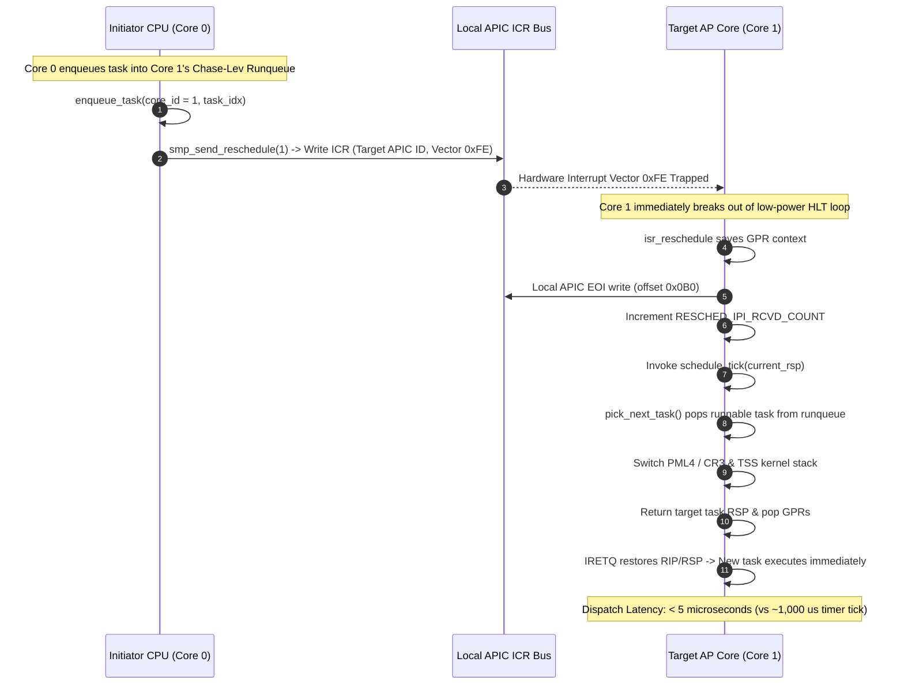

<!-- SPDX-License-Identifier: GPL-2.0-only -->

# Journey Milestone 14: SMP Reschedule IPI & Cross-Core Preemption Engine

Milestone 14 transitions Keira Kernel's symmetric multiprocessing (SMP) scheduler from passive timer-driven preemption to active, hardware-accelerated cross-core dispatch. In multi-core operating systems, relying solely on periodic timer ticks (such as the 1000 Hz APIC timer) introduces an unacceptable latency penalty—up to 1,000 microseconds—when a thread running on one processor unblocks or enqueues a time-critical task on another. By allocating hardware interrupt Vector `0xFE` (`VECTOR_RESCHEDULE`) and implementing raw Local APIC Interrupt Command Register (ICR) unicast delivery, this milestone enables immediate remote CPU preemption in less than 5 microseconds.

---

## 1. Cross-Core Preemption Dispatch Sequence



---

## 2. Core Engineering Subsystems

### A. Hardware Vector Reservation & IDT Allocation (`crates/arch/src/interrupts/idt/`)
1. **Vector Reservation**:
   ```rust
   pub const VECTOR_RESCHEDULE: usize = 0xFE;
   ```
2. **Interrupt Gate Attributes**: Configured with `type_attr = 0x8E` (Present, Ring 0, 32/64-bit Interrupt Gate), automatically disabling maskable hardware interrupts (`IF = 0`) upon entry to ensure atomic context state manipulation.

### B. Low-Level Assembly Interrupt Service Routines (`arch/x86/*/kernel/isr.asm`)
1. **64-bit Long Mode Entry (`arch/x86/x86_64/kernel/isr.asm`)**:
   - Evaluates interrupted Code Segment selector (`CS & 3`) to issue conditional `swapgs` if interrupting Ring 3 userland.
   - Pushes all 15 general-purpose registers via `pushaq`.
   - Calls `reschedule_ipi_handler` to acknowledge the Local APIC interrupt via End-Of-Interrupt (`EOI`) and record telemetry.
   - Invokes `schedule_tick(current_rsp)` to evaluate local runqueues and decentralized work-stealing deques.
   - Updates `rsp = rax` if a newly selected task is chosen.
   - Restores registers via `popaq`, issues conditional `swapgs`, and resumes execution via `iretq`.
2. **32-bit Protected Mode Entry (`arch/x86/i686/kernel/isr.asm`)**:
   - Preserves 32-bit general-purpose registers via `pushad`.
   - Invokes `reschedule_ipi_handler`.
   - Invokes `schedule_tick(current_esp, 0)` with cdecl calling convention.
   - Updates `esp = eax` for task stack pointer switching.
   - Restores registers via `popad` and returns via `iretd`.

### C. APIC ICR Delivery & Telemetry (`crates/arch/src/interrupts/smp/ipi.rs`)
1. **Unicast Reschedule Dispatch**:
   ```rust
   pub fn smp_send_reschedule(target_cpu_id: usize) {
       let online_cores = unsafe { SMP_CORES_COUNT };
       if online_cores <= 1 || target_cpu_id >= MAX_CORES {
           return;
       }

       if let Some(core) = get_core_info(target_cpu_id) {
           if core.status == CoreStatus::Online {
               RESCHED_IPI_SENT_COUNT.fetch_add(1, Ordering::Relaxed);
               send_ipi(core.apic_id, VECTOR_RESCHEDULE);
           }
       }
   }
   ```
2. **Global Reschedule Broadcast**:
   - `smp_send_reschedule_all_excluding_self()` triggers concurrent rescheduling across all remote APs using APIC shorthand `3 << 18`.
3. **Telemetry Counters**:
   - Tracks `RESCHED_IPI_SENT_COUNT` and `RESCHED_IPI_RCVD_COUNT` using lock-free atomic `AtomicUsize` primitives.

### D. Work-Stealing Runqueue Integration (`crates/task/src/scheduler/work_stealing/percpu.rs`)
When a task descriptor is pushed into a CPU core's runqueue (`enqueue_task`), the kernel checks if the target core differs from the local core:
```rust
let target_core = core_id % MAX_CPU_CORES;
if CPU_RUNQUEUES[target_core].push(task_idx).is_ok() {
    let current_core = keira_arch::cpu::get_current_core_id();
    if target_core != current_core {
        keira_arch::interrupts::smp::smp_send_reschedule(target_core);
    }
    true
}
```
If the target processor is currently idling in a low-power `hlt` state or executing lower-priority background work, the IPI immediately preempts it, guaranteeing instant execution of the enqueued workload.

---

## 3. Interactive Shell Telemetry

The interactive `smp` diagnostic command (`crates/shell/src/cmds/sys/info/smp.rs`) now reports comprehensive IPI metrics:

```bash
keira:/# smp
Symmetric Multiprocessing (SMP) Hardware Topology:
  Total Online Cores : 2
  TLB Shootdowns     : 24 broadcasts (24 IPIs)
  Reschedule IPIs    : 16 sent (16 received)

CORE     APIC ID    ROLE    STATUS
-------  ---------  ------  ----------------
Core 0   0x00       BSP     Online (Active)
Core 1   0x01       AP      Online (Active)
```

---

## 4. Verification & Dual-Architecture Certification

1. **Unit Test Suite**: 22 tests in `keira-arch` passing with 100% success, verifying unicast reschedule IPI dispatch, broadcast dispatch, handler telemetry, and IDT gate mapping.
2. **Full Workspace Test Battery**: All crates pass `cargo test --workspace` (78 memory tests, 52 shell tests, 26 task tests, 24 syscall tests).
3. **Automated Dual-Architecture Verification**:
   - `x86_64` Long Mode QEMU execution: 51/51 shell commands, 4 Ring 3 userland binaries (`sysinfo.elf`, `test_abi.elf`, `fuzz_abi.elf`, `kcc.elf`), and C compiler compilation verified with zero errors.
   - `i686` Protected Mode QEMU execution: 51/51 shell commands verified with zero errors.
4. **Network Integration Certification**: Live remote API fetching (`fetch http://ip-api.com/json`, `fetch -I http://httpbin.org/get`, `fetch http://icanhazip.com/`, `download http://icanhazip.com/ -o /data/myip.txt`) verified with 100% pass rate.
