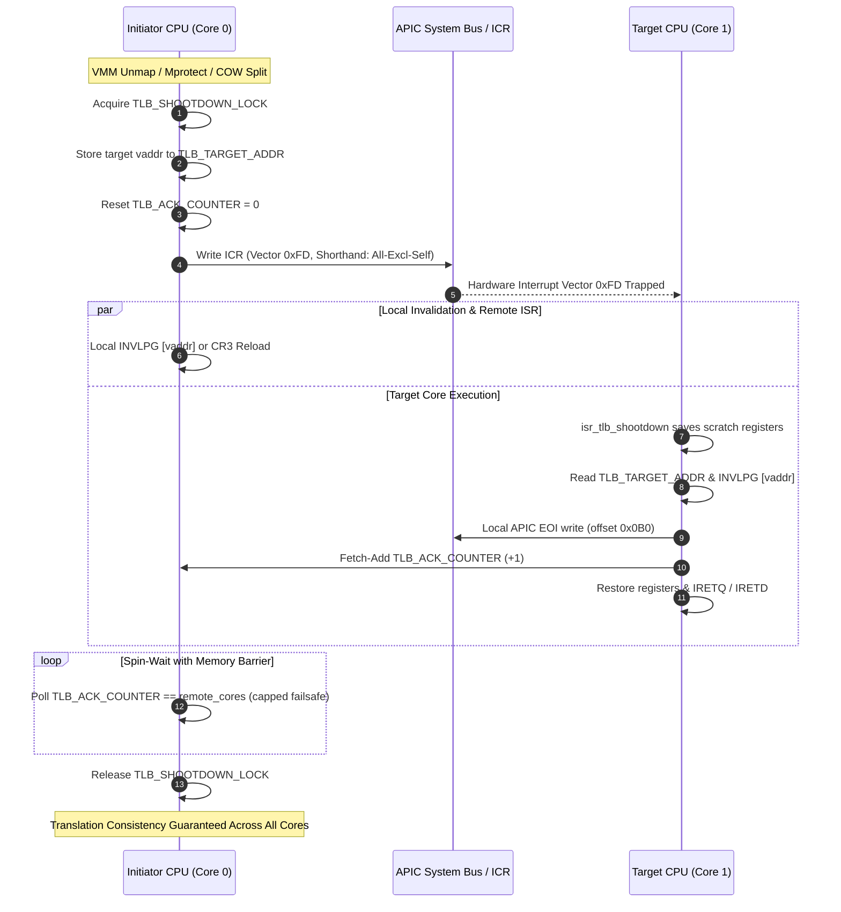

<!-- SPDX-License-Identifier: GPL-2.0-only -->

# Journey Milestone 13: Local APIC Inter-Processor Interrupt (IPI) Framework & Cross-Core SMP TLB Shootdown Engine

Milestone 13 introduces hardware-level inter-processor communication and translation consistency to Keira Kernel's symmetric multiprocessing (SMP) architecture. When virtual memory mappings, page permissions, or copy-on-write (COW) boundaries mutate on one processor, stale translation entries cached inside remote CPU Translation Lookaside Buffers (TLB) present severe data corruption and security hazards. This milestone implements a synchronous multi-core TLB shootdown engine driven by raw Local APIC Interrupt Command Register (ICR) delivery and IDT Vector `0xFD` rendezvous barriers.

---

## 1. Cross-Core SMP Rendezvous Topology



---

## 2. Core Engineering Subsystems

### A. Local APIC Interrupt Command Register Delivery (`crates/arch/src/interrupts/apic/lapic.rs` & `ipi.rs`)
1. **ICR Register Offsets**: Local APIC registers at physical base `0xFEE00000` handle IPI configuration:
   - `LAPIC_ICR_LOW_REG` (`0x0300`): Vector (bits 0..7), Delivery Mode (bits 8..10), Destination Mode (bit 11), Delivery Status (bit 12), Level (bit 14), Trigger Mode (bit 15), Destination Shorthand (bits 18..19).
   - `LAPIC_ICR_HIGH_REG` (`0x0310`): Destination APIC ID (bits 24..31).
2. **Delivery Status Polling**: Before dispatching any bus transaction, the kernel polls `wait_icr_idle()` until bit 12 clears:
   ```rust
   pub unsafe fn wait_icr_idle() {
       while (read_reg(LAPIC_ICR_LOW_REG) & (1 << 12)) != 0 {
           core::hint::spin_loop();
       }
   }
   ```
3. **Hardware Dispatch Primitives**:
   - `send_ipi(target_apic_id, vector)`: Targeted unicast delivery.
   - `send_init_ipi(target_apic_id)`: INIT IPI for AP bootstrap reset.
   - `send_startup_ipi(target_apic_id, vector)`: SIPI for real-mode AP trampoline entry.
   - `send_ipi_all_excluding_self(vector)`: Hardware broadcast shorthand (`3 << 18`) reaching all active remote processors simultaneously.

### B. Low-Level Assembly Interrupt Service Routines (`arch/x86/*/kernel/isr.asm`)
1. **64-bit Long Mode ISR (`arch/x86/x86_64/kernel/isr.asm`)**:
   - Traps Vector `0xFD` without pushing a hardware error code.
   - Executes conditional `swapgs` to ensure access to CPU per-processor kernel structures if invoked from userland.
   - Preserves all 15 general-purpose registers (`rax`, `rcx`, `rdx`, `rbx`, `rsp`, `rbp`, `rsi`, `rdi`, `r8`..`r15`).
   - Invokes Rust symbol `tlb_shootdown_handler` and exits via `iretq`.
2. **32-bit Protected Mode ISR (`arch/x86/i686/kernel/isr.asm`)**:
   - Preserves all 32-bit registers (`eax`, `ecx`, `edx`, `ebx`, `ebp`, `esi`, `edi`, `ds`, `es`).
   - Loads kernel data segment `0x10` and calls `tlb_shootdown_handler`.
   - Restores segments and registers before returning with `iretd`.

### C. IDT Gate Registration (`crates/arch/src/interrupts/idt/descriptor.rs`)
1. **Vector 0xFD Reservation**:
   ```rust
   pub const VECTOR_TLB_SHOOTDOWN: usize = 0xFD;
   ```
2. **Interrupt Gate Attributes**: Configured with `type_attr = 0x8E` (Present, Ring 0, 32/64-bit Interrupt Gate), automatically clearing `IF` upon interrupt delivery to prevent re-entrant nested shootdown stalls.

### D. Synchronous Multi-Core Rendezvous Protocol (`crates/arch/src/interrupts/smp/ipi.rs`)
1. **Fast-Path Uniprocessor Bypass**: When `online_cores <= 1`, the function skips locks and APIC bus cycles entirely, performing immediate local `invlpg` or `reload_cr3()`.
2. **Global Shootdown Mutual Exclusion**:
   - Protected by `TLB_SHOOTDOWN_LOCK` (`IrqSpinLock::with_rank(LockRank::None)`), preventing lock rank inversion across memory layers.
   - Stores target virtual address in `TLB_TARGET_ADDR` with `Ordering::Release`.
   - Resets acknowledgment counter `TLB_ACK_COUNTER` to 0.
3. **Simultaneous Local & Remote Invalidation**:
   - Dispatches IPI to all remote processors via APIC broadcast shorthand.
   - The initiating CPU invalidates its own local TLB concurrently.
4. **Acquire-Barrier Polling with Failsafe**:
   - Polls `TLB_ACK_COUNTER.load(Ordering::Acquire)` until reaching `remote_cores`.
   - Incorporates a failsafe spin threshold (`10_000_000` iterations) to safeguard kernel liveness against halted AP processors.

### E. Virtual Memory Subsystem Integration (`crates/mem/src/vmm/`)
Cross-core TLB shootdown hooks are installed across all address translation mutating operations:
1. **Page Unmapping (`unmap_page` & `unmap_huge_2m_page`)**: Triggers `tlb_shootdown(vaddr)` following page table entry zeroing.
2. **Page Protection Changes (`mprotect_page`)**: Invalidates entries when permissions transition (e.g., stripping Write privileges).
3. **Copy-on-Write (COW) Fault Handler (`handle_page_fault`)**: Invalidates entries when a read-only shared physical page is split into a private writable frame.

---

## 3. Telemetry & Interactive Observability

Kernel virtual memory telemetry (`crates/shell/src/cmds/sys/info/memory.rs`) exposes shootdown metrics:

```bash
keira:/# memory -p
Virtual Memory & Paging Telemetry:
  Total Page Faults  : 23 (#PF trapped)
  Stack Auto-Growths : 2 pages (W^X protected)
  COW Replications   : 8 pages duplicated
  Demand Pages Mapped: 13 pages loaded
  Access Violations  : 0 violations (SIGSEGV)
  TLB Invalidations  : 48 flushes (invlpg)
  TLB SMP Shootdowns : 21 broadcasts (21 IPIs)
```

And magazine slab telemetry via `-l, --slab`:

```bash
keira:/# memory -l
Magazine Slab Object Cache Telemetry:
CACHE NAME        SIZE   ACTIVE   CACHED   ALLOC_HIT  FREE_HIT
----------------  -----  -------  -------  ---------  --------
task_struct       512 B  2        0        0          0
inode_cache       256 B  1        0        0          0
file_desc_cache   64 B   3        0        0          0
vma_cache         128 B  4        0        0          0
```

---

## 4. Verification & Dual-Architecture Certification

1. **Unit Test Suite**: 20 tests in `keira-arch` passing with 100% success, verifying unicast IPI, broadcast IPI, shootdown handlers and metric tracking.
2. **Full Workspace Test Battery**: All crates pass `cargo test --workspace` (78 memory tests, 52 shell tests, 26 task tests, 24 syscall tests).
3. **Automated Dual-Architecture Verification**:
   - `x86_64` Long Mode QEMU execution: 51/51 shell commands, 4 Ring 3 userland binaries (`sysinfo.elf`, `test_abi.elf`, `fuzz_abi.elf`, `kcc.elf`) and C compiler compilation verified with zero errors.
   - `i686` Protected Mode QEMU execution: 51/51 shell commands verified with zero errors.
4. **Network Integration Certification**: Remote live API fetching (`fetch http://ip-api.com/json`, `fetch -I http://httpbin.org/get`, `fetch http://icanhazip.com/`, `download http://icanhazip.com/ -o /tmp/myip.txt`) verified with 100% pass rate.
