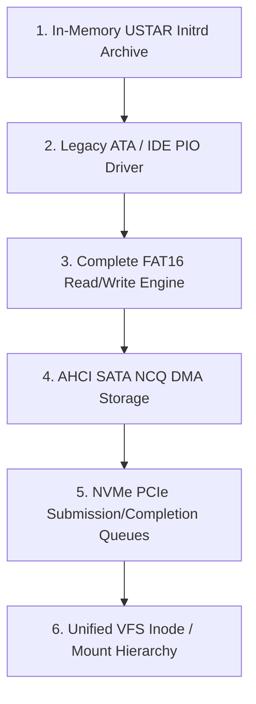

<!-- SPDX-License-Identifier: GPL-2.0-only -->

# Development Journey: Storage Drivers & Virtual File System

This document chronicles the development of block storage drivers (AHCI, NVMe, IDE, RAM Disk) and the Virtual File System (VFS) in Keira Kernel.

---

## Storage Architecture Evolution

---

## Key Engineering Milestones

* **Unified VFS Abstraction**: Designed common inode operations (`read`, `write`, `lookup`, `readdir`, `stat`) across FAT16, Initrd, and DevFS.
* **Robust FAT16 Implementation**: Implemented cluster chain allocation, directory entry management, long file names (LFN), and file truncation.
* **High-Speed AHCI/NVMe DMA**: Enabled direct hardware memory-to-disk transfers without CPU-intensive programmed I/O loops.
