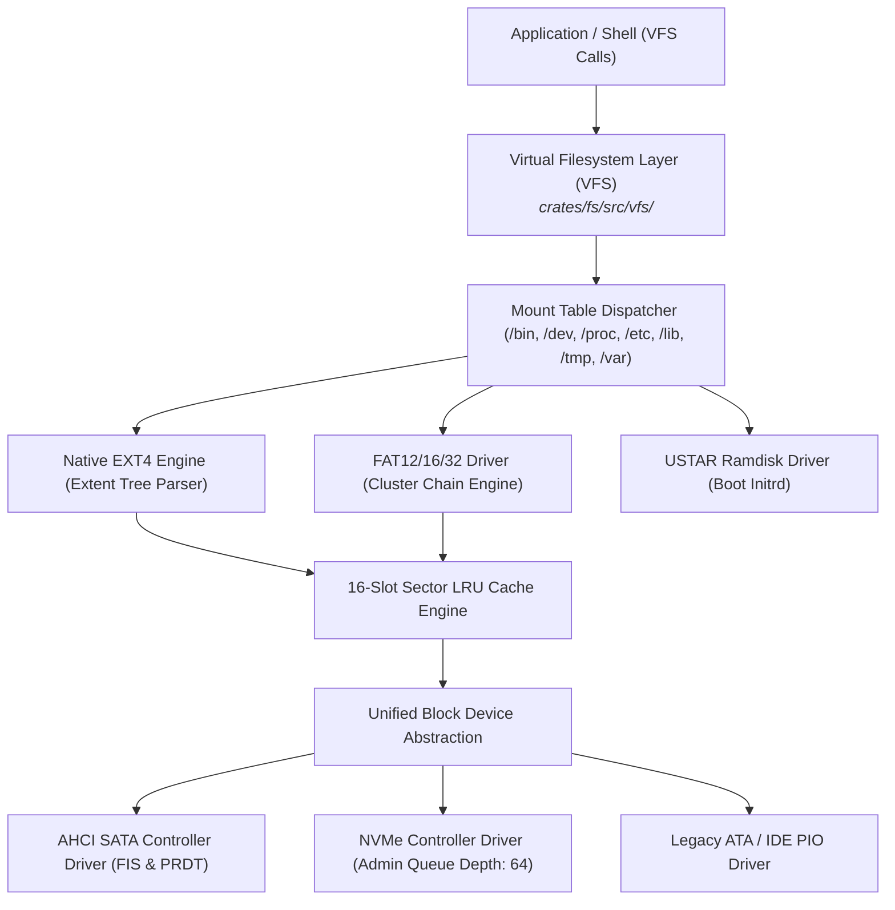

<!-- SPDX-License-Identifier: GPL-2.0-only -->

# Journey Milestone 3: Storage Drivers, VFS & Filesystem Layers

Milestone 3 equips Keira with complete block storage access, an extensible Virtual Filesystem (VFS) abstraction, FAT16/FAT32 write support, native Linux EXT4 read support and an in-kernel Sector LRU Cache.

---

## 1. Storage & Filesystem Architecture


```mermaid
graph TD
    App["Application / Shell (VFS Calls)"] --> VFS["Virtual Filesystem Layer (VFS)<br/><i>crates/fs/src/vfs/</i>"]
    VFS --> MountTable["Mount Table Dispatcher (/bin, /dev, /proc, /etc, /lib, /tmp, /var)"]
    MountTable --> EXT4["Native EXT4 Engine (Extent Tree Parser)"]
    MountTable --> FAT["FAT12/16/32 Driver (Cluster Chain Engine)"]
    MountTable --> USTAR["USTAR Ramdisk Driver (Boot Initrd)"]
    EXT4 & FAT --> LRUCache["16-Slot Sector LRU Cache Engine"]
    LRUCache --> BlockDev["Unified Block Device Abstraction"]
    BlockDev --> AHCI["AHCI SATA Controller Driver (FIS & PRDT)"]
    BlockDev --> NVMe["NVMe Controller Driver (Admin Queue Depth: 64)"]
    BlockDev --> ATA["Legacy ATA / IDE PIO Driver"]
```

---

## 2. Core Engineering Implementation Details

### A. AHCI SATA Driver & Frame Information Structures (FIS)
Keira interacts with modern SATA storage via the Advanced Host Controller Interface (AHCI):
- Discovers the AHCI controller via PCI Class `0x01` (Mass Storage), Subclass `0x06` (SATA), Prog IF `0x01` (AHCI 1.0).
- Maps the Generic Host Control registers (ABAR MMIO space).
- Configures Command List and Received FIS (Frame Information Structure) buffers in physical DMA memory.
- Uses **Physical Region Descriptor Tables (PRDT)** to stream sectors directly between disk controllers and kernel RAM without CPU polling loops.

### B. Virtual Filesystem (VFS) Architecture
The VFS abstracts all storage media behind a unified POSIX tree:
- **Standard UNIX FHS Hierarchy**: `/bin` (binaries), `/dev` (device nodes), `/proc` (kernel telemetry), `/sys` (hardware topology), `/etc` (system configuration), `/include` (headers), `/lib` (runtime libraries), `/tmp` (scratch workspace) and `/var/log` (logs and persistent diagnostics).
- **Mount Points**: Block devices and ramdisks are dynamically bound to root subdirectories via `vfs::mount(target_path, driver)`.
- **Path Resolution**: The `resolve_path()` engine parses absolute and relative paths, resolves directory symlinks and dispatches file operations (`open`, `read`, `write`, `close`, `seek`) to the target filesystem driver.

### C. Native Linux EXT4 Extent Tree Traversal
Rather than relying on outdated indirect block pointers, Keira implements a bare-metal reader for Linux EXT4 filesystems:
1. Validates the **Superblock Magic** signature `0xEF53`.
2. Reads the Block Group Descriptor Table to locate inode tables and bitmaps.
3. Parses the 4-level **Extent Tree** embedded within the inode's `i_block` structure:
   - `ext4_extent_header`: Magic `0xF30A`, entry count and depth.
   - `ext4_extent_idx`: Points to intermediate extent nodes down the tree.
   - `ext4_extent`: Leaf node specifying file block offset, block length and starting physical block address.
4. Allows direct, high-performance streaming of multi-megabyte kernel assets from standard Linux partitions.

### D. Sector LRU Cache Engine
Disk access latency is mitigated by an in-kernel **Least Recently Used (LRU) Sector Cache**:
- Maintains 16 slots of 512-byte sector buffers.
- Tracks hits, misses and evictions to maximize throughput.
- Flushed synchronously during `sync` commands to ensure persistent integrity.

---

## 3. Real-Time Telemetry & Shell Verification

```text
keira:/# drives
NAME       TYPE       SIZE (KB)   STATUS
----       ----       ---------   ------
ahci0      SATA Disk 10240        [Mounted]

keira:/# disk
Active Drive (ahci0) Size: 10 MB (20480 sectors)
Filesystem:    FAT16
Cluster Size:  2048 bytes (4 sectors)
Reserved Secs: 4
Root Directory: 512 entries (start sector: 132)
LRU Cache:     5/16 slots (Hits: 1, Misses: 5, Evictions: 0, Hit Ratio: 16%)

keira:/# list /etc
Directory of IDE disk:
  [file] grub.cfg
  [file] hostname
  [file] kernel.cfg

keira:/# view /etc/grub.cfg
console=tty0 serial=ttyS0,115200 root=/dev/sda1 quiet loglevel=3
```
