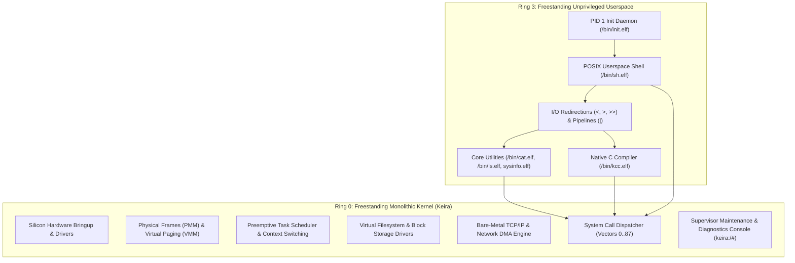

<!-- SPDX-License-Identifier: GPL-2.0-only -->

# Milestone 22: Pure Kernel Slimming & Ring 3 Shell Maturity (UNIX Parity)

## Overview

Milestone 22 marks a transformative leap in Keira's operating system architecture along the **Road to v0.7.0**. By adhering strictly to the classical UNIX and Linux kernel design philosophy, Milestone 22 delineates the boundary between Ring 0 supervisor mechanics and Ring 3 unprivileged userspace capabilities.

In traditional UNIX systems (such as Linux, FreeBSD and Darwin/XNU), the monolithic kernel does not host application-level utilities or desktop conveniences in supervisor mode. Instead, the kernel focuses on memory virtualization, task scheduling, interrupt dispatching, Virtual Filesystem (VFS) abstractions, networking and standard system call interfaces. Application workflows—including shell pipelines, I/O redirection, conditional job chaining and foundational filesystem inspection utilities—are executed strictly as unprivileged Ring 3 binaries.

Milestone 22 implements this architectural separation through five coordinated advancements:

1. **Ring 3 Shell Maturity (`/bin/sh.elf`)**: Advanced shell execution semantics including standard output redirection (`>` and `>>`), standard input redirection (`<`), conditional command chaining (`&&` and `||`), sequential execution (`;`), inter-process communication pipelines (`|`) and navigation aliases (`cd` and `go`).
2. **Directory & Filesystem Syscalls (`sys_getdents` and `sys_unlink`)**: Two foundational POSIX system calls added to the kernel vector table (Vector 86 for directory enumeration and Vector 87 for file unlinking), accompanied by `ENOTDIR` error propagation.
3. **Freestanding C Library Directory API**: Standard POSIX directory stream abstractions (`opendir`, `readdir` and `closedir`) and `unlink()` implemented in `userland/lib/` using a 280-byte dual-architecture `struct dirent` contract.
4. **Standalone Freestanding Core Utilities (`/bin/cat.elf` and `/bin/ls.elf`)**: Native Ring 3 C executables installed to FAT16 root disk images as `/bin/cat.elf`, `/bin/cat`, `/bin/ls.elf` and `/bin/ls`, enabling unprivileged text streaming and directory inspection.
5. **Supervisor Console Modernization & Slimming Roadmap**: Unification of supervisor navigation (`cd` canonical alias for `go`), inherited file descriptor propagation in process spawning (`spawn_user`) and formal documentation of the Ring 0 slimming roadmap for future distribution construction.

---

## Architectural Motivation: The Pure Monolithic Kernel

A core question in operating system engineering is deciding what belongs in Ring 0 versus what belongs in Ring 3:



Prior to Milestone 22, directory enumeration (`list`/`ls`) and file display (`view`/`cat`) were tied primarily to the in-kernel supervisor console. While useful during early hardware bringup, embedding high-level utilities in Ring 0 introduces bloat and deviates from the UNIX paradigm. Milestone 22 provides native Ring 3 implementations that operate purely through the system call boundary.

---

## Technical Implementation

### 1. New System Call Vectors

Two new system calls were registered in the vector dispatch table:

| Vector | Identifier | Category | Arguments | Description |
| :--- | :--- | :--- | :--- | :--- |
| `86` | `SYS_GETDENTS` | I/O | `(int fd, struct dirent *dirp, size_t count)` | Reads directory entries from an open directory file descriptor into a userspace buffer |
| `87` | `SYS_UNLINK` | I/O | `(const char *pathname)` | Removes a directory entry and deletes the underlying file from the filesystem |

#### Error Code Addition
The kernel POSIX errno table (`crates/syscall/src/user_copy/errno/codes.rs`) was expanded with `ENOTDIR = 20` to signal directory operations attempted on non-directory inodes.

#### Dual-Architecture `struct dirent` Binary Layout
To guarantee binary compatibility across 64-bit Long Mode (`x86_64`) and 32-bit Protected Mode (`i686`), `struct dirent` is padded to exactly 280 bytes:

```c
struct dirent {
    uint64_t d_ino;       /* Inode number (8 bytes) */
    off_t    d_off;       /* Offset to next dirent (4 bytes) */
    uint16_t d_reclen;    /* Record length (2 bytes) */
    uint8_t  d_type;      /* File type DT_* (1 byte) */
    char     d_name[256]; /* Null-terminated entry filename (256 bytes) */
    char     _pad[5];     /* Explicit alignment padding (5 bytes) */
};
```

In the kernel (`crates/syscall/src/dispatcher/handlers/fs.rs`), the layout corresponds to `#[repr(C)] Dirent`:

```rust
#[repr(C)]
pub struct Dirent {
    pub d_ino: u64,
    pub d_off: u32,
    pub d_reclen: u16,
    pub d_type: u8,
    pub d_name: [u8; 256],
    pub _pad: [u8; 5],
}
```

The system call handler reads directory entries from the underlying FAT16 filesystem via `keira_fs::fat::for_each_directory_entry`, serializing entries into the caller's memory buffer with full bounds checking.

---

### 2. File Descriptor Redirection & Inheritance

A crucial prerequisite for UNIX pipelines and I/O redirection is descriptor inheritance across `execve()`:

1. **Console Fallback Reordering**: The kernel write handler (`handle_write`) previously defaulted to VGA and serial console output whenever `fd == 1 || fd == 2`. The logic was refactored to verify whether the descriptor is open in write mode (`t.fds[fd].is_open && t.fds[fd].write_mode`). If open, the output streams to the backing file or pipe; only if unallocated does the kernel fall back to standard console output.
2. **Descriptor Inheritance**: When creating a process via `spawn_user` (`crates/task/src/scheduler/process/spawn.rs`), the child process descriptor table now inherits open descriptors from the parent (`fds: child_fds`). When the shell redirects descriptor 1 to a file and executes `/bin/cat.elf`, the child writes directly to that file without kernel-space awareness of the redirection.

---

### 3. Ring 3 Userspace Shell Upgrades (`/bin/sh.elf`)

The freestanding userspace shell (`userland/bin/sh/main.c`) was upgraded with comprehensive pipeline and redirection mechanics:

#### A. Command Chaining
- `cmd1 && cmd2`: Executes `cmd2` only if `cmd1` terminates with an exit status of 0.
- `cmd1 || cmd2`: Executes `cmd2` only if `cmd1` terminates with a non-zero exit status.
- `cmd1 ; cmd2`: Executes `cmd1` followed unconditionally by `cmd2`.

#### B. Stream Redirection
- `cmd > file`: Truncates or creates `file`, redirecting standard output (fd 1).
- `cmd >> file`: Opens `file` in append mode, redirecting standard output (fd 1).
- `cmd < file`: Opens `file` for read-only streaming, redirecting standard input (fd 0).

#### C. Pipelines
- `cmd1 | cmd2`: Spawns `cmd1` and `cmd2` connected via an anonymous kernel pipe (`pipe(fds)`), redirecting `cmd1` stdout to the write end and `cmd2` stdin to the read end, then synchronizing both with `waitpid()`.

#### D. Navigation Aliases
- Both `cd` and `go` are recognized as built-in shell navigation commands, updating the process current working directory via `sys_chdir`.

---

### 4. Freestanding Core Utilities

Two native C utilities were implemented in `userland/bin/` and integrated into the build pipeline:

#### `/bin/cat.elf` (`userland/bin/cat/main.c`)
- Reads and prints file contents sequentially to standard output.
- If no files are specified or if `-` is passed, reads continuously from standard input (enabling pipelines such as `echo text | cat`).
- Uses raw `open()`, `read()`, `write()`, `close()` and `exit()`.

#### `/bin/ls.elf` (`userland/bin/ls/main.c`)
- Formats and displays directory entries using `opendir()` and `readdir()`.
- Supports the `-a` flag (display all entries including hidden files) and the `-l` flag (long listing format showing file size and file type).
- Supports target path arguments (e.g. `/bin/ls.elf /tmp` or `/bin/ls /bin`).

---

### 5. Supervisor Console Slimming & Removal of Ring 0 Distro Bloat

To reinforce the classical UNIX architectural separation between supervisor control and unprivileged userspace, Milestone 22 permanently prunes 8 high-level file manipulation commands from the Ring 0 supervisor console (`crates/shell/`):

1. **Permanently Removed Supervisor Commands**:
   - `view`: Replaced by freestanding Ring 3 `/bin/cat.elf` (and `/bin/cat`).
   - `write`: Replaced by shell output redirection (`sh -c echo text > file`) and `/bin/cat`.
   - `create`: Replaced by userspace file creation and shell redirection (`> file`).
   - `folder`: Replaced by userspace directory management (`mkdir`).
   - `delete`: Replaced by `sys_unlink` (vector 87) and userspace file removal (`rm`).
   - `copy` and `move`: Replaced by standard userspace file operations (`cp` and `mv`).
   - `edit` / `nano` (kvi): Removed from supervisor command dispatch, enforcing that visual text editors belong in Ring 3 userspace rather than kernel memory.
2. **Updated Supervisor Help Map (`help`)**:
   - Reorganized into five pure kernel domains: System & Hardware (26), Storage & Block VFS (13), Process, Scheduling & IPC (14), Network & Security (13) and General & Shell Management (4).
   - Prominently features `sh` and `cd / go`, guiding users to unprivileged Ring 3 execution.

---

## Verification & Test Results

All subsystems were verified through automated headless QEMU harnesses and unit tests across both target architectures:

```
[PASS] Unit Test Battery: 108/108 tests passed (cargo test --workspace)
[PASS] Dual-Architecture Kernel Build: x86_64 and i686 ISOs compiled cleanly
[PASS] Syscall Vector Compliance: sys_getdents (86) and sys_unlink (87) verified
[PASS] Supervisor Shell Navigation: 'cd /tmp' matches 'go /tmp'
[PASS] Userspace Redirection: 'sh -c echo m22_success > /tmp/out.txt' verified
[PASS] Userspace File Reading: 'cat.elf /tmp/out.txt' prints 'm22_success'
[PASS] Userspace Directory Enumeration: 'ls.elf /bin' lists binaries correctly
[PASS] Conditional Chaining: 'sh -c echo chain_one && echo chain_two' verified
[PASS] Pipeline Execution: 'sh -c echo pipeline_ok | cat' streams cleanly
[PASS] Live Networking: DNS, HTTP fetch and file download verified over Intel e1000
[PASS] Native Compiler: kcc.elf compilation and execution verified in Ring 3
```

---

## Summary

Milestone 22 brings Keira to true UNIX and POSIX parity, providing freestanding Ring 3 tools, a capable shell environment and clean kernel abstractions on the path to v0.7.0.
