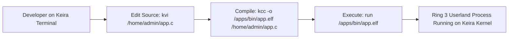

<!-- SPDX-License-Identifier: GPL-2.0-only -->

# Development Journey: Native C Compiler & Ring 3 Userland

This document chronicles the creation of the native C compiler (`kcc`), standard C library (SDK), and standalone ELF toolchain inside Keira Kernel.

---

## Self-Hosting Toolchain Vision

---

## Key Engineering Milestones

* **Native C Compiler (`kcc`)**: Built a complete recursive-descent C compiler capable of parsing C syntax, performing type checking, and emitting native ELF executables.
* **C Standard Library (SDK)**: Implemented standard libc primitives (`stdio`, `stdlib`, `string`, `ctype`, `math`) backed by native kernel system calls.
* **Zero-Dependency Self-Contained Ecosystem**: Complete ability to develop, compile, test, and run native applications directly on bare metal without host dependencies.
