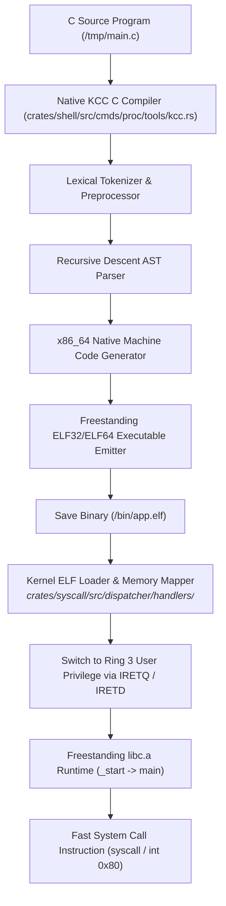

<!-- SPDX-License-Identifier: GPL-2.0-only -->

# Journey Milestone 6: Userland Runtime & Native C Compiler

Milestone 6 realizes the ultimate objective of an operating system kernel: achieving complete privilege isolation between untrusted user applications (Ring 3) and privileged supervisor services (Ring 0), complemented by a freestanding C runtime and an in-kernel C compiler.

---

## 1. Userland Execution & Toolchain Pipeline


```mermaid
graph TD
    Source["C Source Program (/tmp/main.c)"] --> KCC["Native KCC C Compiler (crates/shell/src/cmds/proc/tools/kcc.rs)"]
    KCC --> Lexer["Lexical Tokenizer & Preprocessor"]
    Lexer --> Parser["Recursive Descent AST Parser"]
    Parser --> CodeGen["x86_64 Native Machine Code Generator"]
    CodeGen --> ELFEmitter["Freestanding ELF32/ELF64 Executable Emitter"]
    ELFEmitter --> Disk["Save Binary (/bin/app.elf)"]
    Disk --> Loader["Kernel ELF Loader & Memory Mapper<br/><i>crates/syscall/src/dispatcher/handlers/</i>"]
    Loader --> Ring3["Switch to Ring 3 User Privilege via IRETQ / IRETD"]
    Ring3 --> Libc["Freestanding libc.a Runtime (_start -> main)"]
    Libc --> Syscall["Fast System Call Instruction (syscall / int 0x80)"]
```

---

## 2. Technical Implementations

### A. Ring 3 Privilege Separation & Memory Defense
Transitioning from Ring 0 to unprivileged Ring 3 execution enforces strict isolation:
1. **User Address Space**: Maps code (`RX`), read-only data (`R`) and user stack/heap (`RW`) with the `User/Supervisor` flag (`U/S = 1`) enabled in page table entries.
2. **`W^X` Memory Protection**: No page is permitted to possess both `Writable` and `Executable` permissions simultaneously, eliminating arbitrary code injection vulnerabilities.
3. **The `IRETQ` Jump**: The kernel constructs an artificial interrupt frame on the kernel stack:
   ```text
   [Stack Top] -> SS (User Data 0x23)
               -> RSP (User Stack Top)
               -> RFLAGS (IF=1, IOPL=0)
               -> CS (User Code 0x1B)
               -> RIP (Entrypoint Address)
   ```
   Executing `IRETQ` drops CPU privilege to CPL=3 and begins user code execution.

### B. Fast Syscall Vector Dispatcher
System call transitions bypass legacy software interrupt overhead using modern CPU hardware extensions:
- **x86_64**: Uses the `syscall` instruction. The target kernel handler address is programmed into the `IA32_LSTAR` MSR (`0xC0000082`). Privilege bits are configured via `IA32_STAR` (`0xC0000081`).
- **i686**: Uses the standard `int 0x80` software trap gate.
- **Validated User Copying**: All pointers passed from userland are strictly verified against user address boundaries before dereferencing via `copy_from_user()` and `copy_to_user()`. Null pointer dereferences or kernel-space addresses instantly return `-EFAULT`.

### C. Freestanding C SDK (`libc.a`)
User applications link against a custom freestanding C runtime:
- **Standard Headers**: `<stdint.h>`, `<stddef.h>`, `<stdbool.h>`, `<string.h>`, `<stdio.h>`, `<stdlib.h>`, `<unistd.h>`, `<sys/syscall.h>`.
- **Startup CRT**: `_start` extracts arguments and environment variables from the user stack, initializes file descriptors, invokes `main(argc, argv)` and routes the integer return code directly to `exit(res)`.

### D. In-Kernel KCC C Compiler
Keira includes a native C compiler capable of running directly on bare metal without host tooling:
- Compiles C source files directly from the VFS: `kcc /tmp/main.c -o /bin/app.elf`.
- Produces valid, standard ELF binaries containing `.text`, `.rodata`, `.data` and `.bss` sections.
- Emitted binaries execute with complete Ring 3 isolation via `run /bin/app.elf`.

---

## 3. Real-Time Telemetry & Shell Verification

```text
keira:/# view /tmp/main.c
/* Keira Comprehensive KCC Sample Program */

int compute(int x, int y) {
    int res = (x * y) + (x % y);
    return res ^ (x >> 1);
}

void main(void) {
    printf("Keira KCC Compiler Execution\n");
    int i = 0, total = 0;
    while (i < 10) {
        i++;
        if (i == 5) continue;
        if (i > 8) break;
        total += compute(i, 3);
    }
    printf("KCC compilation & execution complete!\n");
}

keira:/# kcc /tmp/main.c -o /bin/app.elf
Compiling: /tmp/main.c -> /bin/app.elf
Loading ELF binary: /bin/kcc.elf
KCC (Keira C Compiler) Native Toolchain
[INFO] Compiling source: /tmp/main.c -> /bin/app.elf
[DONE] Compilation Successful!
  Code size: 402 bytes, Data size: 69 bytes
  Functions compiled: 2
  Executable written to /bin/app.elf
Program exited normally.
[OK] Executable ready at /bin/app.elf
Hint: Execute with 'run /bin/app.elf'

keira:/# run /bin/app.elf
Loading ELF binary: /bin/app.elf
Keira KCC Compiler Execution
KCC compilation & execution complete!
Program exited normally.
```
