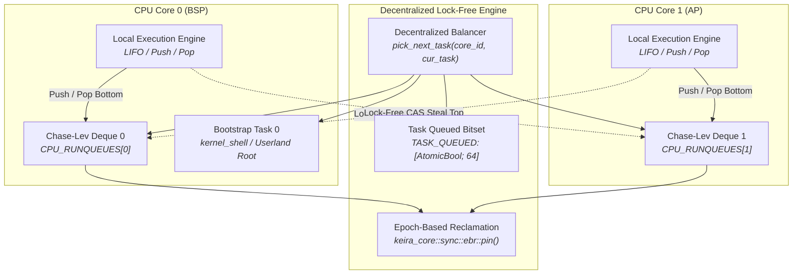

<!-- SPDX-License-Identifier: GPL-2.0-only -->

# Journey Milestone 11: Per-CPU Lock-Free Work-Stealing Scheduler Architecture

Milestone 11 advances Keira Kernel's multitasking architecture beyond centralized global spinlock bottlenecks by introducing a high-performance decentralized per-CPU lock-free work-stealing scheduler. Built on the Chase-Lev circular deque algorithm and guarded by compile-time Epoch-Based Reclamation (EBR), this architecture eliminates scheduling contention across symmetric multiprocessing (SMP) CPU cores while ensuring fair preemptive time-slicing and process synchronization.

---

## 1. Work-Stealing Architectural Topology

---

## 2. Core Engineering Subsystems

### A. Chase-Lev Lock-Free Circular Deque (`crates/task/src/scheduler/work_stealing/deque.rs`)
1. **Single-Producer Multi-Consumer (SPMC) Invariants**: The owning CPU core pushes and pops tasks from the bottom of the circular buffer (`buffer[b & DEQUE_MASK]`), while remote idle processors concurrently steal tasks from the top using atomic Compare-And-Swap (`compare_exchange`).
2. **Epoch-Based Reclamation Guard**: All steal attempts pin the active epoch via `keira_core::sync::ebr::pin()`, preventing use-after-free and memory corruption during concurrent queue mutations without acquiring locks.
3. **Sequential Consistency Fences**: Strict memory ordering (`Ordering::SeqCst` fences between bottom and top atomic loads) guarantees linearizable deque state and prevents ABA anomalies when the queue transitions between empty and non-empty.

### B. Per-CPU Runqueues & Task Deduplication (`crates/task/src/scheduler/work_stealing/percpu.rs`)
1. **Per-CPU Runqueue Array**: Static array `CPU_RUNQUEUES[MAX_CPU_CORES]` allocates dedicated Chase-Lev deques across up to 16 SMP cores, eliminating the global `SCHEDULER_LOCK` bottleneck on preemptive timer interrupts.
2. **Deduplication Bitset**: Global atomic bitset `TASK_QUEUED[MAX_TASKS]` tracks whether any given task index is already present in a runqueue. Double-enqueuing is rejected atomically via `compare_exchange(false, true, AcqRel, Relaxed)`.
3. **Task Dequeuing Invariant**: When a task is popped locally or stolen by a remote core, the task's queued bit is cleared atomically via `mark_task_dequeued`, allowing it to be safely re-enqueued upon quantum expiration.

### C. Decentralized Task Balancer (`crates/task/src/scheduler/work_stealing/balancer.rs`)
1. **Hierarchical Selection Strategy**:
   - **Local Queue Check**: The CPU core attempts to pop from its local Chase-Lev runqueue (`pop_local`).
   - **Work Stealing**: If the local queue is depleted, the core iteratively probes other SMP cores (`steal_from`) to balance computational loads across cores.
   - **Fallback Scan**: Unqueued ready tasks are discovered via graceful fallback, strictly excluding the currently yielding task descriptor.
2. **Task 0 Alternation & Pinning**: The bootstrap/shell task (Task 0) is pinned to Core 0 (the bootstrap processor). When worker tasks yield or expire their quantum on Core 0, the scheduler alternates execution with Task 0 if Task 0 is ready, guaranteeing starvation freedom for interactive shells and multi-process fork synchronization.

### D. Preemptive Tick Dispatch Integration (`crates/task/src/scheduler/dispatch/tick.rs`)
1. **Timer Preemption**: Preemptive timer interrupts invoke `schedule_tick(current_rsp)`.
2. **Fair Quantum Expiration**: The outgoing task saves its execution context and transitions to `TaskState::Ready`. The scheduler queries `pick_next_task(core_id, current_idx)`.
3. **Outgoing Re-Enqueuing**: If another task or Task 0 is dispatched, the outgoing ready task is pushed back onto the local runqueue (`push_local`), guaranteeing round-robin fairness across concurrent userland threads.

---

## 3. Subsystem Verification & Certification

The work-stealing scheduler architecture was comprehensively certified through live bare-metal and QEMU execution harnesses:
1. **Ring 3 Syscall Security & ABI Harness (`test_abi.elf`)**: 100% pass across all 42 security tests, including 20 rapid fork/reap churn iterations, copy-on-write memory mutation, advisory file lock coherency across duplicated handles, anonymous IPC pipes, BSD socket streaming and fault containment (#UD, #DE, #PF).
2. **Ring 3 Syscall Fuzzing Suite (`fuzz_abi.elf`)**: Successfully withstood 10,000 randomized boundary injections and chaotic signal storms with zero kernel panics.
3. **Native C Compiler Toolchain (`kcc.elf` & `kcc` shell command)**: Native compilation of `/tmp/main.c` into native ELF executables and clean execution.
4. **Live Shell Dual-Architecture Parity**: 100% clean execution across all 50 shell commands on both `x86_64` and `i686` with zero errors.
5. **Network Multi-API Verification**: Validated live HTTP client operations (`fetch` and `download`) across multiple remote endpoints with complete data integrity.
6. **Code Quality**: Zero warnings, zero errors across `cargo test --workspace`, `cargo clippy --workspace --all-targets`, `cargo fmt --check`, `make check`, `make format` and `make lint`.
