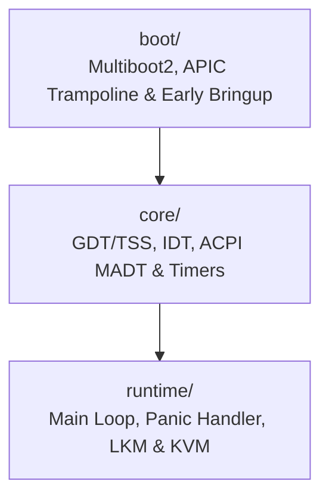

<!-- SPDX-License-Identifier: GPL-2.0-only -->

# Keira Kernel Core Architecture & Subsystems

The `kernel` domain provides the foundational execution environment, CPU initialization, symmetric multiprocessing, interrupt routing, hardware discovery, and runtime management.

---

## Subsystem Architecture

---

## Submodule Index

| Submodule | Focus Area | Description |
| :--- | :--- | :--- |
| [`boot/`](boot/README.md) | CPU Bootstrap | Multiboot2 handshake, SMP real-mode trampoline, early bringup |
| [`core/`](core/README.md) | Hardware Infrastructure | GDT/TSS descriptors, IDT interrupt gates, ACPI tables, HPET, and Local APIC |
| [`runtime/`](runtime/README.md) | Runtime Engine | Kernel main loop, panic handling, LKM module loading, and KVM virtualization |
