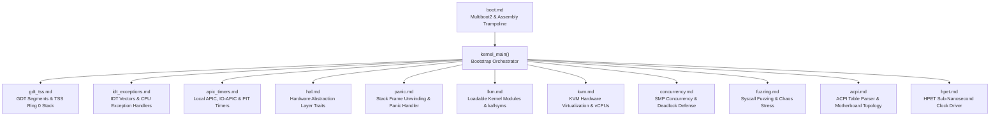

<!-- SPDX-License-Identifier: GPL-2.0-only -->

# Keira Kernel Core Subsystem

The `kernel` subsystem coordinates hardware bootstrap, CPU initialization, Global Descriptor Tables (GDT), Interrupt Descriptor Tables (IDT), APIC timers, Hardware Abstraction Layer (HAL) traits, stack unwinding panic handlers, Loadable Kernel Modules (LKM), and Kernel-based Virtual Machine (KVM) hardware virtualization.

---

## Subsystem Architecture & Modules

---

## Module Index

| Document | Component | Description |
| :--- | :--- | :--- |
| [`boot.md`](boot.md) | Multiboot2 Boot Sequence | 32-bit and 64-bit assembly trampolines, multiboot tags, and Rust entry point |
| [`gdt_tss.md`](gdt_tss.md) | GDT & TSS Context | Kernel/User code/data segment descriptors and Task State Segment stacks |
| [`idt_exceptions.md`](idt_exceptions.md) | Interrupt Vector Table | 256-entry IDT table, hardware IRQ dispatching, and CPU exception handlers (`#DB`, `#PF`, `#GP`, `#DF`) |
| [`apic_timers.md`](apic_timers.md) | Timers & Interrupt Routing | Local APIC calibration, IO-APIC routing, SMP multi-core IPIs, PIT frequency divisor, and RTC clock |
| [`hpet.md`](hpet.md) | High-Precision Event Timer | 64-bit MMIO up-counter, sub-nanosecond 128-bit math, atomic i686/x86_64 access, and clock syscalls |
| [`acpi.md`](acpi.md) | ACPI & Hardware Topology | RSDP detection, XSDT/RSDT traversal, MADT interrupt controller parsing, and multi-core APIC discovery |
| [`hal.md`](hal.md) | Hardware Abstraction Layer | Architecture-independent hardware interfaces for CPU, MMU, and Interrupts |
| [`panic.md`](panic.md) | Kernel Panic Engine | Dual-architecture stack frame unwinding and formatted serial/VGA crash logging |
| [`lkm.md`](lkm.md) | Loadable Kernel Modules | Module lifecycle states, dynamic symbol export, kallsyms, and Syscalls 34 & 35 |
| [`kvm.md`](kvm.md) | KVM Hypervisor | Hardware Intel VMX / AMD SVM detection, guest vCPU execution, VM-exits, and Syscalls 42 & 43 |
| [`concurrency.md`](concurrency.md) | SMP Concurrency & Deadlock Defense | Strict lock ranking hierarchy, CPUID recursion detection, interrupt inversion defense, and watchdog |
| [`fuzzing.md`](fuzzing.md) | Syscall Fuzzing & Chaos Stress | High-throughput Syzkaller-Lite mutation strategy, boundary pools, 5-phase chaos stress, and zero-panic metrics |
