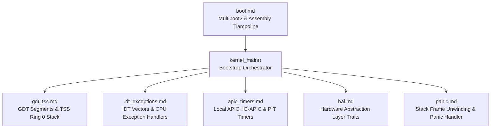

<!-- SPDX-License-Identifier: GPL-2.0-only -->

# Keira Kernel Core Subsystem

The `kernel` subsystem coordinates hardware bootstrap, CPU initialization, Global Descriptor Tables (GDT), Interrupt Descriptor Tables (IDT), APIC timers, Hardware Abstraction Layer (HAL) traits, and stack unwinding panic handlers.

---

## Subsystem Architecture & Modules

---

## Module Index

| Document | Component | Description |
| :--- | :--- | :--- |
| [`boot.md`](boot.md) | Multiboot2 Boot Sequence | 32-bit and 64-bit assembly trampolines, multiboot tags, and Rust entry point |
| [`gdt_tss.md`](gdt_tss.md) | GDT & TSS Context | Kernel/User code/data segment descriptors and Task State Segment stacks |
| [`idt_exceptions.md`](idt_exceptions.md) | Interrupt Vector Table | 256-entry IDT table, hardware IRQ dispatching, and CPU exception handlers (`#DB`, `#PF`, `#GP`, `#DF`) |
| [`apic_timers.md`](apic_timers.md) | Timers & Interrupt Routing | Local APIC calibration, IO-APIC routing, SMP multi-core IPIs, PIT frequency divisor, and RTC clock |
| [`hal.md`](hal.md) | Hardware Abstraction Layer | Architecture-independent hardware interfaces for CPU, MMU, and Interrupts |
| [`panic.md`](panic.md) | Kernel Panic Engine | Dual-architecture stack frame unwinding and formatted serial/VGA crash logging |
